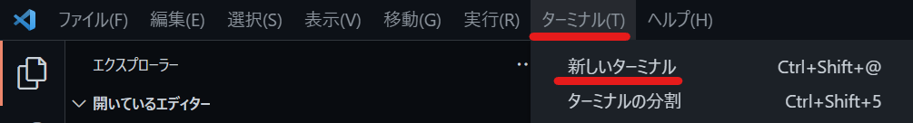
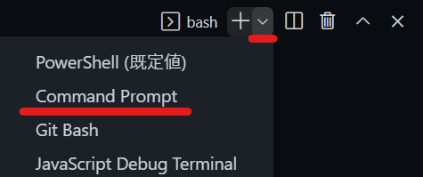
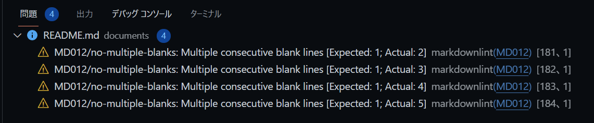
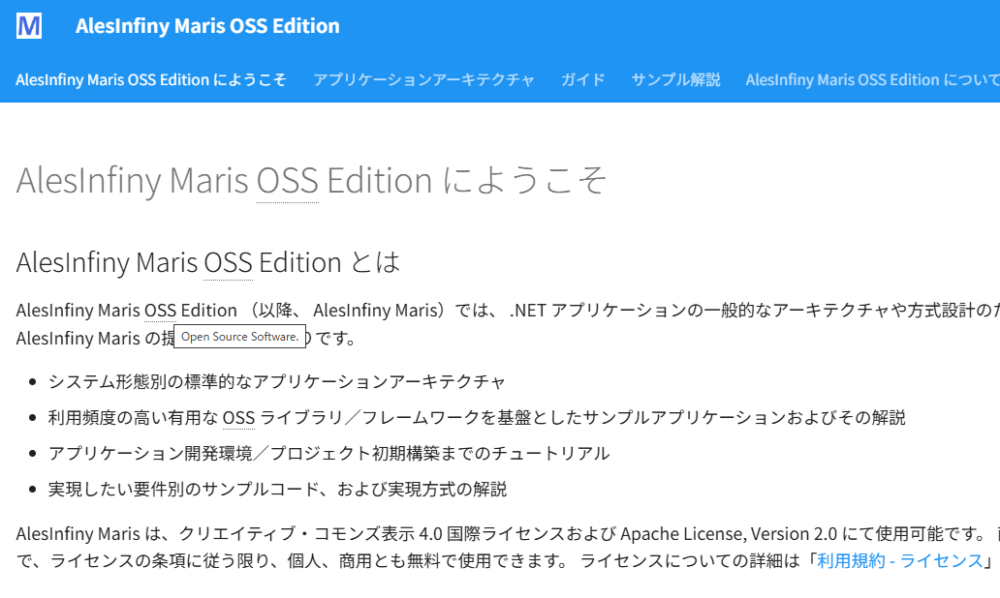
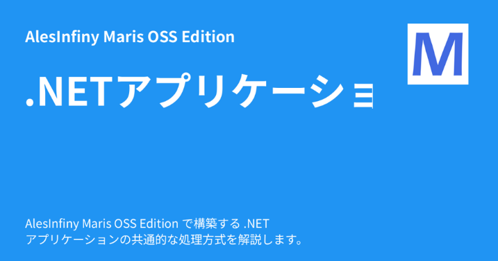
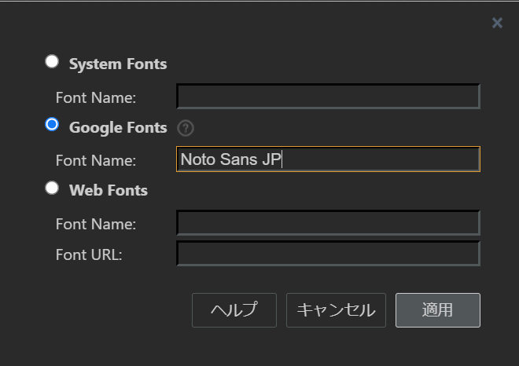
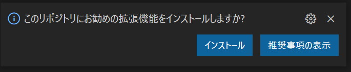
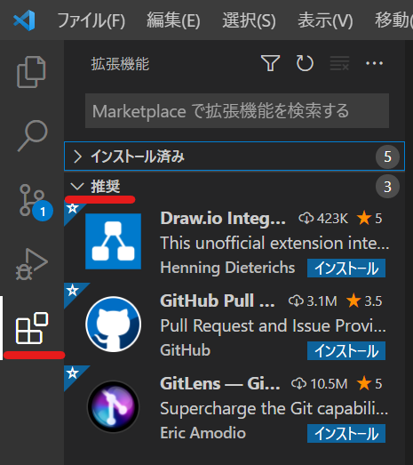

<!-- textlint-disable @textlint-rule/require-header-id -->
<!-- markdownlint-disable-file CMD001 -->
<!-- cSpell:ignore hoge hogehoge dotnetfw pymdown -->

# AlesInfiny Maris OSS Edition ドキュメントについて

## 本番環境

<https://maris.alesinfiny.org/>

## フォルダー構造

documents フォルダー配下のフォルダー、ファイルの配置は以下の通りです。

|               |                  |                       |                    |                     |                                               |
| ------------- | ---------------- | --------------------- | ------------------ | ------------------- | --------------------------------------------- |
| _materials    |                  |                       |                    |                     | ドキュメント内で利用する素材                  |
|               | images           |                       |                    |                     | 画像素材（画像を作るための元ファイル）        |
|               |                  | app-architecture      |                    |                     | contents/imagesフォルダーと構造をそろえる     |
|               |                  |                       | hoge.drawio        |                     | ファイル名は生成後の画像ファイルと同じにする  |
| contents      |                  |                       |                    |                     | ドキュメント本体                              |
|               | about-maris      |                       |                    |                     | 利用規約等、ライセンス関連のファイル          |
|               | app-architecture |                       |                    |                     | アプリケーションアーキテクチャ                |
|               |                  | client-side-rendering |                    |                     | CSR編                                         |
|               |                  |                       | test               |                     | テスト方針                                    |
|               |                  |                       |                    | backend-application | バックエンドアプリのテスト方針                |
|               |                  | console-app           |                    |                     | コンソールアプリケーション編                  |
|               |                  | overview              |                    |                     | 概要編                                        |
|               |                  | security              |                    |                     | アプリケーションセキュリティ編                |
|               | assets           |                       |                    |                     | 共通資材（ロゴなど）                          |
|               |                  | images                |                    |                     |                                               |
|               | guidebooks       |                       |                    |                     | ガイドライン系ドキュメント                    |
|               |                  | app-testing           |                    |                     | アプリケーションテスト                        |
|               |                  | conventions           |                    |                     | 規約                                          |
|               |                  | git                   |                    |                     | Git リポジトリ構築ガイド                      |
|               |                  | how-to-develop        |                    |                     | アプリケーション開発手順                      |
|               |                  |                       | cors               |                     | CORS 環境の構築ガイド                         |
|               |                  |                       | dotnet             |                     | .NET 編                                       |
|               |                  |                       | local-environment  |                     | ローカル開発環境の構築                        |
|               |                  |                       | publication        |                     | アプリケーションの発行手順                    |
|               |                  |                       | vue-js             |                     | Vue.js 編                                     |
|               |                  | migration             |                    |                     | マイグレーション                              |
|               |                  |                       | dotnetfw-risk      |                     | .NET Frameworkにとどまることのリスク          |
|               |                  | modern-dev-process    |                    |                     | 開発プロセスのモダナイズ                      |
|               | images           |                       |                    |                     | ページ固有の画像ファイル置き場                |
|               |                  | about-maris           |                    |                     | mdファイルの配置フォルダーと構造をそろえる    |
|               |                  |                       | hoge.png           |                     | 画像ファイルはsvgかpngにする                  |
|               |                  |                       | animation.gif      |                     | gif アニメーションも利用可                    |
|               |                  | app-architecture      |                    |                     |                                               |
|               |                  | guidebooks            |                    |                     |                                               |
|               |                  |                       | app-testing        |                     |                                               |
|               |                  |                       | conventions        |                     |                                               |
|               |                  |                       | git                |                     |                                               |
|               |                  |                       | how-to-develop     |                     |                                               |
|               |                  |                       | migration          |                     |                                               |
|               |                  |                       | modern-dev-process |                     |                                               |
|               | samples          |                       |                    |                     | サンプルアプリケーション解説                  |
|               |                  | azure-ad-b2c          |                    |                     | Azure AD B2C の認証を利用するサンプル解説     |
|               |                  | console-app-with-di   |                    |                     | コンソールアプリの要件別サンプル解説          |
|               |                  | downloads             |                    |                     | サンプルアプリケーションコード置き場(zip圧縮) |
|               | stylesheets      |                       |                    |                     | 既定のスタイルシートの上書き設定              |
|               | index.md         |                       |                    |                     | トップページ                                  |
| includes      |                  |                       |                    |                     | Snippets の置き場                             |
|               | abbreviations.md |                       |                    |                     | 略語用語集                                    |
| overrides     |                  |                       |                    |                     | Mkdocs Materialの拡張ファイル置き場（\*）     |
| readme-images |                  |                       |                    |                     | README.md 内の画像ファイル置き場              |
| .gitignore    |                  |                       |                    |                     | mkdocs 用の gitignore                         |
| mkdocs.yml    |                  |                       |                    |                     | mkdocs の設定ファイル                         |
| README.md     |                  |                       |                    |                     | このドキュメント                              |

\*：詳細は [Mkdocs Materialの解説](https://squidfunk.github.io/mkdocs-material/customization/?h=theme#extending-the-theme) と [GitHub リポジトリ](https://github.com/squidfunk/mkdocs-material/tree/master/src/overrides) を参照。

## ドキュメント作成手順

最初に「[ドキュメント作成環境の構築](#ドキュメント作成環境の構築)」に従って、ドキュメント作成環境を構築してください。
ドキュメントの作成にあたり、以下の手順、規則に従って作成してください。

### ドキュメントの作成

フォルダー構造に従って Markdown ファイルを作成します。

Markdown の作成にあたっては、 Material for MkDocs の Web サイトを参照してください。
素の Markdown とは異なる表現パターンがあります。

<https://squidfunk.github.io/mkdocs-material/reference/abbreviations/>

### 動作確認

記事をある程度作成したら、 mkdocs を用いて確認します。

Visual Studio Code で [ターミナル] を開きます。
ターミナルが開いていない場合は、以下の通り新たに開いてください。



[ターミナル] ウィンドウの右上のドロップダウンを開き、お好きなものを選択してください。
以降 Command Prompt を選択した場合の例を示します。



ターミナルのコマンドプロンプトで、 [mkdocs.yml] ファイルのあるフォルダーに移動してください。
フォルダー移動後、以下のコマンドを実行してください。

```plain
mkdocs serve
```

うまく実行できると、以下のようなメッセージが出て、 Web サーバーが起動します。

```plain
INFO     -  Building documentation...
INFO     -  Cleaning site directory
INFO     -  Documentation built in 1.04 seconds
INFO     -  [10:07:52] Serving on http://127.0.0.1:8000/
INFO     -  [10:07:53] Browser connected: http://127.0.0.1:8000/
```

最後に出力されている URL を任意のブラウザーで開いてください。
作成した記事を参照し、正しく表示できていることを確認します。

警告がある場合は、そのまま Markdown を修正して保存します。
保存するとブラウザー側はホットリロードが行われ、即座に編集結果が反映されます。
また mkdocs.yml ファイルを編集した場合も、ファイルを保存した瞬間にホットリロードが走ります。

Markdown ファイルを追加したら、ほとんどの場合 mkdocs.yml の nav セクションを修正する必要があります。

### ドキュメントのリンクの記載ルール

ドキュメントにリンクを追加する場合、以下のように記載します。

- このドキュメントの別ページに遷移するリンクの場合

    以下のように記載します。

    ```md
    [概要編](overview/index.md)
    ```

    特定のページの見出しを指定する場合は、各見出しに付与した ID を以下のようにリンクの末尾に付与します。

    ```md
    [CSR アーキテクチャ概要 - アプリケーションコア層](../csr-architecture-overview.md#application-core)
    ```

- 外部ページに遷移するリンクの場合

    以下のように、外部リンクを表すアイコンを表示するための `:material-open-in-new:` と別タブに遷移させるための `{ target=_blank }` を付与します。

    ```md
    [External Link :material-open-in-new:](https://external-link){ target=_blank }
    ```

- ライセンス条文等に含まれる外部ページリンクの場合

    ライセンス条文のように原文をそのまま表示する必要のある記載の場合は、外部リンクであってもアイコンを付与しないようにします。
    そのため、以下のように別タブに遷移させるための `{ target=_blank }` のみ記載します。

    ```md
    [License Link](https://license-link){ target=_blank }
    ```

### Github コードの記載ルール

AlesInfiny Maris の Github コードをドキュメントで参照する場合、コンテンツタブとコードブロックを利用します。
具体的には、以下のように記載します。

- コード全体をドキュメントに表示する場合

    コード全体をドキュメントに表示する場合、コードブロック内に Github の URL を直接記載します。
    コンテンツタブの設定は、コードの行数に応じて `!!!` と `???` を使い分けてください。

    ```md
    ??? example "App.vue の設定例"

        ```html title="サンプルアプリケーションの App.vue" hl_lines="1 3-4"
        https://github.com/AlesInfiny/maris/blob/main/samples/Dressca/dressca-frontend/consumer/src/App.vue
        ```
    ```

- コードの一部を切り取って表示する場合

    コードの一部を切り取って表示する場合、 URL の末尾に `#L1-L8` のように切り取る行数を追記します。
    コンテンツタブの設定は、コードの行数に応じて `!!!` と `???` を使い分けてください。

    ```md
    !!! example "App.vue の設定例"

        ```html title="サンプルアプリケーションの App.vue" hl_lines="1 3-4"
        https://github.com/AlesInfiny/maris/blob/main/samples/Dressca/dressca-frontend/consumer/src/App.vue#L1-L8
        ```
    ```

### 体裁の修正

#### markdownlint

markdownlint の拡張機能をインストールしていると、 [問題] ウィンドウに以下のような Markdown の体裁エラーを指摘するコメントが出ます。



本リポジトリでは Markdown の体裁にエラーがあると、 Web サイトの発行が行えないようになっています。
警告が出ている場合は、メッセージを読んで必ず解消しましょう。

#### CSpell

CSpell の拡張機能をインストールしていると、 [問題] ウィンドウに未定義の単語の存在を知らせるコメントが出ます。
この拡張機能は、英単語のスペルミスを検出するために導入するものであり、コメントの多くはスペルミスに起因しています。
必ず対応するようにしてください。

詳細は「[用語集の整理](#用語集の整理)」を参照してください。

#### textlint

vscode-textlint の拡張機能をインストールしていると、 [問題] ウィンドウに校正に関するコメントが出ます。
この拡張機能は、技術ドキュメントを書く際の冗長な表現を排除したり、表記ゆれの検出したりする自動校正ツールです。
多くの場合、文章の見直しによってエラーを回避できます。
必ず対応するようにしてください。

一部の機能については、誤検知をしてしまう場合や、ルールの適用が不適切なこともあります。
その場合は、文書内に以下のようなコメントを記述することで、一部の解析ルールを無視するよう設定できます。

```markdown
<!-- textlint-disable @textlint-rule/require-header-id -->

# 解析ルールが無効になる場所

<!-- textlint-enable @textlint-rule/require-header-id -->
```

詳細は以下を参照してください。

<https://github.com/textlint/textlint-filter-rule-comments#usage>

### 用語集の整理

CSpell の拡張機能をインストールしていると、 [問題] ウィンドウに上記と同じようなスペルミスを指摘するコメントが出ます。
ドキュメントに関連する部分で警告が出る場合は対策を講じてください。
対応方法は以下の通りです。

1. 一般的な用語 / 技術用語である場合

    [cspell.json] ファイルの `words` に用語を追加してください。

1. 特定のページでのみ使用する特殊な用語や略語の場合

    以下を参照して、ページ内に `cspell:ignore` を追加して、警告を除外する用語を追加してください。
    設定はページ最上部に記述します。

    - <https://github.com/streetsidesoftware/cspell/tree/main/packages/cspell#ignore>
    - <https://github.com/streetsidesoftware/cspell/tree/main/packages/cspell#enable--disable-checking-sections-of-code>

### 略語の登録

[API] や [OSS] といった一般的な略語については、 `documents/includes/abbreviations.md` の略語集に登録します。
以下のように、略語とその正式名称をペアにして記載します。

```md title="abbreviations.md"
*[OSS]: Open Source Software
```

これにより、ドキュメント上の略語にカーソルを合わせることで、正式名称が確認できるようになります。



### 各ページの title/description の設定

以下のように、各 markdown ファイルの上部に `title` と `description` を設定しています。

``` text
---
title: CSR 編
description: クライアントサイドレンダリングを行う Web アプリケーションの アーキテクチャについて解説します。
---
```

ここで設定した `title` と `description` を元にソーシャルカードが生成されるため、以下の文字数を守って設定します。
( `description` を省略すると、 mkdocs.yml の `site_description` の値が設定されます。)

- カード上に表示できる文字数
    - `title`：全角 9 文字 × 3 行まで
    - `description`: 半角 59 文字 ( 全角だと 30 文字目が半分途切れる ) × 2 行まで

※スペースを空けないと 1 単語とみなされ、同じ行に詰め込もうとして文章が途切れるので適宜スペースで区切ってください。

- 例：
    - `title: .NETアプリケーションの処理方式` の場合
    
    - `title: .NET アプリケーションの 処理方式` の場合
    

文字が途切れていないか等を適宜確認してください。
ソーシャルカードはローカルでは生成せず、 CI 上でのドキュメントビルド時に生成されるよう設定しています。
生成されたソーシャルカードは以下の手順で確認してください。

1. GitHub Actions の「ドキュメントのビルド(CI 用)」を開き、対象のブランチを選択してワークフローを実行します。

1. 実行したワークフローの Summary の Artifacts から　documents をダウンロードします。

1. ダウンロードした documents.zip 内の docs.zip を解凍し、`assets/images/social` に生成されたソーシャルカードを確認します。

### 画像の作成方法

#### 画像の作成ルール

図を作成する場合は \*.drawio で作成してください。
\*.drawio ファイルは、 _materials/images フォルダーの配下に作成してください。
画像ファイルは svg 形式または png 形式で出力し、出力した画像ファイルを contents/images フォルダーの配下に配置してください。

スクリーンショットなど、元となる \*.drawio ファイルが存在しない場合は、 _materials/images フォルダーの配下にファイルを配置する必要ありません。

_materials/images フォルダー、 contents/images フォルダーの配下は、画像を配置するマークダウンの置き場所にあわせてフォルダーを掘り、その中に各ファイルを配置してください。

画像ファイル作成にあたり、以下のルールを守って作成してください。

| 項目               | 設定値/選択する値                                    |
| ------------------ | ---------------------------------------------------- |
| フォントサイズ     | 18pt                                                 |
| フォントファミリー | [カスタム] > [Google Fonts] > 「Noto Sans JP」を設定 |



#### ライトモード/ダークモードに関する設定

本ドキュメントでは、ライトモード/ダークモードの切り替えができるように設定されています。
各モードへ対応するために、ライトモード向け / ダークモード向けの 2 通りの画像を作成します。
また、モードによる切り替わりが行われるよう、マークダウンを実装します。

ライトモード用 / ダークモード用の画像作成やマークダウンの実装方法は以下の通りです。

1. 画像原本の \*.drawio ファイルについて、ライトモード用、ダークモード用の 2 通りのファイルを作成します。  
   以下の命名規則に従い、どちらのモード用のファイルかを \*.drawio ファイル名末尾の文字列で表現します。

    | 対象モード   | \*.drawio ファイル名末尾の文字列 |
    | ------------ | -------------------------------- |
    | ライトモード | -light.drawio                    |
    | ダークモード | -dark.drawio                     |

1. コンテンツとして配置する png ファイルも、ライトモード用、ダークモード用の 2 通り用意します。  
   ファイル名の命名規則については \*.drawio ファイルと同様の規則を適用します。

1. マークダウンの実装は以下のように「#only-light」または「#only-dark」を付加して配置します。  
   詳細は以下の公式ドキュメントを参照してください。  
   <https://squidfunk.github.io/mkdocs-material/reference/images/#light-and-dark-mode>

    - 「align=right」は画像の配置に関する属性であり、画面デザインにあわせて任意で付加します。  
    詳細は以下の公式ドキュメントを参照してください。  
    <https://squidfunk.github.io/mkdocs-material/reference/images/#image-alignment>

    - 「loading=lazy」は画像の遅延読込に関する属性であり、必須で付加します。  
    詳細は以下の公式ドキュメントを参照してください。  
    <https://squidfunk.github.io/mkdocs-material/reference/images/#image-lazy-loading>

    ```md
    { align=right loading=lazy }
    { align=right loading=lazy }
    ```

### ドキュメントの自動検証

各種 Linter を用いて、ドキュメントの体裁や表現、表記揺れを自動で検証できます。
Visual Studio Code の [ターミナル] を開き、ルートディレクトリに移動して、以下のコマンドを実行してください。

```plain
npm run lint
```

markdownlint と textlint が実行され、エラーがある場合は表示されます。

markdownlint と textlint を個別に実行したい場合は、それぞれ以下のコマンドを実行してください。

```plain
npm run lint:markdownlint-all
npm run lint:textlint-all
```

## ドキュメント執筆環境の構築方法

### Visual Studio Code のインストール

ドキュメント作成のエディターとして、 Visual Studio Code を利用します。
以下のサイトから最新版の Visual Studio Code をインストールします。

<https://code.visualstudio.com/download>

### Visual Studio Code の拡張機能のインストール

Visual Studio Code の [ファイル] メニューから [ワークスペースを開く] を選択します。
クローンしたフォルダー内にある maris.code-workspace ファイルを選択して開きます。

はじめてワークスペースを開いたとき、以下のようなダイアログが表示されるので、 [インストール] ボタンを押下します。



このダイアログ経由でインストールしなかった場合は、 [拡張機能] メニューから [推奨] のグループを開いて、以下の拡張機能をインストールします。

- [Code Spell Checker](https://marketplace.visualstudio.com/items?itemName=streetsidesoftware.code-spell-checker)
- [Draw.io integration](https://marketplace.visualstudio.com/items?itemName=hediet.vscode-drawio)
- [Markdown All in One](https://marketplace.visualstudio.com/items?itemName=yzhang.markdown-all-in-one)
- [markdownlint](https://marketplace.visualstudio.com/items?itemName=DavidAnson.vscode-markdownlint)
- [vscode-textlint](https://marketplace.visualstudio.com/items?itemName=3w36zj6.textlint)



また、必要に応じて以下の拡張機能をインストールします。

- [Japanese Language Pack for Visual Studio Code](https://marketplace.visualstudio.com/items?itemName=MS-CEINTL.vscode-language-pack-ja)
- [Markdown Preview Mermaid Support](https://marketplace.visualstudio.com/items?itemName=bierner.markdown-mermaid)
- [Table Formatter](https://marketplace.visualstudio.com/items?itemName=shuworks.vscode-table-formatter)

### Node.js のインストール

以下のサイトから安定版の Node.js インストーラーをダウンロードし、インストールしてください。

<https://nodejs.org/ja/>

### Node モジュールのインストール

本リポジトリでは textlint を使用して、校正を自動化します。
以下のコマンドを実行して、 textlint の実行に必要な Node モジュールをインストールしてください。
モジュールの更新も同じコマンドで実行できます。

```plane
npm ci
```

### Pythonのインストール

以下のサイトから、 Windows 用の最新版 Python をインストールします。
インストール時に [Add Python 3.x to PATH] へチェックを入れてからインストールしてください。

<https://www.python.org/downloads/>

コマンドプロンプトを管理者権限で起動します。
以下のコマンドを実行して pip を更新します。

```plain
pip install --upgrade pip
```

### Python モジュールのインストール

本リポジトリでは、 yamllint を使用して、 YAML ファイルの Lint を自動化します。
また、 Mkdocs を用いて、マークダウンから Web サイトを生成します。
以下のコマンドを実行して、必要なモジュールを一括でインストールします。
モジュールの更新も同じコマンドで実行できます。

```plain
pip install -r requirements.txt
```

<!-- textlint-enable @textlint-rule/require-header-id -->
