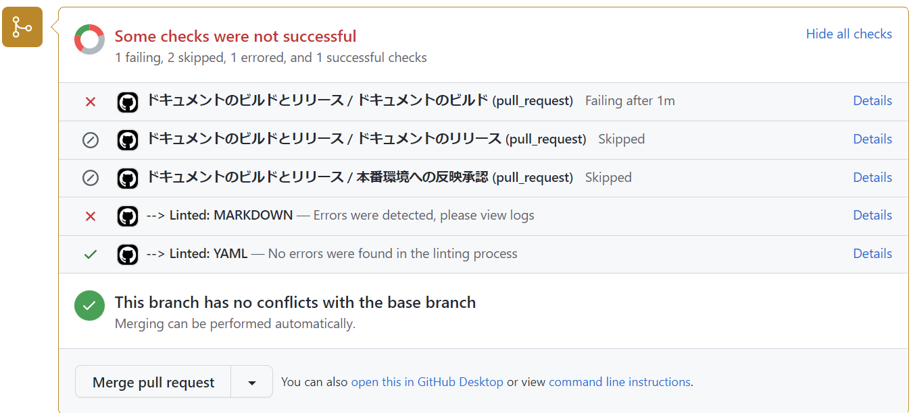
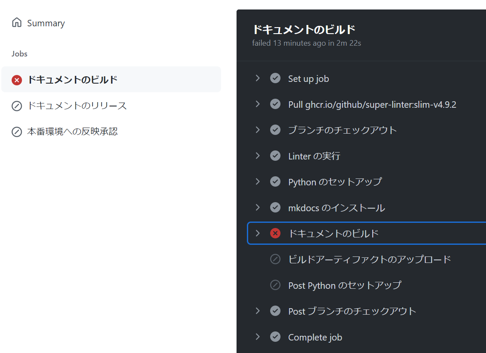

# Maris OSS 版 ドキュメントについて

<!-- cSpell:ignore hoge hogehoge dotnetfw pymdown -->

## 本番環境

<https://wwww.marisossedition.org>

## ディレクトリ構造

documents ディレクトリ配下のディレクトリ、ファイルの配置は以下の通りです。

|               |                  |                       |                    |                                               |
| ------------- | ---------------- | --------------------- | ------------------ | --------------------------------------------- |
| _materials    |                  |                       |                    | ドキュメント内で利用する素材                  |
|               | images           |                       |                    | 画像素材（画像を作るための元ファイル）        |
|               |                  | app-architecture      |                    | contents/imagesディレクトリと構造をそろえる   |
|               |                  |                       | hoge.drawio        | ファイル名は生成後の画像ファイルと同じにする  |
| contents      |                  |                       |                    | ドキュメント本体                              |
|               | app-architecture |                       |                    | アプリケーションアーキテクチャ                |
|               |                  | client-side-rendering |                    | CSR編                                         |
|               |                  | console-app           |                    | コンソールアプリケーション編                  |
|               |                  | overview              |                    | 概要編                                        |
|               | assets           |                       |                    | 共通資材（ロゴなど）                          |
|               |                  | images                |                    |                                               |
|               | guidebooks       |                       |                    | ガイドライン系ドキュメント                    |
|               |                  | app-testing           |                    | アプリケーションテスト（*）                   |
|               |                  | git                   |                    | Git リポジトリ構築ガイド                      |
|               |                  | how-to-develop        |                    | アプリケーション開発手順                      |
|               |                  |                       | dotnet             | .NET 編                                       |
|               |                  |                       | local-environment  | ローカル開発環境の構築                        |
|               |                  |                       | vue-js             | Vue.js 編                                     |
|               |                  | migration             |                    | マイグレーション                              |
|               |                  |                       | dotnetfw-risk      | .NET Frameworkにとどまることのリスク          |
|               |                  |                       | from-dotnetfw      | .NET Frameworkからの移行                      |
|               |                  | modern-dev-process    |                    | 開発プロセスのモダナイズ                      |
|               | images           |                       |                    | ページ固有の画像ファイル置き場                |
|               |                  | app-architecture      |                    | mdファイルの配置ディレクトリと構造をそろえる  |
|               |                  |                       | hoge.png           | 画像ファイルはsvgかpngにする                  |
|               |                  |                       | animation.gif      | gifアニメも利用可                             |
|               |                  | guidebooks            |                    |                                               |
|               |                  |                       | app-testing        |                                               |
|               |                  |                       | how-to-develop     |                                               |
|               |                  |                       | migration          |                                               |
|               |                  |                       | modern-dev-process |                                               |
|               |                  | samples               |                    |                                               |
|               |                  | terms                 |                    |                                               |
|               | samples          |                       |                    | サンプルアプリケーション解説                  |
|               |                  | downloads             |                    | サンプルアプリケーションコード置き場(zip圧縮) |
|               | stylesheets      |                       |                    | 既定のスタイルシートの上書き設定              |
|               | terms            |                       |                    | 利用規約                                      |
| overrides     |                  |                       |                    | Mkdocs Materialの拡張ファイル置き場（\*）     |
| includes      |                  |                       |                    | Snippets の置き場                             |
|               | abbreviations.md |                       |                    | 略語用語集                                    |
| readme-images |                  |                       |                    | README.md 内の画像ファイル置き場              |
| .gitignore    |                  |                       |                    | mkdocs 用の gitignore                         |
| mkdocs.yml    |                  |                       |                    | mkdocs の設定ファイル                         |
| README.md     |                  |                       |                    | このドキュメント                              |

\*：詳細は [Mkdocs Materialの解説](https://squidfunk.github.io/mkdocs-material/customization/?h=theme#extending-the-theme)と [GitHub リポジトリ](https://github.com/squidfunk/mkdocs-material/tree/master/src/overrides)を参照

## ドキュメントの作成方法（わかっている人向けの大雑把な手順）

このリポジトリは GitHub-flow で開発を行います。
Feature ブランチの名前は「feature/<更新内容を表す名前>」として開発を行ってください。
記事の作成後は main ブランチへのマージを行う Pull Request を投げてください。

## ドキュメントの作成方法（詳細版）

### ローカルの main ブランチを最新にする

Visual Studio Code を起動して、 [ファイル] メニューから [ワークスペースを開く] を選択します。
クローンしたディレクトリ内にある maris.code-workspace ファイルを選択して開きます。

[ソース管理] メニューを開き、 [チェックアウト先] を選択します。


main ブランチを選択します（コミットハッシュは図とは異なるはずです。）。


main ブランチをチェックアウトしたら、 pull を実行して最新を取得します。


### Feature ブランチの作成

記事を作成するための Feature ブランチをローカルに作成します。
[ソース管理] メニューを開き、 [ブランチ] > [分岐の作成] を選択します。


作成するブランチ名を入力します。
ブランチ名は「feature/<更新内容を表す名前>」として Enter を押下します。


### ドキュメントの作成

ディレクトリ構成に従って Markdown ファイルを作成してください。

Markdown の作成にあたっては、 Material for MkDocs の Web サイトを参考にしてください。
素の Markdown とは異なる表現パターンがあるので、参考にしてください。

<https://squidfunk.github.io/mkdocs-material/reference/abbreviations/>

### 動作確認

記事をある程度作成したら、 mkdocs を用いて確認を行います。

Visual Studio Code で [ターミナル] を開きます。
ターミナルが開いていない場合は、以下の通り新たに開いてください。


[ターミナル] ウィンドウの右上のドロップダウンを開き、お好きなものを選択してください。
以降 Command Prompt を選択した場合の例を示します。


ターミナルのコマンドプロンプトで、 [mkdocs.yml] ファイルのあるディレクトリに移動してください。
ディレクトリ移動後、以下のコマンドを実行してください。

```plain
mkdocs serve
```

うまく実行できると、以下のようなメッセージが出て、 Web サーバーが起動します。

```plain
INFO     -  Building documentation...
INFO     -  Cleaning site directory
INFO     -  Documentation built in 1.04 seconds
INFO     -  [10:07:52] Serving on http://127.0.0.1:8000/
INFO     -  [10:07:53] Browser connected: http://127.0.0.1:8000/
```

最後に出力されている URL を任意のブラウザーで開いてください。
作成した記事を参照し、正しく表示できていることを確認します。

誤りがある場合は、そのまま Markdown を修正して保存します。
保存するとブラウザー側はホットリロードが行われ、即座に編集結果が反映されます。
また mkdocs.yml ファイルを編集した場合も、ファイルを保存した瞬間にホットリロードが走ります。

Markdown ファイルを追加した場合、ほとんどのケースで mkdocs.yml の nav セクションを修正する必要があります。

### 体裁の修正

#### markdownlint

markdownlint の拡張機能をインストールしていると、 [問題] ウィンドウに以下のような Markdown の体裁誤りを指摘するコメントが出ることがあります。


本リポジトリでは Markdown の体裁に誤りがあると、 Web サイトの発行が行えないようになっています。
警告が出ている場合は、メッセージを読んで必ず解消しましょう。

#### cSpell

cSpell の拡張機能をインストールしていると、 [問題] ウィンドウに未定義の単語の存在を知らせるコメントが出ることがあります。
この拡張機能は、英単語のスペルミスを検出するために導入するものであり、コメントの多くはスペルミスに起因しています。
必ず対応を行うようにしてください。

複合語や技術用語は、辞書登録を行わないと誤検知されることがあります。
その場合はワークスペースの辞書に、単語を登録するようにしてください。
[maris.code-workspace] ファイルの `settings` / `cSpell.words` に単語を登録できます。

コード内や設定ファイル内の文字など、単語登録することが望ましくないと考える場合は、以下の記事を参考にして、各ページで抑制してください。
cSpell が実行されないようにするのではなく、そのページ内で使用する抑制しても良い単語を、ページの先頭に記述する方式で抑制しましょう。
このページの上部にも設定を行ってあります。

<https://github.com/streetsidesoftware/cspell/tree/main/packages/cspell#enable--disable-checking-sections-of-code>

### 用語集の整理

cSpell の拡張機能をインストールしていると、 [問題] ウィンドウに上記と同じような用語誤りやスペルミスを指摘するコメントが出ることがあります。
ドキュメントに関連する部分で警告が出る場合は対策を講じてください。
対応方法は以下の通りです。

1. 一般的な用語 / 技術用語である場合

    ワークスペース ( maris.code-workspace ) の用語集に単語を追加してください。

1. 特定のページでのみ使用する特殊な用語や略語の場合

    以下を参考にして、ページ内に `cSpell:ignore` を追加して、警告を除外する用語を追加してください。
    設定はページ最上部に記述します。

    <https://github.com/streetsidesoftware/cspell/tree/main/packages/cspell#ignore>

### 修正内容のコミット

記事の作成と体裁の修正が完了したら、 Feature ブランチにコミットします。
[ソース管理] メニューを開き、上部の [メッセージ] にコミットメッセージを入力します。
また [✓] アイコンを押下して、ローカルリポジトリにコミットします。

コミットは意味のある単位であれば、何回実施してもかまいません。

### Feature ブランチのアップロード

コミットが完了したら、 Feature ブランチをプッシュして、リモートリポジトリにアップロードします。
[ソース管理] メニューを開き、 [プッシュ] を選択します。


### プルリクエストの作成

GitHub でプッシュした Feature ブランチを main ブランチにマージするプルリクエストを作成してください。
プルリクエストを作成すると、 Markdown と YAML の Lint と、ビルド可否のチェックが行われます。

Lint の結果、警告がある場合はGitHub Actionsが失敗します。



mkdocs のビルドがエラーとなった場合もGitHub Actionsは失敗します。
いずれの場合も GitHub Actions のログからエラー情報を確認できます。
右側の詳細ログからエラーとなっている箇所を開くことで、ログメッセージを確認できます。



続いて mkdocs の実行ログを参照し、警告が出ていないことを確認してください。
警告が出ている場合は解消するようにします。
mkdocs で警告が出ても、 GitHub Actions は正常に終了してしまいます。
必ずログを確認するようにしましょう。

なお mkdocs の警告は、ローカル PC で `mkdocs serve` コマンドを実行しても確認できます。

プルリクエストをマージすると、継続的デプロイメントが走り、自動的にステージング環境の Web サイトが更新されます。

### 最終確認

Web サイトの更新が完了したら、以下にアクセスして問題なく修正が反映されていることを確認します。

<https://app-oss-maris-staging.azurewebsites.net/>

問題がある場合は、再度 Feature ブランチを作成するところから再実施してください。
修正に時間がかかる場合は、以前のリリース物を再リリースし、切り戻すようにしてください。

## 画像の作成方法

### 画像の作成ルール

図を作成する場合は \*.drawio で作成してください。
\*.drawio ファイルは、 _materials/images ディレクトリの配下に作成してください。
画像ファイルは svg 形式または png 形式で出力し、出力した画像ファイルを contents/images ディレクトリの配下に配置してください。

スクリーンショットなど、元となる \*.drawio ファイルが存在しない場合は、 _materials/images ディレクトリの配下にファイルを配置する必要ありません。

_materials/images ディレクトリ、 contents/images ディレクトリの配下は、画像を配置するマークダウンの置き場所にあわせてディレクトリを掘り、その中に各ファイルを配置してください。

画像ファイル作成にあたり、以下のルールを守って作成してください。

| 項目               | 設定値/選択する値                                    |
| ------------------ | ---------------------------------------------------- |
| フォントサイズ     | 18pt                                                 |
| フォントファミリー | [カスタム] > [Google Fonts] > 「Noto Sans JP」を設定 |


### ライトモード/ダークモードに関する設定

本ドキュメントでは、ライトモード/ダークモードの切り替えができるように設定されています。
各モードに対応するために、ライトモード用/ダークモード用の 2 通りの画像を作成します。
また、モードによる切り替わりが行われるよう、マークダウンを実装します。

ライトモード用/ダークモード用の画像作成やマークダウンの実装方法は以下の通りです。

1. 画像原本の \*.drawio ファイルについて、ライトモード用、ダークモード用の 2 通りのファイルを作成します。  
   以下の命名規則に従い、どちらのモード用のファイルかを \*.drawio ファイル名末尾の文字列で表現します。

    | 対象モード   | \*.drawio ファイル名末尾の文字列 |
    | ------------ | -------------------------------- |
    | ライトモード | -light.drawio                    |
    | ダークモード | -dark.drawio                     |

1. コンテンツとして配置する png ファイルも、ライトモード用、ダークモード用の 2 通り用意します。  
   ファイル名の命名規則については \*.drawio ファイルと同様の規則を適用します。

1. マークダウンの実装は以下のように「#only-light」または「#only-dark」を付加して配置します。  
   詳細は以下の公式ドキュメントを参照してください。  
   <https://squidfunk.github.io/mkdocs-material/reference/images/#light-and-dark-mode>

    - 「align=right」は画像の配置に関する属性であり、画面デザインにあわせて任意で付加します。  
    詳細は以下の公式ドキュメントを参照してください。  
    <https://squidfunk.github.io/mkdocs-material/reference/images/#image-alignment>

    - 「loading=lazy」は画像の遅延読込に関する属性であり、必須で付加します。  
    詳細は以下の公式ドキュメントを参照してください。  
    <https://squidfunk.github.io/mkdocs-material/reference/images/#image-lazy-loading>

    ```md
    { align=right loading=lazy }
    { align=right loading=lazy }
    ```

## ドキュメント執筆環境の構築方法

### Visual Studio Code のインストール

以下のサイトから最新版の Visual Studio Code をインストールします。

<https://code.visualstudio.com/download>

### リポジトリのクローン

ローカルマシン内の適当なディレクトリで、このリポジトリをクローンします。
詳細な手順は以下を参照してください。

<https://docs.github.com/ja/github/creating-cloning-and-archiving-repositories/cloning-a-repository-from-github/cloning-a-repository>

### ユーザー名、メールアドレスの設定

クローンした Git リポジトリに対して、自分のユーザー名、メールアドレスを設定します。
コマンドプロンプトでクローンしたリポジトリのあるディレクトリに移動して、現在設定されているユーザー名、メールアドレスを確認します。

```plane
c:\hogehoge\maris>git config user.name
XXXXXXXXXXX

c:\hogehoge\maris>git config user.email
YYYYY@hoge.com
```

グローバルの設定が生きている場合は、以下を参照し、メールアドレスとユーザー名の上書き設定を推奨します。
メールアドレスは `GitHub が提供する no-reply メールアドレス` を設定することをおすすめします。
また GitHub 上の設定変更もあわせて行うことをおすすめします。

<https://docs.github.com/ja/github/setting-up-and-managing-your-github-user-account/managing-email-preferences/setting-your-commit-email-address>

### Visual Studio Code 拡張機能のインストール

Visual Studio Code の [ファイル] メニューから [ワークスペースを開く] を選択します。
クローンしたディレクトリ内にある maris.code-workspace ファイルを選択して開きます。

はじめてワークスペースを開いたとき、以下のようなダイアログが表示されるので、 [インストール] ボタンを押下します。


このダイアログ経由でインストールしなかった場合は、 [拡張機能] メニューから [推奨] のグループを開いて、以下の拡張機能をインストールします。

- Markdown All in One
- markdownlint


また必要に応じて以下の拡張機能をインストールします。

- Japanese Language Pack for Visual Studio Code
- Draw.io integration

### Pythonのインストール

以下のサイトから、 Windows 用の最新版 Python をインストールします。
インストール時に [Add Python 3.x to PATH] にチェックを入れてからインストールしてください。

<https://www.python.org/downloads/>

コマンドプロンプトを管理者権限で起動します。
以下のコマンドを実行して pip を更新します。

```plain
pip install --upgrade pip
```

### MkDocs と拡張機能のインストール

以下のコマンドを実行して、 Mkdocs と Mkdocs Material 拡張機能、Pymarkdown 拡張機能、 MkDocs Minify 拡張機能をインストールします。

```plain
pip install mkdocs
pip install mkdocs-material
pip install pymdown-extensions
pip install mkdocs-minify-plugin
```
