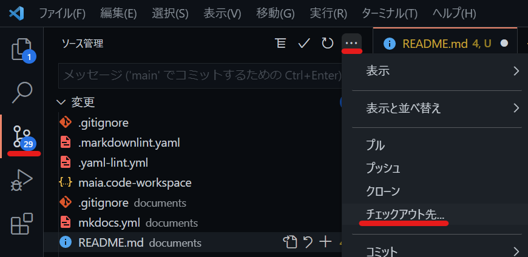
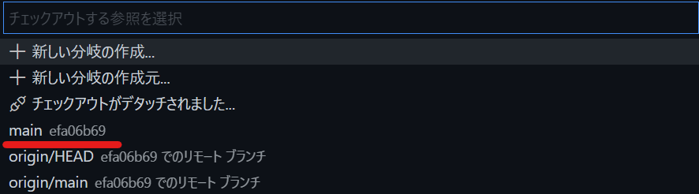
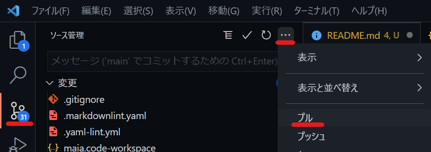
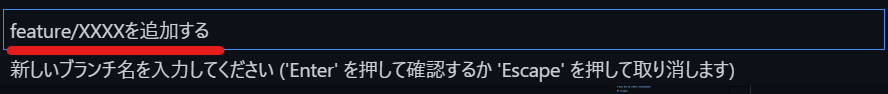

# Maris OSS 版 ドキュメントについて

## 本番環境

<https://wwww.marisossedition.org>

## ディレクトリ構造

documents ディレクトリ配下のディレクトリ、ファイルの配置は以下の通りです。

|             |                |                     |                  |                                            |
|-------------|----------------|---------------------|------------------|--------------------------------------------|
|contents     |                |                     |                  |ドキュメント本体                            |
|             |app-architecture|                     |                  |アプリケーションアーキテクチャ              |
|             |                |client-side-rendering|                  |CSR編                                       |
|             |                |console-app          |                  |コンソールアプリケーション編（※）          |
|             |                |overview             |                  |概要編                                      |
|             |assets          |                     |                  |共通資材（ロゴなど）                        |
|             |                |images               |                  |                                            |
|             |guidebooks      |                     |                  |ガイドライン系ドキュメント                  |
|             |                |app-testing          |                  |アプリケーションテスト（※）                |
|             |                |how-to-develop       |                  |アプリケーション開発手順                    |
|             |                |                     |dotnet            |.NET 編                                     |
|             |                |                     |local-environment |ローカル開発環境の構築                      |
|             |                |                     |vue-js            |Vue.js 編                                   |
|             |                |migration            |                  |マイグレーション                            |
|             |                |                     |dotnetfw-risk     |.NET Frameworkにとどまることのリスク        |
|             |                |                     |from-dotnetfw     |.NET Frameworkからの移行（※）              |
|             |                |modern-dev-process   |                  |開発プロセスのモダナイズ（※）              |
|             |images          |                     |                  |ページ固有の画像ファイル置き場              |
|             |                |app-architecture     |                  |mdファイルの配置ディレクトリと構造をそろえる|
|             |                |guidebooks           |                  |                                            |
|             |                |                     |app-testing       |                                            |
|             |                |                     |how-to-develop    |                                            |
|             |                |                     |migration         |                                            |
|             |                |                     |modern-dev-process|                                            |
|             |                |samples              |                  |                                            |
|             |                |terms                |                  |                                            |
|             |samples         |                     |                  |サンプルアプリケーション解説                |
|             |stylesheets     |                     |                  |既定のスタイルシートの上書き設定            |
|             |terms           |                     |                  |利用規約                                    |
|includes     |                |                     |                  |Snippets の置き場                           |
|             |abbreviations.md|                     |                  |略語用語集                                  |
|readme-images|                |                     |                  |README.md 内の画像ファイル置き場            |
|.gitignore   |                |                     |                  |mkdocs 用の gitignore                       |
|mkdocs.yml   |                |                     |                  |mkdocs の設定ファイル                       |
|README.md    |                |                     |                  |このドキュメント                            |

## ドキュメントの作成方法（わかっている人向けの大雑把な手順）

このリポジトリは GitHub-flow で開発を行います。
Feature ブランチの名前は「feature/<更新内容を表す名前>」として開発を行ってください。
記事の作成後は main ブランチへのマージを行う Pull Request を投げてください。

## ドキュメントの作成方法（詳細版）

### ローカルの main ブランチを最新にする

Visual Studio Code を起動して、 [ファイル] メニューから [ワークスペースを開く] を選択します。
クローンしたディレクトリ内にある maris.code-workspace ファイルを選択して開きます。

[ソース管理] メニューを開き、 [チェックアウト先] を選択します。



main ブランチを選択します（コミットハッシュは図とは異なるはずです。）。



main ブランチをチェックアウトしたら、 pull を実行して最新を取得します。



### Feature ブランチの作成

記事を作成するための Feature ブランチをローカルに作成します。
[ソース管理] メニューを開き、 [ブランチ] > [分岐の作成] を選択します。


作成するブランチ名を入力します。
ブランチ名は「feature/<更新内容を表す名前>」として Enter を押下します。



### ドキュメントの作成

ディレクトリ構成に従って Markdown ファイルを作成してください。

Markdown の作成にあたっては、 Material for MkDocs の Web サイトを参考にしてください。
素の Markdown とは異なる表現パターンがあるので、参考にしてください。

<https://squidfunk.github.io/mkdocs-material/reference/abbreviations/>

### 動作確認

記事をある程度作成したら、 mkdocs を用いて確認を行います。

Visual Studio Code で [ターミナル] を開きます。
ターミナルが開いていない場合は、以下の通り新たに開いてください。


[ターミナル] ウィンドウの右上のドロップダウンを開き、お好きなものを選択してください。
以降 Command Prompt を選択した場合の例を示します。


ターミナルのコマンドプロンプトで、 [mkdocs.yml] ファイルのあるディレクトリに移動してください。
ディレクトリ移動後、以下のコマンドを実行してください。

```plain
mkdocs serve
```

うまく実行できると、以下のようなメッセージが出て、 Web サーバーが起動します。

```plain
INFO     -  Building documentation...
INFO     -  Cleaning site directory
INFO     -  Documentation built in 1.04 seconds
INFO     -  [10:07:52] Serving on http://127.0.0.1:8000/
INFO     -  [10:07:53] Browser connected: http://127.0.0.1:8000/
```

最後に出力されている URL を任意のブラウザーで開いてください。
作成した記事を参照し、正しく表示できていることを確認します。

誤りがある場合は、そのまま Markdown を修正して保存します。
保存するとブラウザー側はホットリロードが行われ、即座に編集結果が反映されます。
また mkdocs.yml ファイルを編集した場合も、ファイルを保存した瞬間にホットリロードが走ります。

Markdown ファイルを追加した場合、ほとんどのケースで mkdocs.yml の nav セクションを修正する必要があります。

### 体裁の修正

markdownlint の拡張機能をインストールしていると、 [問題] ウィンドウに以下のような Markdown の体裁誤りを指摘するコメントが出ることがあります。


本リポジトリでは Markdown の体裁に誤りがあると、 Web サイトの発行が行えないようになっています。
警告が出ている場合は、メッセージを読んで必ず解消しましょう。

### 修正内容のコミット

記事の作成と体裁の修正が完了したら、 Feature ブランチにコミットします。
[ソース管理] メニューを開き、上部の [メッセージ] にコミットメッセージを入力します。
また [✓] アイコンを押下して、ローカルリポジトリにコミットします。

コミットは意味のある単位であれば、何回実施してもかまいません。

### Feature ブランチのアップロード

コミットが完了したら、 Feature ブランチをプッシュして、リモートリポジトリにアップロードします。
[ソース管理] メニューを開き、 [プッシュ] を選択します。


### プルリクエストの作成

GitHub でプッシュした Feature ブランチを main ブランチにマージするプルリクエストを作成してください。

TODO: 記載の修正が必要

> プルリクエストを作成すると、 Markdown の Lint と、ビルド可否のチェックが行われます。
>
> Lint の結果、警告がある場合はビルドパイプラインが失敗します。
> Lint の実行ログや実行結果は、ビルドパイプラインの詳細ログを参照することで確認できます。
> 問題のある個所と警告内容が出力されますので、対応してください。
>
> 
>
> 続いて mkdocs の実行ログを参照し、警告が出ていないことを確認してください。
> 警告が出ている場合は解消するようにします。
> mkdocs で警告やエラーが出ても、ビルドパイプラインは正常に終了してしまいます。
> 必ずログを確認するようにしましょう。
>
> プルリクエストをマージすると、継続的デプロイメントが走り、自動的に Web サイトが更新されます。
>
> ### 最終確認
>
> Web サイトの更新が完了したら、以下にアクセスして問題なく修正が反映されていることを確認します。
>
> <https://TODO>
>
> 問題がある場合は、再度 Feature ブランチを作成するところから再実施してください。
> 修正に時間がかかる場合は、以前のリリース物を再リリースし、切り戻すようにしてください。

## ドキュメント執筆環境の構築方法

### Visual Studio Code のインストール

以下のサイトから最新版の Visual Studio Code をインストールします。

<https://code.visualstudio.com/download>

### リポジトリのクローン

ローカルマシン内の適当なディレクトリで、このリポジトリをクローンします。
詳細な手順は以下を参照してください。

<https://docs.github.com/ja/github/creating-cloning-and-archiving-repositories/cloning-a-repository-from-github/cloning-a-repository>

### ユーザー名、メールアドレスの設定

クローンした Git リポジトリに対して、自分のユーザー名、メールアドレスを設定します。
コマンドプロンプトでクローンしたリポジトリのあるディレクトリに移動して、現在設定されているユーザー名、メールアドレスを確認します。

```plane
c:\hogehoge\maris>git config user.name
XXXXXXXXXXX

c:\hogehoge\maris>git config user.email
YYYYY@hoge.com
```

グローバルの設定が生きている場合は、以下を参照し、メールアドレスとユーザー名の上書き設定を推奨します。
メールアドレスは `GitHub が提供する no-reply メールアドレス` を設定することをおすすめします。
また GitHub 上の設定変更もあわせて行うことをおすすめします。

<https://docs.github.com/ja/github/setting-up-and-managing-your-github-user-account/managing-email-preferences/setting-your-commit-email-address>

### Visual Studio Code 拡張機能のインストール

Visual Studio Code の [ファイル] メニューから [ワークスペースを開く] を選択します。
クローンしたディレクトリ内にある maris.code-workspace ファイルを選択して開きます。

はじめてワークスペースを開いたとき、以下のようなダイアログが表示されるので、 [インストール] ボタンを押下します。


このダイアログ経由でインストールしなかった場合は、 [拡張機能] メニューから [推奨] のグループを開いて、以下の拡張機能をインストールします。

- Markdown All in One
- markdownlint


また必要に応じて以下の拡張機能をインストールします。

- Japanese Language Pack for Visual Studio Code
- Draw.io integration

### Pythonのインストール

以下のサイトから、 Windows 用の最新版 Python をインストールします。
インストール時に [Add Python 3.x to PATH] にチェックを入れてからインストールしてください。

<https://www.python.org/downloads/>

コマンドプロンプトを管理者権限で起動します。
以下のコマンドを実行して pip を更新します。

```plain
pip install --upgrade pip
```

### MkDocs と拡張機能のインストール

以下のコマンドを実行して、 Mkdocs と Mkdocs Material 拡張機能、Pymarkdown 拡張機能、 MkDocs Minify 拡張機能をインストールします。

```plain
pip install mkdocs
pip install mkdocs-material
pip install pymdown-extensions
pip install mkdocs-minify-plugin
```
