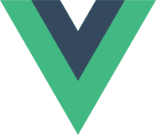

<!-- textlint-disable @textlint-rule/require-header-id -->

# クレジット表記 {#top}

## TypeScript {#typescript}

{ align="left" width="96" }

Microsoft and any contributors grant you a license to the Microsoft documentation and other content in this repository under the [Creative Commons Attribution 4.0 International Public License  :material-open-in-new:](https://creativecommons.org/licenses/by/4.0/legalcode){ target=_blank }, see the [LICENSE :material-open-in-new:](https://github.com/microsoft/TypeScript-Website/blob/cd489d078e7a2af8fdef6a6f7e6359f4c77a68a2/LICENSE){ target=_blank } file, and grant you a license to any code in the repository under the [MIT License :material-open-in-new:](https://opensource.org/licenses/MIT){ target=_blank }, see the [LICENSE-CODE :material-open-in-new:](https://github.com/microsoft/TypeScript-Website/blob/cd489d078e7a2af8fdef6a6f7e6359f4c77a68a2/LICENSE-CODE) file.

Microsoft, Windows, Microsoft Azure and/or other Microsoft products and services referenced in the documentation may be either trademarks or registered trademarks of Microsoft in the United States and/or other countries. The licenses for this project do not grant you rights to use any Microsoft names, logos, or trademarks. Microsoft's general trademark guidelines can be found at http://go.microsoft.com/fwlink/?LinkID=254653.

Privacy information can be found at https://privacy.microsoft.com/en-us/

Microsoft and any contributors reserve all other rights, whether under their respective copyrights, patents, or trademarks, whether by implication, estoppel or otherwise..

{ target=_blank }

## Vue.js {#vue-js style="clear:both;" }

{ width="96" align="left" }

<!-- textlint-disable ja-technical-writing/sentence-length -->

Vue.js artworks by Evan You is licensed under a Creative Commons Attribution-NonCommercial-ShareAlike 4.0 International License.

<!-- textlint-enable ja-technical-writing/sentence-length -->

{ target=_blank }

## Vite {#vite style="clear:both;" }

{ align="left" width="96" }

[MIT License :material-open-in-new:](https://github.com/vitejs/vite/blob/main/LICENSE){ target=_blank }

Copyright (c) 2019-present, Yuxi (Evan) You and Vite contributors

## VeeValidate {#vee-validate style="clear:both;" }

{ align="left" width="96" }

[MIT LICENSE :material-open-in-new:](https://github.com/logaretm/vee-validate/blob/main/LICENSE){ target=_blank }

Copyright (c) Abdelrahman Awad [logaretm1@gmail.com](mailto:logaretm1@gmail.com)

## Pinia {#pinia style="clear:both;" }

{ align="left" width="96" }

[MIT LICENSE :material-open-in-new:](https://github.com/vuejs/pinia/blob/v2/LICENSE){ target=_blank }

Copyright (c) 2019-present Eduardo San Martin Morote

## Axios {#axios style="clear:both;" }

{ align="left" width="96" }

[MIT LICENSE :material-open-in-new:](https://github.com/axios/axios-docs/blob/master/LICENSE){ target=_blank }

Copyright 2020-present John Jakob "Jake" Sarjeant

## Prettier {#prettier style="clear:both;" }

{ align="left" width="96" }

[MIT License :material-open-in-new:](https://github.com/prettier/prettier-logo/blob/master/LICENSE){ target=_blank }

Copyright 2017 James Long

## StyleLint {#stylelint style="clear:both;" }

{ align="left" width="96" }

[MIT License :material-open-in-new:](https://github.com/stylelint/stylelint.io/blob/main/LICENSE){ target=_blank }

Copyright (c) 2015 - 2017 Maxime Thirouin, David Clark & Richard Hallows

## Vitest {#vitest style="clear:both;" }

{ align="left" width="96" }

[MIT License :material-open-in-new:](https://github.com/vitest-dev/vitest/blob/main/LICENSE){ target=_blank }

Copyright (c) 2021-Present Vitest Team

<!-- textlint-enable @textlint-rule/require-header-id -->
