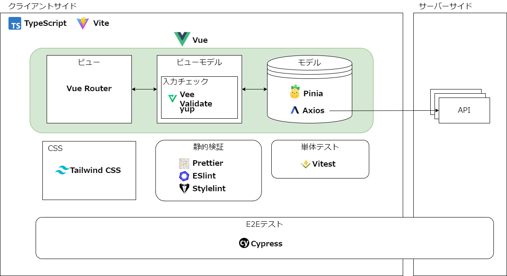
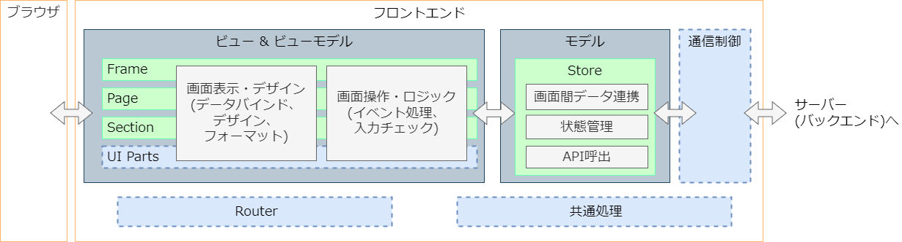
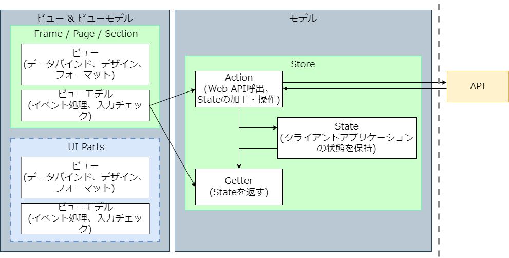
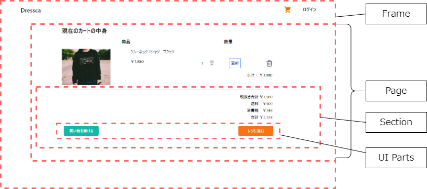
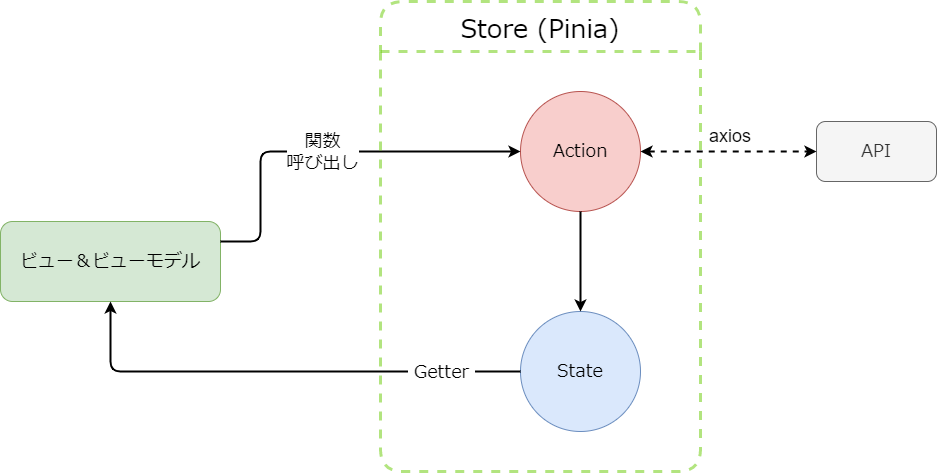
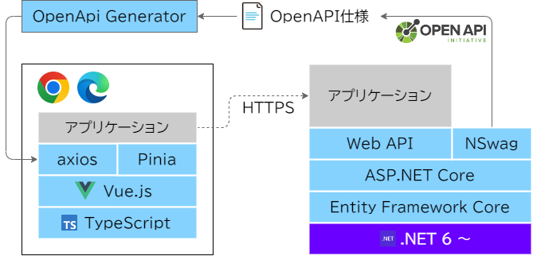

# フロントエンド

## 技術スタック ## {: #tech-stack }

Maris OSS 版を構成する OSS を以下に示します。



| 名称          | 説明                                                                               | ドキュメント |
| ----          | ----                                                                              | ---- |
| TypeScript    | JavaScript を拡張して静的型付にしたプログラミング言語。                               | [github](https://github.com/microsoft/TypeScript) |
| Vue.js        | シンプルな設計で拡張性の高い JavaScript のフレームワーク。                            | [公式ドキュメント](https://v3.ja.vuejs.org/) |
| Vite          | ES modules を利用してプロジェクトの高速な起動・更新を実現するフロントエンドビルドツール。 | [公式ドキュメント](https://ja.vitejs.dev/) |
| Pinia         | Vue.js 用の状態管理ライブラリ。                                                     | [公式ドキュメント](https://pinia.vuejs.org/) |
| Vue Router    | Vue.js を利用した SPA で、ルーティング制御をするための公式プラグイン。                 | [公式ドキュメント](https://router.vuejs.org/) |
| Axios         | Vue.js で非同期通信を行うためのプロミスベースのHTTPクライアント。                      | [github](https://github.com/axios/axios) |
| VeeValidate   | Vue.js 用のリアルタイムバリデーションコンポーネントライブラリ。                        | [公式ドキュメント](https://vee-validate.logaretm.com/v3/overview.html) |
| yup           | JavaScriptでフォームのバリデーションルールを宣言的に記述することのできるライブラリ。     | [github](https://github.com/jquense/yup) |
| Tailwind CSS  | utility class を使って独自のボタンなどを作成する CSS フレームワーク                    | [公式ドキュメント](https://tailwindcss.jp/) |
| Prettier      | JavaScript, Vue, HTML, CSS, JSON などのコードフォーマッター。                        | [公式ドキュメント](https://prettier.io/) |
| ESLint        | JavaScript の静的検証ツール。                                                       | [公式ドキュメント](https://typescript-eslint.io/) |
| Stylelint     | CSS の静的検証ツール。                                                               | [公式ドキュメント](https://stylelint.io/) |
| Vitest        | Vite 環境で動作する高速テスティングフレームワーク。                                    | [公式ドキュメント](https://vitest.dev/) |
| Cypress       | E2E テストツール。                                                                  | [公式ドキュメント](https://www.cypress.io/) |

## アーキテクチャ ## {: #frontend-architecture }

### MVVMパターン ### {: #mvvm-pattern }

Maris OSS 版で採用している Vue のソフトウェア・アーキテクチャは MVVM パターンに分類されます。
以下にアーキテクチャを示します。


| 名称 | 説明 |
| ---- | ---- |
| ビュー           | ブラウザへのレンダリングおよびブラウザからのイベントの待ち受けを役割として担います。ビューには UI の構造やスタイルを定義します。 |
| ビューモデル     | ブラウザからのイベントを受け、プレゼンテーションロジックを実行します。ビューモデルのプレゼンテーションロジックには、レンダリングに必要な処理や入力チェック、モデルを通じたデータの取得や更新などの処理を実装します。 |
| モデル            | ビジネスロジックとして状態管理やブラウザ外部との入出力を担います。モデルのビジネスロジックには、データ構造やデータの状態管理、Web API 呼び出しや Web API 呼び出し結果のハンドリングなどの処理を実装します。モデルは後述する Pinia のアーキテクチャに従って実装します。 |

Vue.js ではビューとビューモデルを [単一ファイルコンポーネント(SFC)](https://v3.ja.vuejs.org/guide/single-file-component.html#単一ファイルコンポーネント) と呼ばれる同一のファイル(拡張子.vue)に記述することができるので、図ではビュー&ビューモデルと表現しています。

### ビュー＆ビューモデル コンポーネント ### {: #view-and-viewmodel-component }



ビューとビューモデルはそれぞれブラウザへのレンダリングとそのブラウザから受けたイベントに対するプレゼンテーションロジックなどを行うコンポーネントです。
ブラウザに表示する画面は Component という複数の画面構成要素と View というそれらを組み立てたページから構成されます。
これらの画面コンポーネントが、デザインやデータバインドなどの画面表示と、イベント処理や入力処理などの画面要素に対する処理を持っています。

#### 画面コンポーネント #### {: #screen-components }

Vue.js はコンポーネント指向のフレームワークであることから画面要素を Component という再利用可能な単位で分割し、複数の画面コンポーネントを組み合わせることによって一つの画面(View)を構成します。
View がルーティングによって遷移される画面として指定されます。画面コンポーネントは実際の画面では以下のようなイメージになります。



#### 画面遷移 #### {: #screen-transition }

画面遷移には、Vue Router という Vue.js の拡張ライブラリを利用します。Vue Router はルーティング定義に基づいて遷移先の画面コンポーネントを特定し、表示する画面コンポーネントを切り替えることで画面遷移を実現します。Vue Router による画面遷移はフロントエンドのみで完結するためバックエンドへの通信を行いません。またMaris OSS 版では、「View」を切り替えの単位としています。

Vue Router : [公式ドキュメント](https://router.vuejs.org/introduction.html)


#### モデルコンポーネントとの連携 #### {: #linkage-with-model-component }

Vue.js ではバックエンドのアプリケーションとの連携をモデルが行います。そのため、ユーザーが行うビュー・ビューモデルからの処理や入力情報をモデルに連携する必要があります。この連携ではビューモデルのロジックから、モデルの Store の Getter や Action を呼び出して行います。

#### フロント入力チェック #### {: #input-validation }

文字種や文字数などの入力チェックは、ビューモデルで行い、不要なバックエンドとの通信の発生を防止します。 Maris OSS 版では VeeValidate と yup という OSS ライブラリを利用します。VeeValidate はフォームや入力コンポーネントの監視を行い、yup は検証スキームを定義する OSS です。


### モデルコンポーネント ### {: #model-component }


モデルはフロントエンドアプリケーションのビジネスロジックとして、扱うデータの状態管理や画面(ビュー)へのデータ連携、Web API の呼び出しおよびハンドリングなどの役割を持つコンポーネントです。このフロントエンドで扱う状態のことを Store と呼び、Maris では Pinia という Vue.js の Store ライブラリを利用して管理します。

Pinia : [公式ドキュメント](https://pinia.vuejs.org/introduction.html)

#### Storeの構成要素 #### {: #store-structure }

Pinia における Store は、State・Getter・Action という三つの要素から構成されています。



| 名称        | 説明                                                                                                                   |
| ----        | ----                                                                                                                  |
| State       | Store で管理するデータそのもの。                                                                                        |
| Getter      | Store で管理しているデータである State を画面コンポーネント(ビュー & ビューモデル)に返すもの。                               |
| Action      | Store で管理しているデータである State に対して変更を行うもの。また API の呼び出しや API のレスポンスのハンドリングを行うもの。 |

#### APIの呼び出しについて #### {: #about-invoke-api }

API の呼び出しは Action で行います。 Maris OSS 版では、 Promise ベースでリクエストの設定が容易な axios という OSS を利用します。

axios : [github](https://github.com/axios/axios)

#### バックエンドとのAPI連携

Maris OSS 版では API 仕様を OpenAPI を用いて作成します。ここには API の機能が説明されており、フロントエンドエンジニアとバックエンドエンジニアの間で API 設計に乖離が生じないようにします。

OpenAPI仕様 : [公式ドキュメント](https://swagger.io/specification/)



<!-- バックエンド編のAPIドキュメントへリンク -->

<!-- ### OpenAPI generator -->

## ディレクトリ構成 ## {: #project-structure }

Vue.js プロジェクトのディレクトリ構成は、ブランクプロジェクト作成時のデフォルトの構成を基に以下のように行います。なおこのディレクトリ配下の構成については、コンポーネント設計方法に依存するため、各プロジェクトの方針に従います。

``` text linenums="0"
<project-name>
├─ cypress/ ------------------ cypress による E2E テストに関するファイルを格納します。
├─ public/ ------------------- メディアファイルや favicon など静的な資産を格納します。
├─ src/
│  ├─ assets/ ---------------- コードや動的ファイルが必要とするCSSや画像などのアセットを格納します。
│  ├─ components/ ------------ 単体で自己完結している再利用性の高い vue コンポーネントなどを格納します。
│  ├─ config/ ---------------- 設定ファイルを格納します。
│  ├─ router/ ---------------- ルーティング定義を格納します。
│  ├─ stores/ ---------------- store に関するファイルを格納します。
│  ├─ views/ ----------------- ルーティングで指定される vue ファイルを格納します。またページ固有の挙動などもここに含めます。
│  ├─ App.vue
│  └─ main.ts
├─ index.html
└─ package.json
```

### viewsディレクトリ

views ディレクトリはルーティングで指定される vue ファイルを格納します。そのためこの下層のディレクトリ構造は URL となるので、サイト構造を意識して作成するようにしましょう。

``` text linenums="0"
src/
└─ views/
   ├─ account/
   │  ├─ Login.vue
   │  └─ Logout.vue
   ├─ catalog/
   └─ order/
```

### componentsディレクトリ

components ディレクトリは主に、再利用性の高い vue コンポーネントファイルを格納します。さらにこの下層ディレクトリはドメインで分割し、それを操作するコンポーネントを格納します。また vue ファイルに限らずプロジェクト内で再利用性の高いもの（iconなど）もこちらに格納します。

``` text linenums="0"
src/
└─ components/
   ├─ account/
   │  ├─ LoginForm.vue
   │  └─ LogoutMessage.vue
   ├─ product/
   │  ├─ ProductDetail.vue
   │  └─ ProductList.vue
   └─ icon/
```

Atomic Designでコンポーネント設計をする場合、atoms, molecules, organismsでディレクトリを構成します。この際、atoms と molecules は同一フォルダにコンポーネント構成パーツとしてまとめ、organisms との区別を「store へのアクセスの有無」で行うことでドメイン分割が容易になります。

``` text linenums="0"
src/
└─ components/
   ├─ atoms&molecules/
   │  ├─ Button.vue
   │  ├─ Input.vue
   │  └─ Form.vue
   │
   ├─ organisms/
   │  ├─ account/
   │  │  ├─ LoginForm.vue
   │  │  └─ LogoutMessage.vue
   │  └─ product/
   │     ├─ ProductDetail.vue
   │     └─ ProductList.vue
   └─ icon/
```

!!! note "URLとドメイン"
    views ディレクトリは URL 本位、components ディレクトリはドメイン本位で構成するため、下層ディレクトリ構造は一致しません。（部分的に一致することはあります。）

<!--
#### テストファイル

テストファイルは ``` __test__ ``` ディレクトリを作らず、対象コンポーネントの隣に配置します。
-->