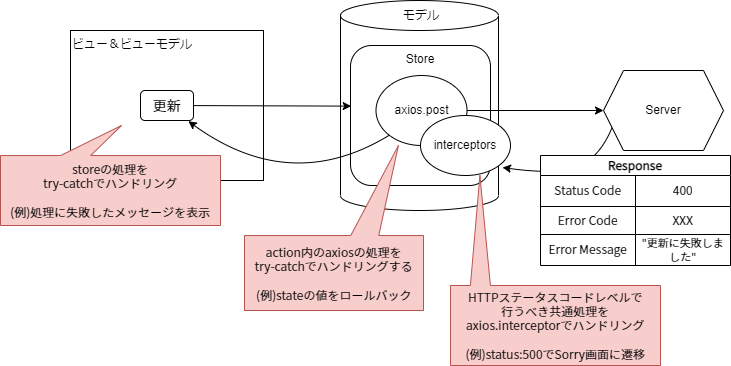

# 全体処理方式 {#top}

クライアントサイドレンダリング方式のアプリケーション全体で考慮すべきアーキテクチャについて、その実装方針を説明します。

## 例外処理方針 {#exception-policy}

## フロントエンドの例外処理 {#frontend-error-handling}

フロントエンドの例外処理方針は、ユーザーが自身で対応できるか、という観点が重要になります、
たとえば、セッションタイムアウトになるといったようなケースではユーザーが再度ログインすることで対処できます。
一方で、WebAPI サーバー内で予期しない問題が発生するといったケースでは、ユーザーは時間をおいて再度リクエストするなどのことしかできません。
このようにフロントエンドでは、ユーザーが例外を知りどのような対応をするか、ということに注目しメッセージの内容や通知方法を決定します。

## エラーハンドリング {#client-error-handling}

Vue.js アーキテクチャで例外が発生する箇所は以下のようなものが挙げられます。

- Vue コンポーネント
- Store
- WebAPI の応答
- その他

### クライアントコード内で発生する例外 {#client-code-error}

TypeScript で記述するコード(Store や共通部品)のハンドリングできる例外については、同期処理なら `try-catch` 、 Promise を利用した非同期処理なら `catch` チェーンで処理します。

（ただし非同期処理についてはキャッチできないため、Vue.js では親コンポーネントに対する `errorCaptured` フックを利用してハンドリングします。）
`catch` チェーンで書くのが良いのでは？

予期しないエラーについては、TypeScript の `window.onerror` や Vue.js の `Vue.config.errorHandler` のようなグローバルエラーハンドリングを利用します。

Vue コンポーネントで発生した例外は、ハンドリングしない場合、親コンポーネントへ例外が伝播し続けます。
ハンドリングできない例外については、最上位である main.ts のグローバルエラーハンドリングで処理されます。

### API 通信で発生する例外 {#api-connection-error}

API 通信で発生する例外についてはいくつかの段階に分けて処理します。なお API 通信には Axios を利用していることを前提としています。

1. HTTP ステータスコードの共通処理

   HTTP ステータスコード 500 番等に対して、 `axios.interceptors` を利用し、共通処理を実装します。

1. API レスポンスの業務例外に対する処理

    HTTP メソッドに対して `try-catch`(同期) もしくは `catch` チェーン(非同期)で処理します。

1. API レスポンスに対する画面処理

    ビュー・ビューモデルとモデルの責務を区別するため、 API 通信を含む(Store)メソッドに対して `try-catch` で処理します。
（今後追加予定）

## ログ出力方針 {#logging-policy}

（今後追加予定）

<!-- ### トランザクション管理 -->

<!-- ## 入力値検査方針 {#validation-policy} -->

<!-- ### セキュリティ対策 -->

## ヘルスチェック機能の実装方針 {#health-check-implementation}

AlesInfiny Maris では、 Web API を通じてシステムが正常稼働中か確認します。
`Microsoft.Extensions.Diagnostics.HealthChecks` の機能を利用してヘルスチェック用の Web API を実装しています。

実装方法の詳細については、[ヘルスチェック API の実装](../../guidebooks/how-to-develop/dotnet/health-check-api.md) およびサンプルアプリケーションを参照してください。
また、ヘルスチェックの全体方針については、[ヘルスチェックの必要性](../overview/dotnet-application-processing-system.md#health-check-necessity)を参照してください。

### API の仕様 {#api-specs}

ヘルスチェック用の Web API にリクエストを送信すると、アプリケーションおよび関連するデータベース等の稼働状況が確認されます。

アプリケーションとデータベース等の外部サービスが全て正常稼働している場合を正常状態とします。
アプリケーションとデータベース等の外部サービスのいずれかに異常がある場合を異常状態とします。

正常状態の場合は、 HTTP 200 のレスポンスを返却し、異常状態の場合は HTTP 503 のレスポンスを返却します。

|      HealthStatus      | ステータスコード | レスポンスボディ |                   詳細                   |
| ---------------------- | ---------------- | ---------------- | ---------------------------------------- |
| HealthStatus.Healthy   | 200              | Healthy          | サーバーがリクエスト受付可能             |
| HealthStatus.Unhealthy | 503              | Unhealthy        | サーバーがリクエスト受付不可/停止状態   |

[`HealthStatus` :material-open-in-new:](https://learn.microsoft.com/ja-jp/dotnet/api/microsoft.extensions.diagnostics.healthchecks.healthstatus){ target=_blank } をどのように使い分けるかについては、[HealthStatus の使い分け](../../guidebooks/how-to-develop/dotnet/health-check-api.md#health-status) を参照してください。

また、ロードバランサーによってはヘルスチェック実行時の HTTP メソッドが限られるため、 HTTP GET/HEAD メソッドに対応しています。

### 検証ロジックの追加 {#add-health-check-logic}

ヘルスチェック API は Web プロジェクトのアプリケーションとしての稼働状況と、データベース等の利用/依存しているサービスの稼働状況を取りまとめてレスポンスを返します。
そのため、ヘルスチェック API 実行時に独自の検証ロジックを含める場合は、検証対象の外部サービスに依存するプロジェクトへ実装します。

図のように、外部サービスのヘルスチェックロジックはプレゼンテーション層にあたる Web プロジェクトに直接実装しません。
検証対象の外部サービスに対応するそれぞれのプロジェクトへ分割してロジックを追加し、 Web プロジェクトから参照するようにします。

{ loading=lazy }
{ loading=lazy }
