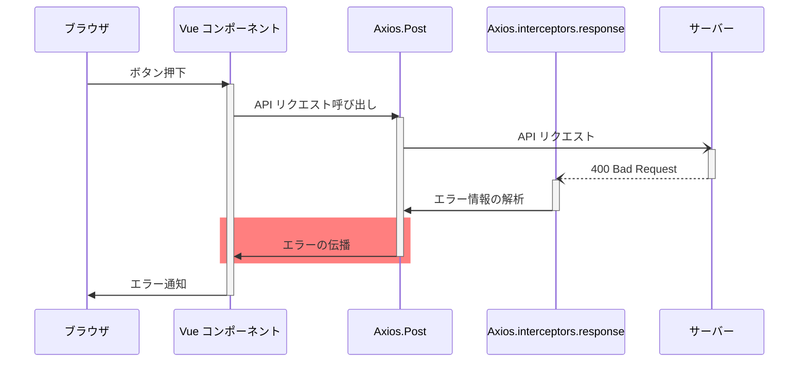

<!-- cspell:ignore rgba -->

# 例外処理方針 {#top}

ここでは、サーバーサイド・クライアントサイドそれぞれのアプリケーションの例外処理方針を説明します。

## サーバーサイドの例外処理方針 {#server-side-error-handling}

### 例外の種類 {#exception-types-server-side}

例外は、業務例外とシステム例外の 2 種類に分けて考えます。

- 業務例外：業務フローで想定されるエラーを表す例外です。
- システム例外：業務フロー上は想定されないシステムのエラーを表す例外です。

サーバーサイドアプリケーションでは、業務例外は独自に作成する例外クラス（ `System.Exception` の派生クラス）で表現します。システム例外は、原則として .NET が提供する例外クラスです。

### 例外の捕捉 {#catch-exceptions-server-side}

業務例外は、 API コントローラー上で発生が予測できる箇所では `try-catch` を利用して捕捉し、例外の内容に応じた適切なレスポンスを返却します。システム例外は原則として捕捉しません。

<!-- textlint-disable ja-technical-writing/sentence-length -->

API コントローラー上で捕捉されなかった業務例外、およびシステム例外は、グローバルエラーハンドラーである例外フィルター（ `Microsoft.AspNetCore.Mvc.Filters.IExceptionFilter` インターフェースの実装クラス）で捕捉します。

<!-- textlint-enable ja-technical-writing/sentence-length -->

### 例外の処理 {#error-handling-server-side}

Web API は、最終的に HTTP ステータスコードやレスポンスボディをクライアントサイドへ返します。 Web API 内部で例外が発生した場合は、それが伝わるレスポンスを返却する必要があります。

ユーザー自身の対応により正しい業務フローに復帰できるかどうかが重要です。
ユーザーの入力や操作が原因で例外が発生した場合、つまりユーザー自身の対応によって正しい業務フローに復帰できる場合は HTTP 4xx 系のステータスコードを返します。

<!-- textlint-disable ja-technical-writing/sentence-length -->

一般的なリクエストエラーを示す HTTP 400 Bad Request を返却する場合は、 [RFC 9457 :material-open-in-new:](https://www.rfc-editor.org/rfc/rfc9457.html){ target=_blank }で定義された ProblemDetails にスローされた業務例外の詳細を含めます。

<!-- textlint-enable ja-technical-writing/sentence-length -->

この処理は例外フィルターが行います。
それ以外の特定の 4xx ステータスコード（ HTTP 404 Not Found など）は、 API コントローラーの業務ロジック内で明示的に返却します。

サーバーサイド側の想定外の事態で例外が発生した場合は HTTP 500 を返します。
この処理は ASP.NET Core ランタイムが行います。

!!! note "「リソースが存在しない場合」を示す業務例外の取り扱い"

    何らかのリソースを取得・更新・削除しようとするとき、リクエストパラメーターに設定されたキーの指し示すリソースが存在しないことは、業務フロー上、一般的に起こりえます。この業務例外をどのような HTTP ステータスで返すかをアプリケーションとして決めておく必要があります。

    たとえば、「 GET メソッドでは HTTP 404 Not Found 、それ以外（ POST / PUT / PATCH / DELETE ）では HTTP 400 Bad Request を返す」といった方針が考えられます。

### クライアントサイドへの例外の伝播フロー {#server-and-client-side-error-handling}

サーバーサイドアプリケーションで発生するシステム例外や業務例外は、例外フィルターによって捕捉します。
例外フィルターでは、ログ出力方針に従ってアプリケーションログを出力します。

システム例外を例外フィルターで捕捉した場合は、 HTTP 500 のエラーレスポンスをクライアントサイドアプリケーションに返却します。
クライアントサイドアプリケーションは、システムエラー画面に遷移し、 Sorry メッセージを出力します。
クライアントサイドアプリケーション内で例外が発生した場合も、同様にシステムエラー画面に遷移します。

業務例外を例外フィルターで補足した場合は、 HTTP 400 のエラーレスポンスをクライアントサイドアプリケーションに返却します。
クライアントサイドアプリケーションは、その画面内のメッセージ領域にエラーメッセージを表示します。

{ loading=lazy }
{ loading=lazy }

## クライアントサイドの例外処理方針 {#frontend-error-handling}

クライアントサイドは、ユーザーが操作する、ログの取得が難しいなど、サーバーサイドとは異なる特性があります。
しかし例外処理方針としては、サーバーサイドと同様に正常なフローに復帰できるかどうかを最も重要な観点とし、そのためにどこで例外を捕捉しどのようにユーザーへ通知するかを検討します。

### 例外の種類 {#exception-types-client-side}

クライアントサイドの例外は、サーバーサイドと同様、業務例外とシステム例外の 2 種類に分けて考えます。

業務例外は、業務フローで想定されるエラーを表す例外です。システム例外は、業務フロー上は想定されないシステムのエラーを表す例外です。
API 通信においては、ステータスコードが 40x のエラーを業務例外、 50x のエラーをシステム例外として扱います。

### 例外の捕捉 {#catch-exceptions-client-side}

クライアントサイドで発生する例外には以下のようなものが考えられます。

- ユーザーが操作した際に発生する例外
- API 通信で発生する例外
- システムエラー
- ネットワークエラー

例外の発生が予測できる箇所では、同期処理は `try-catch` 、非同期処理は `catch` メソッドを利用します。予期せぬ例外が発生した場合は、 Vue.js の `app.config.errorHandler` や JavaScript の `window.onerror` といったグローバルエラーハンドリングで例外を捕捉します。

| 例外の種類                                            | ハンドリング方法              |
| ---------------------------------------------------- | ----------------------------- |
| Vue アプリケーション内で発生する例外                   | `app.config.errorHandler`    |
| JavaScript の構文エラーや Vue アプリケーション外の例外 | `window.onerror`             |
| 非同期処理で発生する例外                              | `window.onunhandledrejection` |

HTTP 通信で発生する例外について、レスポンスやステータスコードを解析する場合は、 Axios の `axios.interceptors.response` が有効です。

### 例外の処理 {#error-handling-client-side}

クライアントサイドの例外処理では、ユーザーが自身で対応できるか、という観点が重要になります。
たとえばセッションタイムアウトになるといったような場合は、ユーザーが再度ログインすることで対処できます。
一方 WebAPI サーバー内で予期しない問題が発生した場合、ユーザー自身では問題を解決できず、システム管理者に問い合わせをするようなフローが考えられます。

ユーザーに対しては、自身がどのような対応をできるかを考慮し、適切な通知方法を選択します。ポップアップ等の画面遷移を伴わずに通知するか、エラーページへ遷移するかは、ユーザーが操作を継続できるかどうかによって選択します。
一方開発者向けの通知では、エラーの詳細を把握するために必要な情報を収集することが重要です。開発環境であればコンソールログに出力し、本番環境ではログ収集ツールに送信する、などが考えられます。
ただしコンソールログへの出力は原則開発環境のみとします。

### API 通信で発生する例外処理フロー {#api-connection-error-flow}

クライアントサイドで最も多く発生する例外は、 API 通信に関連するものです。これはネットワークエラーやサーバーエラー、ユーザーの入力エラーなど様々な要因によって引き起こされます。

クライアントサイドでの例外の処理は、通知方法や画面遷移などシナリオによって様々なので、 API 通信の呼び出し元で個別に処理する必要があります。
たとえばリクエストに不備がある、といったユーザーが対応できるようなエラーについては、対応方法をユーザーに通知します。
一方で認証エラーやネットワークエラーのような共通の対応方法が考えられる場合には、特定のエラー処理の仕組み（カスタムエラーなど）を使って処理を一元化する方法が考えられます。

通知方法は、ユーザーの入力を阻害しないようなポップアップやトースト通知などを選択することが望ましいです。ただし、状況によってはエラー画面に遷移する必要がある場合もあります。シナリオに合わせて最適な方法を選択し、ユーザーにわかりやすくエラーを伝えることが重要です。

また、発生したエラーの解析には、以下の方法が考えられます。

- [axios.interceptors.response :material-open-in-new:](https://axios-http.com/ja/docs/interceptors){ target=_blank } でエラー情報を解析し、適切なカスタムエラーを返却する。
- エラー番号やエラーメッセージを通知し、開発者が問合せるための情報を提供する
- ユーザーの状況やエラー内容をログ収集ツールに送信する

以下は、 API 通信で発生する例外処理のフローです。

