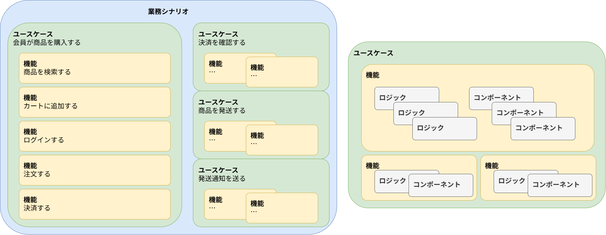

<!-- cspell:ignore Kent C. Dodds -->
# フロントエンドアプリケーションのテスト {#top}

本章では、フロントエンドアプリケーションのテスト方針について解説します。
AlesInfiny Maris では、継続的インテグレーションを前提として、静的解析から E2E テストまでを自動化し、品質と開発スピードの両立を目指します。
フロントエンドアプリケーションでは、ユースケースを効果的に検証するために、単体テストよりも結合テストを重視するテスト戦略（テスティングトロフィー）を採用します。
本章では、各テストの目的・対象・使用ツールを整理し、自動テストと手動テストの役割分担について解説します。

## 継続的インテグレーション {#continuous-integration}

[継続的インテグレーション :material-open-in-new:](https://developer.mozilla.org/en-US/docs/Glossary/Continuous_integration){ target=_blank }とは、変更をコードベースに頻繁に統合し、そのたびに自動ビルド・自動テストで検証するソフトウェア開発スタイルです。
継続的インテグレーションを実行する目的は、より短い期間でより多くの機能を本番環境へリリースすることです。
一方で、頻繁なコードベースへの変更には、既存の機能に対するリグレッションのリスクが伴います。
このようなリスクを軽減し、品質を保証したうえで継続的インテグレーションを実現するためには、品質の保証に十分な数の自動テストを継続的にメンテナンスする必要があります。
本章で紹介する下記のテストは、開発者のローカル環境および、 GitHub や Azure DevOps のような CI/CD 環境で自動実行できるようにします。
コードベースへ変更を加える前にこれらの自動テストを実行することによって、リグレッションのリスクの低減とリリーススピードの両立を実現します。

- 静的解析
    - 自動化
- 単体テスト
    - 自動化
- 機能内結合テスト
    - 自動化
- 機能間結合テスト
    - 自動化
- 画面・API 結合テスト
    - E2E テスト
    - 手動
- システムテスト
    - 手動
- ユーザー受け入れテスト
    - 手動
- ビジュアルリグレッションテスト
    - 自動化
- アクセシビリティテスト
    - 自動化

| 名称               | 目的 | 手法 |
| ---------------- | -- | -- |
| 静的解析             |    |    |
| 単体テスト            |    |    |
| 機能内結合テスト         |    |    |
| 機能間結合テスト         |    |    |
| クライアント・サーバー結合テスト |    |    |
| システムテスト          |    |    |
| ユーザー受け入れテスト      |    |    |
| ビジュアルリグレッションテスト  |    |    |
| アクセシビリティテスト      |    |    |

## 検証の対象 {#verification}

テストにより、機能要件と非機能要件を検証します。
自動テストでは、機能要件を中心に検証します。

### 機能要件 {#conception}

フロントエンドアプリケーションの機能を検証するうえで、中心になる概念がユースケースです。
テスティングトロフィーを提唱した Kent C. Dodds は、コードカバレッジよりも、ユースケースの網羅率を高めることが重要だと説明しています[^1]。
ユースケースとは、利用者や外部システムといったアクターが、ある目的を達成するために、システムとどう相互作用するかを表す UML で用いられる概念です[^2]。

ユースケースは 1 つ以上の複数の機能によって実現されます。
ユースケースは業務要件によって決定され、ユースケース図として記述されます。
そしてユースケースを実現するための機能が持つべき仕様として、機能要件が決定されます。

たとえば、 EC サイトにおける「会員が商品を購入する」というユースケースは、「商品を検索する」・「カートに追加する」・「ログインする」・「注文する」といった複数の機能によって実現されます。
このユースケースを実現するためには、「商品検索機能」や、「カート機能」、「ログイン機能」、「注文機能」といった機能が必要です。

業務シナリオは、ユースケースの組み合わせによって定義されます。
業務シナリオは業務要求によって決定され、業務フローとして記述されます。
たとえば、 EC サイト運営における受注から出荷までの業務シナリオは、「会員が商品を購入する」・「決済を確認する」・「商品を発送する」・「発送通知を送る」といった複数のユースケースをつないだ業務フローとして定義されます。

{ width="800" loading=lazy }

### 非機能要件 {#conception2}

非機能要件とその検証方法について述べます。

## テスト戦略のモデル {#test-strategy-model}

<!-- textlint-disable ja-technical-writing/sentence-length -->

テストの種類ごとの比率に関する戦略の代表的なモデルとして、[テストピラミッド :material-open-in-new:](https://web.dev/articles/ta-strategies?hl=ja#the_classic_the_test_pyramid){ target=_blank }と [テスティングトロフィー :material-open-in-new:](https://web.dev/articles/ta-strategies?hl=ja#testing_trophy){ target=_blank }が挙げられます。
テストピラミッドは単体テストを厚くし、結合テストや E2E テストを少数に絞るモデルであり、各テストの量を種類別に積み上げると、下図のようにピラミッド状の三角形を形成します。
テスティングトロフィーは、[React Testing Library :material-open-in-new:](https://github.com/testing-library/react-testing-library){ target_blank }の開発者として知られる [Kent C. Dodds :material-open-in-new:](https://kentcdodds.com/){ target_blank }により提唱された、単体テストよりも結合テストを重視するモデルです。このことにより、同様に積み上げた場合に下図のように中腹部が膨らんだトロフィー状の形を形成します。

<!-- textlint-enable ja-technical-writing/sentence-length -->

{ width="800" loading=lazy }

一般に、バックエンドアプリケーションにはテストピラミッドが適し、フロントエンドアプリケーションにはテスティングトロフィーのほうが適している傾向にあると考えられます。というのも、バックエンドアプリケーションで最もテストすべき対象は業務ロジックである一方で、フロントエンドアプリケーションで最もテストすべき対象はユーザー体験を含めたユースケースだと考えられるからです。
バックエンドアプリケーションの業務ロジックは関数やクラス単体に閉じた設計がなされるため、単体テストによって検証可能です。

しかし、フロントエンドアプリケーションのユースケースは、ユーザーからの入力、コンポーネントの見た目の変化、業務ロジックの相互作用によって実現されるので、単体テストではアプリケーションの機能を効果的に検証できません。
よって、フロントエンドアプリケーションでは、コンポーネント・業務ロジック・ユーザーとのインタラクション間の結合テストを重視することによって、アプリケーションの機能をより効果的に検証できます。

以上から、コンポーネント志向のフロントエンドアプリケーションでは、テスティングトロフィーに従い、コンポーネント間、コンポーネントと業務ロジック間、コンポーネントとユーザーとのインタラクション間の結合テストを重視します。バックエンドアプリケーションにおいて用いられるアプリケーションとデータベースとの結合テストとは異なるため、注意してください。フロントエンドアプリケーションとバックエンドアプリケーション間の結合の妥当性は、 E2E テストによって検証します。

!!! warning "テスト戦略のアンチパターン"
    E2E テストおよび手動テストへの依存のリスクを説明します。

| テスト種別            | 基幹システム | 企業向けSaaS | toC向けWebサービス |
| ---------------- | -----: | -------: | -----------: |
| 静的解析             |      高 |        高 |            高 |
| 単体テスト            |      高 |        高 |            高 |
| 機能内結合テスト         |      高 |        高 |            中 |
| 機能間結合テスト         |      高 |        高 |            中 |
| クライアント・サーバー結合テスト |      高 |        高 |          中〜高 |
| システムテスト          |      高 |      中〜高 |            中 |
| ユーザー受け入れテスト      |      高 |        中 |          低〜中 |
| ビジュアルリグレッションテスト  |      中 |        中 |            高 |
| アクセシビリティテスト      |      中 |      中〜高 |            高 |
| 性能テスト            |      高 |        高 |            高 |
| セキュリティテスト        |      高 |        高 |          中〜高 |
| 運用監視・本番検知        |      高 |        高 |            高 |


## テストツール {#testing-tools}

テストの種類と目的に応じて適切なテストツールを採用します。
それぞれのテストツールについて説明します。

- Prettier
- ESLint
- Stylelint
- tsc/vue-tsc
- Vitest
- Vitest Browser Mode
- Vue Test Utils
- Lighthouse CI
- Playwright

## 対象となるアプリケーション構成 {#target-application-structure}

CSR 編で扱うアプリケーションのコードベースは、次のようなフォルダー構成を想定します。
全体像は [フロントエンドアーキテクチャ - フォルダー構成](../../frontend-architecture.md#project-structure) を参照してください。

```text title="src 配下のフォルダー構成" linenums="0"
<project-name>
├─ src/
│  ├─ system-common/
│  ├─ business-common/
│  ├─ feature1/
│  ├─ feature2/
│  ├─ authentication/
│  ├─ basket/
│  ├─ catalog/
│  └─ ordering/ 
```

買い物かご機能、カタログ機能、注文機能はそれぞれ別のチームが開発することを想定します。

```text title="feature 配下のフォルダー構成" linenums="0"
<project-name>
├─ src/
│  ├─ components/ ------------ 再利用性の高い Vue コンポーネントを格納します。
│  ├─ composables/------------ 状態を持つロジックを再利用するための関数を格納します。
│  ├─ plugins/    ------------ アプリ全体に横断的な機能を格納します。
│  ├─ router/ ---------------- ルーティング定義を格納します。
│  ├─ services/ -------------- ページとストアの処理を中継するサービスを格納します。
│  ├─ stores/ ---------------- ストアの定義を格納します。
│  └─ views/ ----------------- ルーティング定義に対応するページコンポーネントを格納します。
```

以下では、テストの種類ごとに、目的、対象、利用するツールについて述べます。

## 静的解析 {#static-analysis}

プログラムを実行せずにソースコードを解析することで、不具合の原因となる記述や規約違反を検出します。

### 目的 {#stating-analysis-purpose}

- フォーマットを統一し、規約への準拠を保証する
- 不具合を早期に検出する

### 対象 {#static-analysis-targets}

コードベース全体を対象とします。

### 使用ツール {#static-analysis-tools}

- フォーマッター：設定に従ってコードのフォーマットを自動整形します。
    - Prettier
- リンター：規約違反や記述ミス、保守性の低い書き方、潜在的な不具合につながるコードを検出します。一部は自動修正できます。
    - ESLint
    - Stylelint
- 型チェッカー：型の整合性を検証し、型の不一致による問題を静的に検出します。
    - tsc
    - vue-tsc

## 単体テスト {#unit-testing}

アプリケーションを構成するロジックを、個々のモジュール単位で検証します。
データ取得やグローバルな状態など、個々のモジュールの外部に依存する箇所はモック化してテストします。

### 目的 {#unit-testing-purpose}

- ロジックの正しさを高速に検証する
- 異常系や境界値を網羅しやすくする
- 不具合の原因箇所を特定しやすくする

### 対象 {#unit-testing-targets}

機能を実現するロジックを検証します。
たとえば、分岐条件・バリデーションのルール・バックエンドの API レスポンスから画面へ詰め替える項目・ストアに保存する項目を検証します。

#### ソースコード {#unit-testing-targets-source}

- composables
- services
- stores
- plugins

これらはロジックの正しさが重要です。
そのため、コードカバレッジを重視します。
router は単なるルーティングの設定に近いので、単体テストの効果が低いです。

### 使用ツール {#unit-testing-tools}

- Vitest

## 結合テスト {#integration-testing}

テスティングトロフィーで最も重視すべきテストの種類です。
バックエンドアプリケーションからの API レスポンスはモック化します。

### 目的 {#integration-testing-purpose}

- UI コンポーネント単位での振る舞いを確認する
- ユーザー操作に対する表示やイベント発火を確認する
- ロジックと描画の結び付きが正しいことを確認する

### 対象 {#integration-testing-targets}

ユースケースを実現するユーザーインタラクション・ロジック・コンポーネント間の結合を検証します。

#### ソースコード {#integration-testing-targets-source}

- components
- views

これらはロジックに加えて、描画結果や操作に対する振る舞いが重要です。
そのため、コードカバレッジではなく、ユースケースの網羅率を重視します。

### 使用ツール {#integration-testing-tools}

- Vitest
- Vitest Browser Mode
- Vue Test Utils

## ビジュアルリグレッションテスト {#visual-regression-testing}

画面やコンポーネントの見た目を画像として比較し、意図しない差分を検出します。

### 目的 {#visual-regression-testing-purpose}

- レイアウト崩れやスタイル崩れを検出する

### 対象 {#visual-regression-testing-targets}

- components
- views

### 使用ツール {#visual-regression-testing-tools}

- Vitest Browser Mode を用いたスクリーンショット比較

    - components に対して実行します。

- Playwright

    - views に対して実行します。

## アクセシビリティテスト {#accessibility-testing}

### 目的 {#accessibility-testing-purpose}

### 対象 {#accessibility-testing-targets}

- views

### 使用ツール {#accessibility-testing-targets}

- Lighthouse CI

## E2E テスト {#e2e-testing}

実際の利用に近い形でアプリケーション全体を操作し、ユースケース単位で動作を検証します。
または 1 つのアプリケーションに閉じた範囲で、業務シナリオあるいは業務シナリオの一部を検証します。

### 目的 {#e2e-testing-purpose}

- 単体テスト・結合テストでは検出できない不具合を検出する

### 対象 {#e2e-testing-targets}

- ユースケース
- 業務シナリオ（業務シナリオの一部）

E2E テストを実行するためには、バックエンドアプリケーションの起動、データベースの準備、外部サービスのモックといった準備が必要です。
そのため、実装・実行・保守ともに高いコストを要します。
よって、対象を必要最小限に絞り込むことが重要です。
対象を絞り込むために、下記の 2 種類[^3]に該当する対象を選定します。

1. ハッピーパス（ゴールデンパス）
テスト対象のアプリケーションにおいて、最も一般的であると判断されるユースケースです。
EC サイトであれば、「会員が商品を購入する」といったユースケースが考えられます。

1. ネガティブパス（Scary Path）
テスト対象のアプリケーションの異常系のユースケースのうち、想定外の動作をした場合にリスクの高いユースケースです。
EC サイトであれば、「会員が商品を購入する」といったユースケースにおいて、外部の決済サービスの不通により購入がエラーになった場合が考えられます。

この 2 種類の共通点は、システムが想定通りの動作をしなかった場合に業務上クリティカルな影響があることです。それゆえ、 E2E テストの実行に高いコストを支払ったとしても、これらのパスの動作を検証する価値があります。

### 使用ツール {#e2e-testing-tools}

- Playwright

## 手動テスト {#manual-testing}

業務シナリオに沿って手動でシステムを操作することで実行します。
手動テストは CI/CD パイプラインで実行しないので、使用ツールについては説明しません。

### 目的 {#manual-testing-purpose}

業務シナリオを検証します。
下記のように、 E2E テストまでの自動テストでは検出できないことがある不具合を検出します。

- UX に関する問題
- 外部サービスに依存する問題
- パフォーマンスに関する問題
- セキュリティに関する問題

### 対象 {#manual-testing-targets}

- 外部環境も含むアプリケーション全体

[^1]:[How to know what to test :material-open-in-new:](https://kentcdodds.com/blog/how-to-know-what-to-test#how-do-i-know-where-to-start-in-an-app){ target_blank }（2026/4 閲覧）
[^2]:要出典
[^3]:[Test paths: Typical kinds of test cases :material-open-in-new:](https://web.dev/articles/ta-test-cases#test_paths_typical_kinds_of_test_cases){ target_blank }
