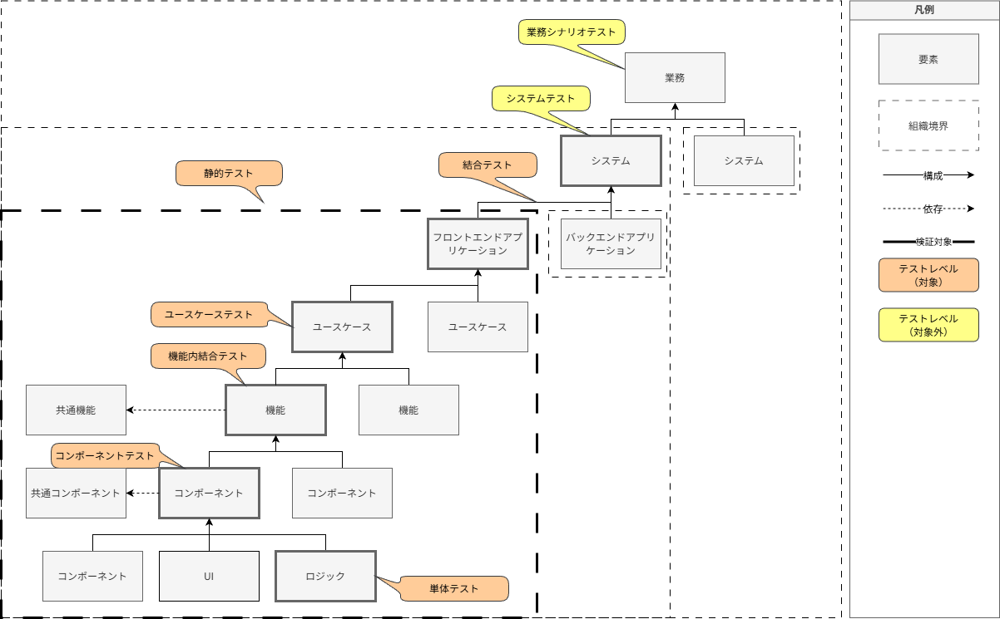
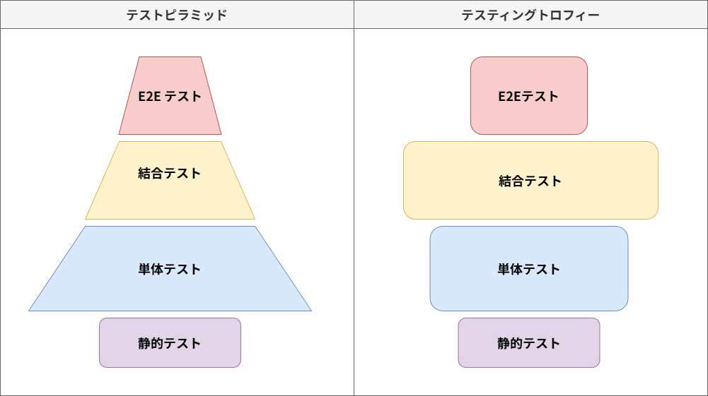

<!-- cspell:ignore Kent C. Dodds -->
# フロントエンドアプリケーションのテスト {#top}

本章では、フロントエンドアプリケーションのテスト方針について解説します。
AlesInfiny Maris では、継続的インテグレーションを目的として、静的テストから E2E テストの一部までを自動化し、品質と開発スピードの両立を目指します。
本章では自動テストが可能なテストレベルのみを扱い、システムテストや受け入れテストといったテストレベルについては扱いません。

## 概観 {#overview}

下記は大規模なエンタープライズ向けアプリケーションを想定した模式図です。
システムの構成要素、テストによる検証対象、適用する [テストレベル](../index.md#test-level)、組織境界を示しています。

{ width="800" loading=lazy }

要素の一覧を表に示します。

| 要素                           | 構成                                                        | 依存関係                     |
| ------------------------------ | ----------------------------------------------------------- | ---------------------------- |
| フロントエンドアプリケーション | ユースケースによって構成される                              | —                            |
| ユースケース                   | 機能によって構成される                                      | —                            |
| 機能                           | コンポーネントによって構成される                            | 共通機能に依存する           |
| コンポーネント                 | ロジック・UI・別のコンポーネントによって構成される          | 共通コンポーネントに依存する |
| UI                             | コンポーネントの構成要素のうち、HTML・CSS で構成される部分  | —                            |
| ロジック                       | コンポーネントの構成要素のうち、TypeScript で構成される部分 | —                            |

テストの一覧を表に示します。

| テストレベル      | 名称                 | 自動／手動 | 内容                                                                                         |
| ----------------- | :------------------- | ---------- | :------------------------------------------------------------------------------------------- |
| 単体テスト (UT0)  | 静的テスト           | 自動       | 不具合の原因となる記述や規約違反を検出                                                       |
| 単体テスト (UT0)  | 単体テスト           | 自動       | モジュール単位でUI・ロジック・コンポーネントの動作を検証                                           |
| 単体テスト (UT0)  | コンポーネントテスト | 自動       | UI・ロジック・コンポーネント間の結合によるコンポーネントの実現を検証                         |
| 単体テスト (UT0)  | 機能内結合テスト     | 自動       | コンポーネントの結合による機能の実現を検証                                                   |
| 単体テスト (UT0)  | ユースケーステスト   | 自動       | 機能間の結合によるユースケースの実現を検証                                                   |
| 結合テスト (ITa) | 自動 E2E テスト      | 自動       | 重要なユースケースについて、フロントエンド・バックエンドアプリケーション間の結合を自動で検証 |
| 結合テスト (ITa)  | E2E テスト           | 手動       | フロントエンド・バックエンドアプリケーション間の結合を手動で検証                             |

??? info "エッジケース"
    エッジケースについて解説します。

## テスト戦略 {#test-strategy-model}

<!-- textlint-disable ja-technical-writing/sentence-length -->

テスト戦略の代表的なモデルとして、[テストピラミッド :material-open-in-new:](https://web.dev/articles/ta-strategies?hl=ja#the_classic_the_test_pyramid){ target=_blank }が挙げられます。
テストピラミッドは単体テストを厚くし、結合テストや E2E テストを少数に絞るモデルであり、各テストの量を種類別に積み上げると、下図のようにピラミッド状の三角形を形成します。

 一方で、フロントエンドアプリケーションのテストの文脈でよく挙げられるモデルが、[テスティングトロフィー :material-open-in-new:](https://web.dev/articles/ta-strategies?hl=ja#testing_trophy){ target=_blank }です。
テスティングトロフィーは、[React Testing Library :material-open-in-new:](https://github.com/testing-library/react-testing-library){ target_blank }の開発者として知られる [Kent C. Dodds :material-open-in-new:](https://kentcdodds.com/){ target_blank }により提唱された、単体テストよりも結合テストを重視するモデルです。上述の表に当てはめると、機能内結合テストや機能間結合テストが単体テストよりも重視されます。このことにより、同様に積み上げた場合に下図のように中腹部が膨らんだトロフィー状の形を形成します。

<!-- textlint-enable ja-technical-writing/sentence-length -->

{ width="800" loading=lazy }

toC 向け Web サービスでは、 ユーザー体験の良し悪しが競争力の源泉となる傾向にあるので、ユーザーインタラクションに関する機能とその品質を重視する必要があります。
このことにより、フロントエンドアプリケーションを構成するコードのうち、 UI に関するコードのほうがロジックに関するコードよりも多くを占める傾向性があると考えられます。

一方で、基幹システムのようなエンタープライズ向け業務アプリケーションでは、 ユーザーの利便性よりもデータの整合性や権限管理が重要視される傾向にあると考えられます。そのため、フォームの入力値検証などの業務ロジックをフロントエンドアプリケーションにも厚く実装する必要があります。
よって、 ロジックに関するコードの比率が toC 向け Web サービスと比較して多くなると考えられます。

そのため、エンタープライズ向け業務アプリケーションの領域では、たとえフロントエンドアプリケーションであっても、単体テストを重視するテストピラミッド戦略のほうが、現実を反映した適切なモデルになりやすいと考えられます。

??? warning "テスト戦略のアンチパターン"
    E2E テストおよび手動テストに過度に依存したテスト戦略は、テストがリリースのボトルネックになる状況へ陥りやすいため、避けるべきです。
    E2E テストは、フロントエンドアプリケーションとバックエンドアプリケーションを実際に連携させ、ユーザー操作に近い形で機能を検証できる有効な手段です。
    しかし、画面操作、通信、データベース更新などを含むため、単体テストや結合テストと比べて実行に物理的な時間を要します。
    また、テスト環境、外部サービス、テストデータの状態などの影響を受けやすく、エラー原因の切り分けにも時間がかかります。
    手動テストも、実際の利用者に近い観点で確認できる一方、機能追加や修正の都度広範囲の回帰検証を手動で実行することは難しく、変更の影響を十分に確認できないままリリースせざるを得ない状況を招きます。
    その結果、 E2E テストや手動テストへの依存度が高いほど、リリース前の検証作業が肥大化し、リリース頻度を下げるボトルネックになります。
    アプリケーションの規模が大きく、運用期間が長くなるほど、テストがボトルネックとなるリスクは高くなると考えられます。

## エンタープライズ向けアプリケーションのテスト戦略 {#test-strategy-for-ja-enterprise-application}

大規模システムの開発では、小規模システムと比較して、組織境界をまたいだテストが指数関数的に高コストになる傾向があると想定されます。
そのため、システム全体の構成要素となるサブシステムや、サブシステムを構成する機能は、できるだけ組織の境界をまたがないようにデザインされる傾向にあります。
よって、大規模なエンタープライズ向けアプリケーションのテスト戦略も、できるだけ組織に閉じた形で実装・実行可能になるよう策定するほうが運用上有利だと考えられます。

テスト戦略を選択するうえで、テスト工程の実行スピードが機能リリースのボトルネックになるかどうかは重要です。
ミッションクリティカルでない領域の Web サービスや SaaS 、社内ツールといったアプリケーションはリリースの頻度が高くなる傾向になるため、自動テストを用いて回帰検証の時間の短縮を必要とします。
逆に、公共・金融などといったミッションクリティカルな業務領域のアプリケーションはリリースの頻度が低くなる傾向にあるので、自動テストがボトルネックとなる可能性も低くなります。

??? note "継続的インテグレーション"
    [継続的インテグレーション :material-open-in-new:](https://developer.mozilla.org/en-US/docs/Glossary/Continuous_integration){ target=_blank }とは、変更をコードベースに頻繁に統合し、そのたびに自動ビルド・自動テストで検証するソフトウェア開発スタイルです。
    継続的インテグレーションを実行する目的は、より短い期間でより多くの機能を本番環境へリリースすることです。
    一方で、頻繁なコードベースへの変更には、既存の機能に対するリグレッションのリスクが伴います。
    このようなリスクを軽減し、品質を保証したうえで継続的インテグレーションを実現するためには、品質の保証に十分な数の自動テストを継続的にメンテナンスする必要があります。本章で紹介する下記のテストは、開発者のローカル環境および、 GitHub や Azure DevOps のような CI/CD 環境で自動実行できるようにします。コードベースへ変更を加える前にこれらの自動テストを実行することによって、リグレッションのリスクの低減とリリーススピードの両立を実現します。

## テストツール {#testing-tools}

テストの種類と目的に応じて適切なテストツールを採用します。
それぞれのテストツールについて説明します。

- [Prettier :material-open-in-new:](https://prettier.io/){ target_blank }

    ソースコードのフォーマットを自動的に整形します。

- [ESLint :material-open-in-new:](https://eslint.org/){ target_blank }

    TypeScript のコードを静的に解析し、不具合の原因となる記述やコーディング規約違反を検出します。

- [Stylelint :material-open-in-new:](https://stylelint.io/){ target_blank }

    CSS を静的解析し、記述ミスやスタイル規約違反を検出します。

- [tsc(vue-tsc) :material-open-in-new:](https://github.com/vuejs/language-tools){ target_blank }

    TypeScript の型チェックを行い、型の不整合を検出します。

- [Vitest :material-open-in-new:](https://vitest.dev/){ target_blank }

    テストランナーとして、自動テストを実行します。

- [Vitest Browser Mode :material-open-in-new:](https://vitest.dev/guide/browser/){ target_blank }

    実ブラウザーまたはヘッドレスブラウザー上でテストを実行し、ブラウザー固有の挙動を含めて検証します。

- [Vue Test Utils :material-open-in-new:](https://test-utils.vuejs.org/){ target_blank }

    Vue コンポーネントをマウントし、表示内容やイベント、状態変化を検証するためのテストユーティリティです。

- [Playwright :material-open-in-new:](https://playwright.dev/){ target_blank }

    実ブラウザーを操作して、ユーザー操作に近い形で E2E テストを実行します。

- [Lighthouse CI :material-open-in-new:](https://github.com/GoogleChrome/lighthouse-ci/){ target_blank }

    Web アプリケーションのパフォーマンス、アクセシビリティ、 SEO などの指標を計測します。

## 対象となるアプリケーション構成 {#target-application-structure}

CSR 編で扱うアプリケーションのコードベースは、次のようなフォルダー構成を想定します。
全体像は [フロントエンドアーキテクチャ - フォルダー構成](../../frontend-architecture.md#project-structure) を参照してください。

```text title="src 配下のフォルダー構成" linenums="0"
<project-name>
├─ src/
│  ├─ system-common/
│  ├─ business-common/
│  ├─ feature1/
│  ├─ feature2/
│  ├─ authentication/
│  ├─ basket/
│  ├─ catalog/
│  └─ ordering/ 
```

```text title="各 feature 配下のフォルダー構成" linenums="0"
<project-name>
├─ src/
│  ├─ components/ ------------ 再利用性の高い Vue コンポーネントを格納します。
│  ├─ composables/------------ 状態を持つロジックを再利用するための関数を格納します。
│  ├─ plugins/    ------------ アプリ全体に横断的な機能を格納します。
│  ├─ router/ ---------------- ルーティング定義を格納します。
│  ├─ services/ -------------- ページとストアの処理を中継するサービスを格納します。
│  ├─ stores/ ---------------- ストアの定義を格納します。
│  └─ views/ ----------------- ルーティング定義に対応するページコンポーネントを格納します。
```

以下では、テストの種類ごとに、目的、対象、利用するツールについて詳細を説明します。

## 静的テスト {#static-analysis}

プログラムを実行せずにソースコードを解析することで、不具合の原因となる記述や規約違反を検出します。

### 目的 {#stating-analysis-purpose}

- フォーマットを統一し、規約への準拠を保証する
- 不具合を早期に検出する

### 対象 {#static-analysis-targets}

コードベース全体を対象とします。

### 使用ツール {#static-analysis-tools}

- フォーマッター：設定に従ってコードのフォーマットを自動整形します。
    - Prettier
- リンター：規約違反や記述ミス、保守性の低い書き方、潜在的な不具合につながるコードを検出します。一部は自動修正できます。
    - ESLint
    - Stylelint
- 型チェッカー：型の整合性を検証し、型の不一致による問題を実行前に検出します。
    - tsc
    - vue-tsc

## 単体テスト {#unit-testing}

アプリケーションを構成するロジックを、個々のモジュール単位で検証します。
API 経由のデータ取得や、グローバルな状態など、個々のモジュールの外部に依存する箇所はモック化します。

### 目的 {#unit-testing-purpose}

- ロジックの正しさを高速に検証する
- 異常系や境界値を網羅しやすくする
- 不具合の原因箇所を特定しやすくする

### 対象 {#unit-testing-targets}

機能を実現するロジックを検証します。
たとえば、分岐条件・バリデーションのルール・ API レスポンスから画面へ詰め替える項目・ストアに保存する項目を検証します。

#### ソースコード {#unit-testing-targets-source}

- composables
- services
- stores
- plugins

これらはロジックの正しさが重要になるので、コードカバレッジを重視します。

### 使用ツール {#unit-testing-tools}

- Vitest

## コンポーネントテスト {#intra-feature-integration-testing}

機能内の UI・ロジック・コンポーネント間の結合を検証します。
API 経由のデータ取得や、グローバルな状態など、各機能の外部に依存する箇所はモック化します。

### 目的 {#intra-feature-integration-testing-purpose}

- UI コンポーネント単位での振る舞いを確認する
- ユーザー操作に対する表示やイベント発火を確認する
- ロジックと描画の結び付きが正しいことを確認する

### 対象 {#intra-feature-integration-testing-targets}

ユースケースを実現するユーザーインタラクション・ロジック・コンポーネント間の結合を検証します。

#### ソースコード {#intra-feature-integration-testing-source}

- components
- views

これらはロジックに加えて、描画結果や操作に対する振る舞いが重要です。
そのため、コードカバレッジに加えて、ユーザーインタラクションの網羅率も重視する必要があります。

実ブラウザー操作に近い形で検証するために、 Vitest Browser Mode の [Context API :material-open-in-new:](https://vitest.dev/api/browser/context.html#context-api){ target_blank }を用いてテストを実装します。

### 使用ツール {#intra-feature-integration-testing-tools}

- Vitest
- Vitest Browser Mode
- Vue Test Utils

## ユースケーステスト {#inter-feature-integration-test}

機能間結合テストでは、フロントエンドアプリケーション内の機能と機能の間の結合を検証します。

## E2E テスト {#e2e-testing}

E2E テストでは、フロントエンドアプリケーションとバックエンドアプリケーション間の結合を検証します。
下記では、テストツールを利用した自動 E2E テストについて扱い、手動でアプリケーションを操作する E2E テストについては扱いません。
外部のシステム・サブシステムに依存する箇所はモック化します。

### 目的 {#e2e-testing-purpose}

- 単体テスト ( UT0 )では検出できない不具合を検出する
- フロントエンド・バックエンドアプリケーション間の API リクエスト・レスポンスの形式の妥当性を検証する

### 対象 {#e2e-testing-targets}

自動 E2E テストを実行するためには、バックエンドアプリケーションの起動、データベースの準備、外部サービスのモックといった準備が必要です。
そのため、実装・実行・保守ともに高いコストを要するので、自動化の対象は必要最小限に絞り込むことが重要です。
対象を絞り込む基準として、下記の 2 種類[^1]に該当する対象を選定します。

1. ハッピーパス（ゴールデンパス）
テスト対象のアプリケーションにおいて、最も一般的であると判断されるユースケースです。
EC サイトであれば、「会員が商品を購入する」といったユースケースが考えられます。

1. ネガティブパス（Scary Path）
テスト対象のアプリケーションの異常系のユースケースのうち、想定外の動作をした場合にリスクの高いユースケースです。
EC サイトであれば、「会員が商品を購入する」といったユースケースにおいて、外部の決済サービスの不通により購入がエラーになった場合が考えられます。

この 2 種類の共通点は、システムが想定通りの動作をしなかった場合に業務上クリティカルな影響があることです。
それゆえ、自動化に高いコストを支払ったとしても検証する価値があります。

### 使用ツール {#e2e-testing-tools}

- Playwright
- Mock Service Worker

[^1]:[Test paths: Typical kinds of test cases :material-open-in-new:](https://web.dev/articles/ta-test-cases#test_paths_typical_kinds_of_test_cases){ target_blank }
