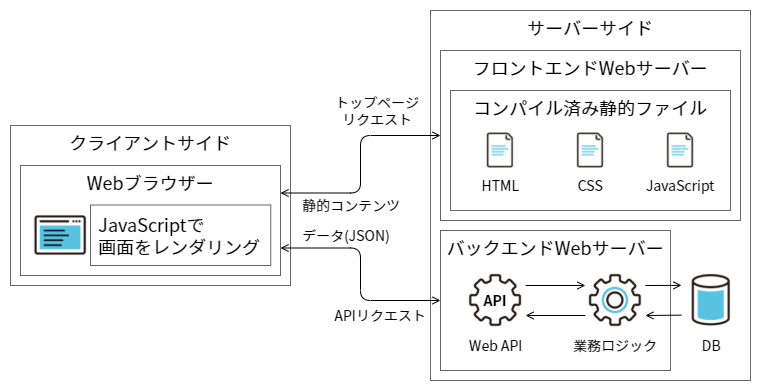
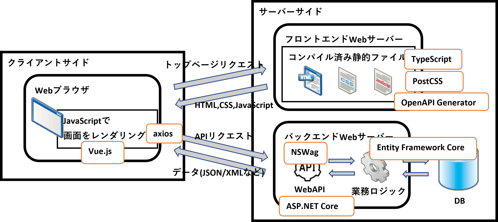

# 概要編

## 構築できるアプリケーション形態

Maris OSS版を利用することで構築できるアプリケーションの概要を、アプリケーション形態ごとに説明します。

- Webアプリケーション（クライアントサイドレンダリング）  
  HTMLをクライアント側JavaScriptでレンダリングする方式のWebアプリケーションです。
  画面初期表示時にはコンパイル済みの静的ファイルをダウンロードして、JavaScriptで動的に画面をレンダリングします。業務データの取得、更新などの処理を行う際は、Web API経由でサーバー側の業務ロジックを呼び出します。

    { loading=lazy }

- Webアプリケーション（サーバーサイドサイドレンダリング）  
  サーバーサイドで構築したHTMLを表示する方式のWebアプリケーションです。（今後追加予定）

- コンソールアプリケーション  
  クライアント端末で動作するネイティブアプリケーションです。（今後追加予定）
  
## アプリケーション構成

Maris OSS版として、アプリケーション形態ごとに標準的なアプリケーション構成を定義しています。ここでは主要な構成要素を示します。詳細はアプリケーション種別ごとの詳細ページ、および、サンプルプリケーションを参照してください。

- Webアプリケーション（クライアントサイドレンダリング）

    - サーバーサイドの構成要素
        - ASP.NET Core
        - Entity Framework Core
        - NSWag
    - クライアントサイドの構成要素
        - Vue.js/Vite
        - TypeScript
        - axios
        - PostCSS
        - OpenAPI Generator

- Webアプリケーション（サーバーサイドレンダリング）  
  （今後追加予定）

- コンソールアプリケーション  
  （今後追加予定）

## ソリューション構造

Maris OSS版では推奨のソリューション構造は定義していません。1システム1ソリューションの構造を基本として、以下のような観点で必要に応じてソリューション分割を検討してください。
一般に、小規模なシステムでは単一ソリューションを選択し、大規模になるほどソリューションを分割する傾向があります。

- リリースする単位（変更が波及する範囲）で分割する
- 開発者のグループ（協力会社ごとなど）で分割する
- 複数システム（複数ソリューション）で共用する共通基盤を別枠として分割する
