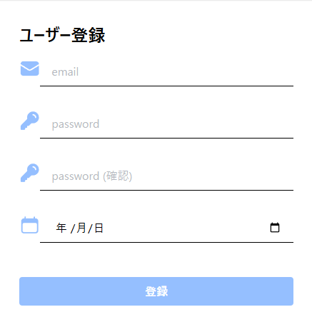
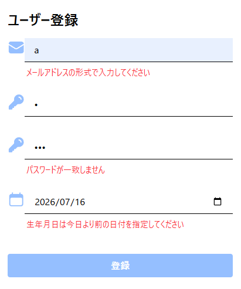

# 入力値検証 {#top}

フロントエンドのアーキテクチャに基づき、入力値検証には VeeValidate と Zod を使用します。
また、入力値検証失敗時のメッセージを管理するために、 Vue I18n を使用します。
メッセージ管理機能の実装方法の詳細に関しては、[こちら](./message-management.md) を確認してください。

## 必要なパッケージのインストール {#install-packages}

ターミナルを開き、対象プロジェクトのワークスペースフォルダーで以下のコマンドを実行します。

```shell
npm install vee-validate zod@^3 @vee-validate/zod vue-i18n
```

## メッセージの定義 {#definition-messages}

入力値検証失敗時のメッセージを定義するため、`./src/locales` フォルダーに JSON ファイルを作成し、以下のように記述します。
メッセージを多言語対応する場合には、それぞれの言語の JSON ファイルを作成し、各言語のメッセージをフォルダーで分割して管理します。

```json title="validationTextList_jp.json"
https://github.com/AlesInfiny/maris/blob/main/samples/Dressca/dressca-frontend/consumer/src/locales/ja/validationTextList_ja.json
```

## 入力値検証時の設定 {#settings-validation}

各言語設定に基づいた、入力値検証メッセージを読み込みます。
共通スキーマをファイル `./src/validation/validation-items.ts` に以下のように定義し、 Vue I18n を使用してデフォルトのエラーメッセージを設定します。

```typescript title="validation-items.ts"
https://github.com/AlesInfiny/maris/blob/main/samples/Dressca/dressca-frontend/consumer/src/validation/validation-items.ts
```

作成したファイルを読み込むため、 入力値を検証する Vue ファイルのスクリプト構文に以下を記述します。

```vue title="example.vue"
import { toTypedSchema } from '@vee-validate/zod'
import { z } from 'zod'
import { ValidationItems } from '@/validation/validation-items'

// フォーム固有のバリデーション定義
const { requiredEmail: requiredEmailRule, required: requiredRule } = ValidationItems()
const formSchema = toTypedSchema(
  z.object({
    email: requiredEmailRule(),
    password: requiredRule(),
  }),
)
</script>
```

## 入力値検証の実行 {#input-validation}

AlesInfiny Maris ではフロントエンドの入力値検証に VeeValidate と Zod を利用しています。
VeeValidate v4 と Zod をつなぐための @vee-validate/zod が Zod 4 系と互換性がなく、対応予定の時期が執筆時点で未定のため、 Zod 3 系を利用しています。

入力値検証の実装は、以下の流れで行います。

1. Zod 組み込みのルールを組み合わせたり、独自にロジックを実装したりしてバリデーションルールを定義する。
1. VeeValidate の API (`useField()`, `useForm()` 等)を使用して入力値のフィールドとバリデーションルールを対応させる。
  
  VeeValidate の API については [公式ドキュメント :material-open-in-new:](https://vee-validate.logaretm.com/v4/guide/components/validation/){ target=_blank } を参照してください。

### 前提：実装例で使用する画面の概要 {#assumption}

以下のような画面を実装例として使用します。

1. 作成する画面のイメージ：エラーがない状態

    { loading=lazy }

1. 作成する画面のイメージ：入力エラーがある状態

    { loading=lazy }

??? example "コードの全体像"

    画面の実装例は以下の通りです。 `ValidationItems` の実装については[バリデーションルールの共通化](#sharing-validation-rules) の共通スキーマの定義例を参照してください。

    ```vue title="TestRegister.vue"
    <script setup lang="ts">
    import { useField, useForm } from 'vee-validate'
    import { toTypedSchema } from '@vee-validate/zod'
    import { z } from 'zod'
    import { EnvelopeIcon, KeyIcon, CalendarIcon } from '@heroicons/vue/24/solid'
    import { ValidationItems } from '@/validation/validation-items'

    // フォーム固有のバリデーション定義
    const { requiredEmail: requiredEmailRule, required: requiredRule, birthdateSchema: birthdateRule } = ValidationItems()

    const formSchema = toTypedSchema(
      z
        .object({
          email: requiredEmailRule(),
          password: requiredRule(),
          passwordConfirm: requiredRule(),
          birthdate: birthdateRule,
        })
        .refine((data) => data.password === data.passwordConfirm, {
          message: "パスワードが一致しません",
          path: ["passwordConfirm"],
        }),
    )

    const { meta } = useForm({
      validationSchema: formSchema,
      initialValues: { email: '', password: '', passwordConfirm: '', birthdate: ''},
    })
    const { value: email, errorMessage: emailError } = useField<string>('email')
    const { value: password, errorMessage: passwordError } = useField('password')
    const { value: passwordConfirm, errorMessage: passwordConfirmError } = useField('passwordConfirm')
    const { value: birthdate, errorMessage: birthdateError } = useField<string>('birthdate')

    const isInvalid = () => {
      // 検証の成功/失敗を判定
      return !meta.value.valid
    }

    const registerOnClick = () => {
      // 登録処理
    }
    </script>
    <template>
      <div class="container mx-auto max-w-sm">
        <form class="mt-8">
          <div class="form-group mb-4">
            <span class="text-2xl font-medium">ユーザー登録</span>
          </div>
          <div class="form-group">
            <div class="flex justify-between">
              <EnvelopeIcon class="h-8 w-8 text-blue-500/50" />
              <input
                id="email"
                v-model="email"
                type="text"
                placeholder="email"
                autocomplete="username"
                class="w-full border-b px-4 py-2 placeholder-gray-500/50 focus:border-b-2 focus:border-indigo-500 focus:outline-hidden"
              />
            </div>
            <p id="email-error" class="px-8 py-2 text-sm text-red-500">{{ emailError }}</p>
          </div>
          <div class="form-group mt-4">
            <div class="flex justify-between">
              <KeyIcon class="h-8 w-8 text-blue-500/50" />
              <input
                id="password"
                v-model="password"
                type="password"
                placeholder="password"
                autocomplete="current-password"
                class="w-full border-b px-4 py-2 placeholder-gray-500/50 focus:border-b-2 focus:border-indigo-500 focus:outline-hidden"
              />
            </div>

            <p id="password-error" class="px-8 py-2 text-sm text-red-500">{{ passwordError }}</p>
          </div>
          <div class="form-group mt-4">
            <div class="flex justify-between">
              <KeyIcon class="h-8 w-8 text-blue-500/50" />
              <input
                id="password-confirm"
                v-model="passwordConfirm"
                type="password"
                placeholder="password (確認)"
                autocomplete="current-password"
                class="w-full border-b px-4 py-2 placeholder-gray-500/50 focus:border-b-2 focus:border-indigo-500 focus:outline-hidden"
              />
            </div>

            <p id="password-confirm-error" class="px-8 py-2 text-sm text-red-500">{{ passwordConfirmError }}</p>
          </div>
          <div class="form-group mt-4">
            <div class="flex justify-between">
              <CalendarIcon class="h-8 w-8 text-blue-500/50" />
              <input
                id="birthdate"
                v-model="birthdate"
                type="date"
                placeholder="birthdate"
                class="w-full border-b px-4 py-2 placeholder-gray-500/50 focus:border-b-2 focus:border-indigo-500 focus:outline-hidden"
              />
            </div>

            <p id="birthdate-error" class="px-8 py-2 text-sm text-red-500">{{ birthdateError }}</p>
          </div>
          <div class="form-group mt-8">
            <button
              type="button"
              class="w-full rounded-sm bg-blue-500 px-4 py-2 font-bold text-white hover:bg-blue-700 disabled:bg-blue-500/50"
              :disabled="isInvalid()"
              @click="registerOnClick"
            >
              登録
            </button>
          </div>
        </form>
      </div>
    </template>
    ```

### 単項目チェックの実装 {#single-item-validation}

#### Zod 組み込みのルール使用 {#defined-rules}

基本的な単項目チェックを行う場合、 Zod 組み込みのルールを呼び出します。
使用可能な組み込みのルールについては [公式ドキュメント :material-open-in-new:](https://v3.zod.dev/){ target=_blank } を参照してください。

作成する画面の「ユーザー名（メールアドレス）」の検証をする場合、以下のように実装します。

??? example "実装例"

    ```vue hl_lines="8-11"
    <script setup lang="ts">
    import { useField, useForm } from 'vee-validate'
    import { toTypedSchema } from '@vee-validate/zod'
    import { z } from 'zod'

    const formSchema = toTypedSchema(
      // 対象のフィールドがメールアドレス形式であることを確認
      z.object({
        email: z.string().email(),
      }),
    )

    const { meta } = useForm({
      validationSchema: formSchema,
      initialValues: { email: '' },
    })
    const { value: email, errorMessage: emailError } = useField<string>('email')

    const isInvalid = () => {
      // 検証の成功/失敗を判定
      return !meta.value.valid
    }

    const registerOnClick = () => {
      // 登録処理
    }
    </script>

    <template>
      <!-- ... -->
      <input
        id="email"
        v-model="email"
        type="text"
        placeholder="email"
        autocomplete="username"
        class="w-full border-b px-4 py-2 placeholder-gray-500/50 focus:border-b-2 focus:border-indigo-500   focus:outline-hidden"
      />
      <p id="email-error" class="px-8 py-2 text-sm text-red-500">{{ emailError }}</p>
      <!-- ... -->
      <button
        type="button"
        class="w-full rounded-sm bg-blue-500 px-4 py-2 font-bold text-white hover:bg-blue-700 disabled:bg-blue-500/50"
        :disabled="isInvalid()"
        @click="registerOnClick"
      >
        登録
      </button>
    </template>
    ```

#### 検証ロジックのカスタマイズ {#customize-validation-rules}

独自の検証ロジックを使用して単項目チェックを行う場合は、 [refine() :material-open-in-new:](https://v3.zod.dev/?id=refine){ target=_blank } を使用して検証ロジックを実装します。
以下は、「生年月日」に入力された日付が今日よりも前の日付であることを検証し、検証失敗した場合にエラーメッセージを表示する例です。

```typescript
const birthdateSchema = z.string().refine((val) => {
  const inputDate = new Date(val)
  const today = new Date()
  today.setHours(0, 0, 0, 0)
  return inputDate < today
}, {
  message: "生年月日は今日より前の日付を指定してください",
})
```

### 項目間チェックの実装 {#cross-item-validation}

`refine()` を使用して複数の項目の入力値に関わる検証を実装できます。
単項目チェックでは `z.string()` のような単独のフィールドにチェーンする形で `refine()` を使用していましたが、
項目間チェックで`refine()` を使用する際は `z.object()` にチェーンする形で実装します。

以下はパスワードと確認用パスワードの入力値が一致するか確認する例です。

```typescript
const schema = z
  .object({ password: z.string(), passwordConfirm: z.string() })
  .refine((data) => data.password === data.passwordConfirm, {
    message: "パスワードが一致しません",
  })
```

公式ドキュメントでの実装例は [こちら :material-open-in-new:](https://v3.zod.dev/?id=customize-error-path) です。

項目間チェックには [superRefine() :material-open-in-new:](https://v3.zod.dev/?id=superrefine){ target=_blank } も使用できます。
複数エラーを同時に出したい場合や、項目ごとに異なるエラーを出したい場合など、細かなカスタマイズが必要なときは `superRefine()` が適しています。

### バリデーションルールの共通化 {#sharing-validation-rules}

アプリケーション内でバリデーションルールやエラーメッセージを共通化する場合、スキーマとして定義し、各フィールドで適用します。

??? example "共通スキーマの定義例"

    以下の共通スキーマの定義例では、必須バリデーションを他のバリデーションルールよりも先に実行するために必須バリデーションを関数化しています。

    ```typescript title="validation-items.ts"
    import { z } from 'zod'
    import { i18n } from '@/locales/i18n'

    // 必須バリデーション関数
    const required = (message: string) => z.string().trim().min(1, message)

    export function ValidationItems() {
      const { t } = i18n.global
      const validationItems = {
        email: z.string().email(t('email')),
        required: (requiredMessage: string = t('required')) => required(requiredMessage),
        requiredEmail: (requiredMessage: string = t('required')) =>
          required(requiredMessage).email(t('email')),
        samePasswordSchema: z
          .object({ password: z.string(), passwordConfirm: z.string() })
          .refine((data) => data.password === data.passwordConfirm, {
            message: "パスワードが一致しません",
            path: ["passwordConfirm"],
          }),
        birthdateSchema: z.string().refine((val) => {
          const inputDate = new Date(val)
          const today = new Date()
          today.setHours(0, 0, 0, 0)
          return inputDate < today
        }, {
          message: "生年月日は今日より前の日付を指定してください",
        }),
      }
      return validationItems
    }

    ```

??? example "共通スキーマの参照"

    ```vue title="共通スキーマの参照"
    <script setup lang="ts">
    import { useField, useForm } from 'vee-validate'
    import { toTypedSchema } from '@vee-validate/zod'
    import { z } from 'zod'
    import { ValidationItems } from '@/validation/validation-items'

    const { requiredEmail: requiredEmailRule, required: requiredRule } = ValidationItems()
    const formSchema = toTypedSchema(
      z.object({
        userName: requiredEmailRule('ユーザー名は必須です。'),
        password: requiredRule('パスワードは必須です。'),
        // ...
      }),
    )

    // ...
    </script>
    ```

### 共通のエラーメッセージのカスタマイズ {#customize-error-message}

Zod 3 系では `ZodErrorMap` を独自に定義して適用することで、適用範囲のエラーメッセージをカスタマイズできます。
`ZodErrorMap` は、検証失敗の情報 (`issue`) を受け取ってカスタムメッセージを返す関数です。
Zod は内部的にデフォルトのエラーマップを使ってエラーメッセージを生成しているため、独自のエラーマップに差し替えることで、エラーメッセージを一括でカスタマイズできます。
これにより、エラーメッセージを共通化し、設定漏れを防げます。

1. エラーごとにエラーメッセージを指定し、 `ZodErrorMap` を定義します。

    ??? example "ZodErrorMap の定義例"

        ```typescript title="zod-settings.ts"
        import { type ZodErrorMap, ZodIssueCode } from 'zod'
        import { i18n } from '@/locales/i18n'

        // 必須入力項目の最小文字数
        const RequiredMinLength = 1

        /**
         * カスタムエラーマップ
         * @param issue Zodのエラー情報
         * @param ctx コンテキスト情報
         * @returns カスタムエラーメッセージ
         */
        export const customErrorMap: ZodErrorMap = (issue, ctx) => {
          const { t } = i18n.global
          switch (issue.code) {
            // 型に誤り
            case ZodIssueCode.invalid_type:
              return { message: t('invalidFormat') }

            case ZodIssueCode.too_big:
              return { message: t('tooBig', [issue.maximum]) }

            case ZodIssueCode.too_small:
              if (issue.minimum === RequiredMinLength) {
                return { message: t('required') }
              }
              return { message: t('tooSmall', [issue.minimum]) }

            // 文字列のフォーマット違反
            case ZodIssueCode.invalid_string:
              return { message: t('invalidFormat') }
          }

          // デフォルトのメッセージを返す
          return { message: ctx.defaultError }
        }        
        ```

1. `setErrorMap()` を呼び出し、定義した `ZodErrorMap` をグローバルに適用します。

    ??? example "ZodErrorMap の適用"

        ```typescript title="main.ts"
        import { z } from 'zod'
        import { customErrorMap } from '@/validation/zod-settings'

        // createApp() の前に呼び出す
        z.setErrorMap(customErrorMap)
       
        const app = createApp(App)
        // ...

        ```

各フィールドにエラーメッセージを個別に指定している場合は、`ZodErrorMap` で定義した内容よりも優先されます。
