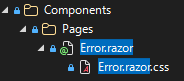

# CSS の設定と CSS フレームワークの適用 {#top}

AlesInfiny Maris OSS Edition は、特定の CSS フレームワークやコンポーネントライブラリーに依存していません。サンプルアプリケーションでは [Fluent UI Blazor](https://github.com/microsoft/fluentui-blazor){ target_blank } を使用していますが、実際の開発プロジェクトでは、プロジェクトの特性に応じた技術を選定してください。

## Fluent UI Blazor {#fluent-ui-blazor}

Fluent UI Blazor は、 Microsoft が開発・提供する Fluent Design System（ Fluent UI ）に準拠した Blazor 向け UI コンポーネントライブラリです。これらのコンポーネントは Razor コンポーネントとして提供されるため、 HTML や CSS の記述量を抑えて画面を構築できます。

[プロジェクトの作成](./create-project.md) において、 Fluent Blazor Web アプリのテンプレートを使用して作成したプロジェクトには、既定で Fluent UI Blazor を使用するための設定が組み込まれています。

そのため、追加で設定することなく Fluent UI Blazor の UI コンポーネントを使用できます。
使用できるコンポーネントの一覧については、[デモおよびドキュメント](https://www.fluentui-blazor.net/){ target_blank }を参照してください。

!!! info "CSS のバンドルと参照"

    Fluent UI Blazor のデザインに用いられる CSS ファイルは、 ビルド時に次のようなパスにバンドルされて出力されます（Sample\obj\Debug\netxx.x\scopedcss\bundle\Sample.styles.css）。
    Fluent Blazor Web アプリのテンプレートでは、このバンドル後 CSS ファイルを読み込むように App.razor に設定が追加されています。
    ```html title="App.razor"
    <link rel="stylesheet" href="@Assets["Sample.styles.css"]" />
    ```

## CSS の分離 {#css-isolation}

Razor コンポーネントごとに CSS ファイルを紐づけて、 その CSS ファイルで定義したスタイルが紐づけたコンポーネントのレンダリング結果にだけ影響するように構成できます。これを CSS の分離（ CSS isolation ）と呼びます。

たとえば、 Error.razor コンポーネントに対して適用する場合、同じフォルダーに Error.razor.css という名称のスコープ付き CSS ファイルを作成することで、 CSS の分離が有効になります。設定例を下記に示します。

```text title="Razor コンポーネントとスコープ付き CSS ファイルの配置例" linenums="0"
<プロジェクト>
└─ Components/
   └─ Pages/
      ├─ Home.razor
      ├─ Error.razor
      └─ Error.razor.css
```

この例の場合、 Razor コンポーネントと紐づくスコープ付き CSS ファイルは、 Visual Studio では以下の画像のようにセットで表示されます。

{ width="300" loading=lazy }

スコープ付き CSS ファイルは、ビルド時に CSS セレクターが書き換えられ、コンポーネントの HTML 要素に b-xxxxxxxxxx のようなスコープ属性名が自動付与されます。そして、それに一致する形で CSS も b-xxxxxxxxx 付きのセレクターに変更されます。
この仕組みにより、スコープ付き CSS ファイルの実装時に同じ名称のセレクターを使用しても、スタイルの衝突を気にする必要がありません。

詳細については [ASP.NET Core Blazor の CSS の分離 :material-open-in-new:](https://learn.microsoft.com/ja-jp/aspnet/core/blazor/components/css-isolation){ target=_blank } を参照してください。
