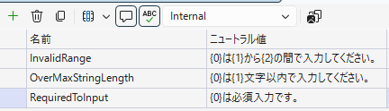
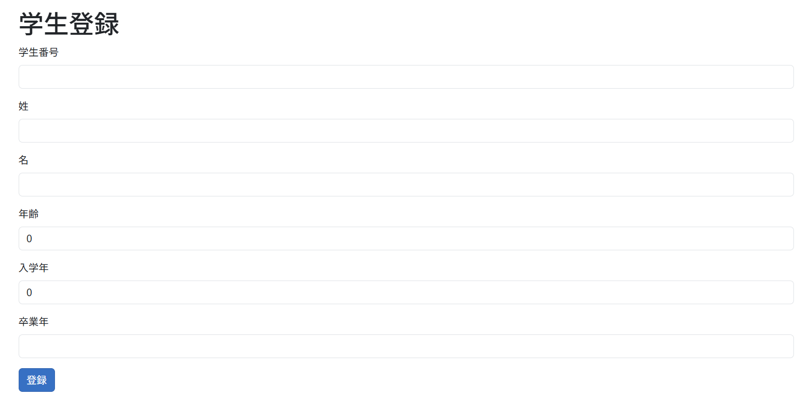
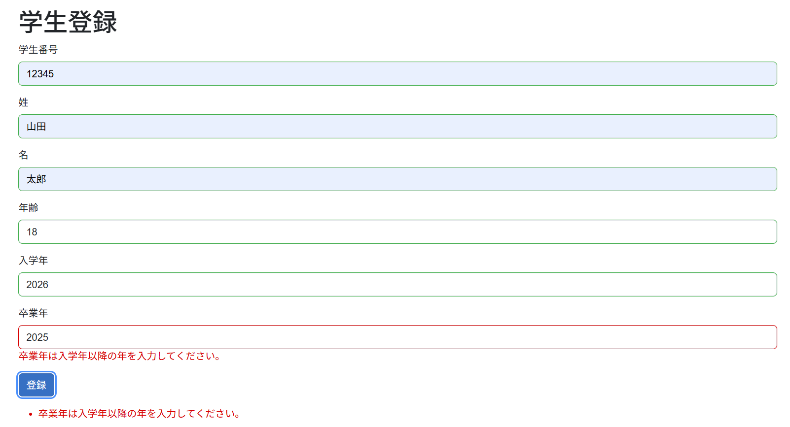
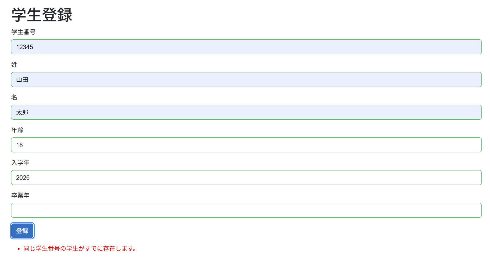

# 入力値検査 {#top}

ここでは、アプリケーションアーキテクチャで定義している入力値検査の実装方法を説明します。
入力値検査方針については [こちら](../../../app-architecture/server-side-rendering/global-function/validation-policy.md) を参照してください。

## 単項目チェックの実装 {#single-item-validation}

<!-- textlint-disable ja-technical-writing/sentence-length -->
Blazor Web アプリでは、 `EditForm` と属性（ `Attribute` ）ベースの検証を組み合わせることで、単項目チェックを実現します。
詳細は [フォーム検証 :material-open-in-new:](https://learn.microsoft.com/ja-jp/aspnet/core/blazor/forms/validation#form-validation){ target=_blank } および [データ注釈検証コンポーネントとカスタム検証 :material-open-in-new:](https://learn.microsoft.com/ja-jp/aspnet/core/blazor/forms/validation#data-annotations-validator-component-and-custom-validation){ target=_blank } を参照してください。
<!-- textlint-enable ja-technical-writing/sentence-length -->

大まかな実装の流れを以下に示します。

1. 検証結果として表示するエラーメッセージを定義します。

    [メッセージリソースの追加](../csr/dotnet/project-settings.md#add-message-resource) の手順に従ってメッセージを作成します。

    ??? example "メッセージリソースの作成例"

        { loading=lazy }

1. ビューモデルを作成します。

    プロパティを持つビューモデルのクラスを作成します。プロパティは入力フォームの各項目となります。

    ??? example "ビューモデルの実装例"

        ```C#
        public class Student
        {
            public Guid Id { get; set; } = Guid.Empty;

            public string StudentNumber { get; set; } = string.Empty;

            public string FirstName { get; set; } = string.Empty;

            public string LastName { get; set; } = string.Empty;

            public int Age { get; set; }

            public int EnrollmentYear { get; set; }

            public int? GraduationYear { get; set; }
        }
        ```

1. ビューモデルの各プロパティに検証属性を付与することで、検証内容や表示するエラーメッセージを定義します。

    ??? example "ビューモデルに検証属性を付与した例"

        ```C#
        public class Student
        {
            public Guid Id { get; set; } = Guid.Empty;

            [Display(Name = "学生番号")]
            [Required(ErrorMessageResourceType = typeof(Messages), ErrorMessageResourceName = nameof(Messages.RequiredToInput))]
            [StringLength(10, ErrorMessageResourceType = typeof(Messages), ErrorMessageResourceName = nameof(Messages.OverMaxStringLength))]
            public string StudentNumber { get; set; } = string.Empty;

            [Display(Name = "姓")]
            [Required(ErrorMessageResourceType = typeof(Messages), ErrorMessageResourceName = nameof(Messages.RequiredToInput))]
            [StringLength(20, ErrorMessageResourceType = typeof(Messages), ErrorMessageResourceName = nameof(Messages.OverMaxStringLength))]
            public string FirstName { get; set; } = string.Empty;

            [Display(Name = "名")]
            [Required(ErrorMessageResourceType = typeof(Messages), ErrorMessageResourceName = nameof(Messages.RequiredToInput))]
            [StringLength(20, ErrorMessageResourceType = typeof(Messages), ErrorMessageResourceName = nameof(Messages.OverMaxStringLength))]
            public string LastName { get; set; } = string.Empty;

            [Display(Name = "年齢")]
            [Required(ErrorMessageResourceType = typeof(Messages), ErrorMessageResourceName = nameof(Messages.RequiredToInput))]
            [Range(0, 150, ErrorMessageResourceType = typeof(Messages), ErrorMessageResourceName = nameof(Messages.InvalidRange))]
            public int Age { get; set; }

            [Display(Name = "入学年")]
            [Required(ErrorMessageResourceType = typeof(Messages), ErrorMessageResourceName = nameof(Messages.RequiredToInput))]
            [Range(1980, 2100, ErrorMessageResourceType = typeof(Messages), ErrorMessageResourceName = nameof(Messages.InvalidRange))]
            public int EnrollmentYear { get; set; }

            [Display(Name = "卒業年")]
            [Range(1980, 2100, ErrorMessageResourceType = typeof(Messages), ErrorMessageResourceName = nameof(Messages.InvalidRange))]
            public int? GraduationYear { get; set; }
        }
        ```

1. Razor コンポーネントに `EditForm` を用いて入力フォームを作成します。
1. `EditForm` にビューモデルをバインドします。

    ??? example "Razor コンポーネントに EditForm を追加した例"

        ```html
        @page "/students/register"
        @using BlazorApp1.ViewModels

        <PageTitle>学生登録</PageTitle>

        <h1>学生登録</h1>

        <EditForm FormName="RegisterStudentForm" EditContext="@editContext" OnValidSubmit="HandleValidSubmit">
            <DataAnnotationsValidator />

            <div class="mb-3">
                <label class="form-label">学生番号</label>
                <InputText class="form-control" @bind-Value="model.StudentNumber" />
                <ValidationMessage For="() => model.StudentNumber" />
            </div>

            <div class="mb-3">
                <label class="form-label">姓</label>
                <InputText class="form-control" @bind-Value="model.FirstName" />
                <ValidationMessage For="() => model.FirstName" />
            </div>

            <div class="mb-3">
                <label class="form-label">名</label>
                <InputText class="form-control" @bind-Value="model.LastName" />
                <ValidationMessage For="() => model.LastName" />
            </div>

            <div class="mb-3">
                <label class="form-label">年齢</label>
                <InputNumber class="form-control" @bind-Value="model.Age" />
                <ValidationMessage For="() => model.Age" />
            </div>

            <div class="mb-3">
                <label class="form-label">入学年</label>
                <InputNumber class="form-control" @bind-Value="model.EnrollmentYear" />
                <ValidationMessage For="() => model.EnrollmentYear" />
            </div>

            <div class="mb-3">
                <label class="form-label">卒業年</label>
                <InputNumber class="form-control" @bind-Value="model.GraduationYear" />
                <ValidationMessage For="() => model.GraduationYear" />
            </div>

            <button type="submit" class="btn btn-primary">登録</button>

            <div class="mt-3">
                <ValidationSummary />
            </div>
        </EditForm>

        @code {
            private Student model = new();
            private EditContext editContext = default!;

            protected override void OnInitialized()
            {
                editContext = new EditContext(model);
                editContext.OnValidationRequested += HandleValidationRequest;
            }

            private void HandleValidationRequest(object? sender, ValidationRequestedEventArgs e)
            {
                // 項目間チェックの実施
            }

            private void HandleValidSubmit()
            {
                // 業務ロジックの実行、複合チェック結果の処理など
            }
        }
        ```

ここまでの手順で以下のような画面が作成されます（ Blazor Web プロジェクトをサンプルありで作成した場合）。

{ loading=lazy }

「登録」ボタンをクリックし、入力チェックが実行されることを確認してください。

## 項目間チェックの実装 {#cross-item-validation}

項目間チェックは `OnValidationRequested` イベントハンドラー内で実装します。

1. `@code` で `ValidationMessageStore` の変数を宣言します。
1. `OnInitialized` または `OnInitializedAsync` メソッド内で上の変数を初期化します。
1. `OnValidationRequested` イベントハンドラーで以下の処理を追加します。
    1. `ValidationMessageStore` をクリアします。
    1. 項目間チェック結果のエラーメッセージを `ValidationMessageStore` に追加します。
    1. `EditContext.NotifyValidationStateChanged` メソッドを呼び出し、入力値検査の状態が変わったことを伝えます。

??? example "項目間チェックの結果を ValidationSummary へ反映する例"

    ```C# hl_lines="4 10 15 19 20"
    @code {
        private Student model = new();
        private EditContext editContext = default!;
        private ValidationMessageStore validationMessageStore = default!;

        protected override void OnInitialized()
        {
            editContext = new EditContext(model);
            editContext.OnValidationRequested += HandleValidationRequest;
            validationMessageStore = new ValidationMessageStore(editContext);
        }

        private void HandleValidationRequest(object? sender, ValidationRequestedEventArgs e)
        {
            validationMessageStore.Clear();

            if (model.GraduationYear < model.EnrollmentYear) // 項目間チェックの実施
            {
                validationMessageStore.Add(new FieldIdentifier(model, nameof(model.GraduationYear)), "卒業年は入学年以降の年を入力してください。");
                editContext.NotifyValidationStateChanged();
                return;
            }
        }
    }
    ```

ここまでの手順を実行し、「卒業年」に「入学年」より過去の年を入力して「登録」ボタンをクリックすると、以下のようにエラーになることを確認してください。



## 複合チェックの実装 {#complex-validation}

複合チェックは、アプリケーションコア層の業務ロジック内で実装します。

1. `@code` で `ValidationMessageStore` の変数を宣言します（項目間チェックと同様）。
1. `OnInitialized` または `OnInitializedAsync` メソッド内で上の変数を初期化します（項目間チェックと同様）。
1. `@code` にビジネスロジックを実行するメソッドを作成します。ここではメソッド名を `HandleValidSubmit` とします。

    ??? example "手順 1 ～ 3 を実行した状態の @code セクション"

        ```C# hl_lines="3 8 11-14"
        private Student model = new();
        private EditContext editContext = default!;
        private ValidationMessageStore validationMessageStore = default!;

        protected override void OnInitialized()
        {
            editContext = new EditContext(model);
            validationMessageStore = new ValidationMessageStore(editContext);
        }

        private void HandleValidSubmit()
        {
            // 業務ロジックの実行
        }
        ```

1. `HandleValidSubmit` メソッド内で以下の処理を追加します。

    1. `ValidationMessageStore` をクリアします。
    1. 相関チェック結果のエラーメッセージを `ValidationMessageStore` に追加します。
        ここでは、ビジネスロジックが複合チェックの結果を業務例外 `DuplicatedStudentNumberException` としてスローしたものとします。
    1. `EditContext.NotifyValidationStateChanged` メソッドを呼び出し、入力値検査の状態が変わったことを伝えます。

    ??? example "HandleValidSubmit メソッドのコード例"

        ```C# hl_lines="3 11 12"
        private void HandleValidSubmit()
        {
            validationMessageStore.Clear();

            try
            {
                // 業務ロジックの実行
            }
            catch (DuplicatedStudentNumberException)
            {
                validationMessageStore.Add(new FieldIdentifier(model, string.Empty), "同じ学生番号の学生がすでに存在します。");
                editContext.NotifyValidationStateChanged();
                return;
            }

            // 以降の処理は省略
        }
        ```

1. `EditForm` の `OnValidSubmit` イベントハンドラーに `HandleValidSubmit` メソッドを関連付けます。

    ??? example "OnValidSubmit イベントハンドラーに HandleValidSubmit メソッドを関連付けた EditForm"

        ```html hl_lines="1"
        <EditForm FormName="RegisterStudentForm" EditContext="@editContext" OnValidSubmit="HandleValidSubmit">
            <DataAnnotationsValidator />

            <!-- 入力項目は省略 -->

            <button type="submit" class="btn btn-primary">登録</button>

            <div class="mt-3">
                <ValidationSummary />
            </div>
        </EditForm>
        ```

ここまでの手順を実行し、複合チェックエラーとなるような値を入力して「登録」ボタンをクリックすると、以下のようなエラーが表示されます。



## 入れ子になった ViewModel での単項目チェック {#validate-nested-view-models}

業務の複雑度によっては、ビューモデルが子アイテムのリストを持つことがあります。このような入れ子になったビューモデルで単項目チェックを実装する方法を説明します（ [参照 :material-open-in-new:](https://learn.microsoft.com/ja-jp/aspnet/core/blazor/forms/validation#nested-objects-and-collection-types) ）。

1. Blazor Web アプリの `Program.cs` で、入れ子になったオブジェクトのバリデーションをサポートするためのサービスを登録します。

    ```C# title="Program.cs" hl_lines="5"
    var builder = WebApplication.CreateBuilder(args);
        
    // その他のサービス登録は省略

    builder.Services.AddValidation();
        
    var app = builder.Build();

    // その他のサービス有効化は省略

    app.Run();
    ```

1. 子アイテムのリストを持つビューモデルを定義します。
1. 上のビューモデルのクラスに `[ValidatableType]` 属性を付与します。

    ??? example "子アイテムのリストを持つビューモデルの例"

        ```C# hl_lines="1 13"
        [ValidatableType]
        public class Student
        {
            public Guid Id { get; set; } = Guid.Empty;

            [Display(Name = "学生番号")]
            [Required(ErrorMessageResourceType = typeof(Messages), ErrorMessageResourceName = nameof(Messages.RequiredToInput))]
            [StringLength(10, ErrorMessageResourceType = typeof(Messages), ErrorMessageResourceName = nameof(Messages.OverMaxStringLength))]
            public string StudentNumber { get; set; } = string.Empty;

            // 省略

            public List<Enrollment> Enrollments { get; set; } = new();
        }
        ```
