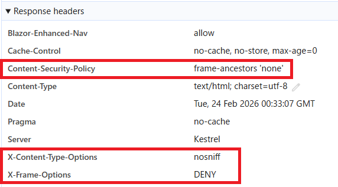

# セキュリティの設定 {#top}

以下の目的で、 `Program.cs` 上で HTTP レスポンスヘッダーを設定します。

- [MIME スニッフィング :material-open-in-new:](https://developer.mozilla.org/ja/docs/Web/HTTP/Guides/MIME_types#mime_%E3%82%B9%E3%83%8B%E3%83%83%E3%83%95%E3%82%A3%E3%83%B3%E3%82%B0){ target=_blank } の防止
- クリックジャッキングの防止（詳細は [こちら](../../../app-architecture/security/clickjacking.md) を参照）

`Program.cs` が冗長になることを防止するため、ミドルウェア [^1] を作成します。

??? example "セキュリティ設定を HTTP レスポンスヘッダーに設定するミドルウェア"

    ```csharp title="HttpSecurityHeadersMiddleware.cs"
    https://github.com/AlesInfiny/maris/blob/main/samples/DresscaCMS/src/DresscaCMS.Web/Extensions/HttpSecurityHeadersMiddleware.cs
    ```

    ```csharp title="HttpSecurityHeadersMiddlewareExtensions.cs"
    https://github.com/AlesInfiny/maris/blob/main/samples/DresscaCMS/src/DresscaCMS.Web/Extensions/HttpSecurityHeadersMiddlewareExtensions.cs
    ```

作成したミドルウェアを `Program.cs` から呼び出します。また、モダンブラウザー向けのクリックジャッキング対策はミドルウェア経由ではなく `Program.cs` 上で直接呼び出します。

??? example "Program.cs の実装"

    ```csharp title="Program.cs" hl_lines="9-11 13-14"
    using DresscaCMS.Web.Extensions; // その他の using は省略

    var builder = WebApplication.CreateBuilder(args);

    // 省略

    var app = builder.Build();

    // クリックジャッキング攻撃への対策として、 CSP frame-ancestors を設定
    app.MapRazorComponents<App>()
        .AddInteractiveServerRenderMode(o => o.ContentSecurityFrameAncestorsPolicy = "'none'");

    // HTTP レスポンスヘッダーにセキュリティ関連の設定を追加するミドルウェアを使用
    app.UseSecuritySettings();

    app.Run();
    ```

HTTP レスポンスヘッダーが以下のように設定されます。



??? info "Blazor Web アプリでのクリックジャッキング対策について"

    上の「 Program.cs の実装」に示すとおり、 Blazor Web アプリでは `frame-ancestors 'none'` の設定を、対話型サーバー側レンダリング（対話型 SSR ）を構成する `AddInteractiveServerRenderMode` メソッド内で行います。
    Blazor Web アプリでは応答ヘッダーの `Content-Security-Policy` に既定で `frame-ancestors 'self'` が設定されますが、 `AddInteractiveServerRenderMode` 内で設定を変更することにより、この設定を無効にできます。

[^1]: ここで言う「ミドルウェア」は、 ASP.NET Core のミドルウェアを指します。 ASP.NET Core のミドルウェアとは、リクエストとレスポンスを処理するために、アプリのパイプラインに組み込まれたソフトウェアのことです（ [詳細 :material-open-in-new:](https://learn.microsoft.com/ja-jp/aspnet/core/fundamentals/middleware/){target=blank} ）。
