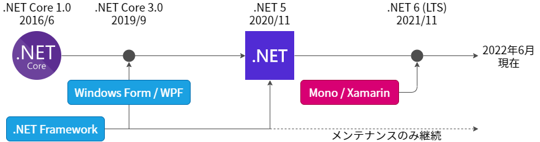

# .NET ランタイムの最新動向

--8<-- "includes/abbreviations.md"

2022年6月現在、 .NET ランタイムには以下があります。

- .NET Framework
    - Windows 上でのみ動作する
    - Windows OS のコンポーネントとしてプリインストールされている
- .NET （旧称：.NET Core）
    - 様々な OS 上で動作する OSS
    - 大幅な軽量化により動作性能が大きく向上
    - .NET 6 で GUI の開発に強みを持つ Mono / Xamarin を統合完了

## .NET Frameworkから.NETへ ## {: #dotnetfw-to-dotnet}

.NET Framework と .NET は一見似ていますが、その成り立ちをたどると別の物であることが分かります。

デスクトップアプリケーションや Web アプリケーションの開発を行うための Windows 環境向けランタイム、 .NET Framework 1.0 がリリースされたのは 2000 年のことでした。

それから .NET Framework はバージョンを重ね、様々なアプリケーションの構築に対応していきました。

一方で技術の革新が進み、クライアントサイドにおいてはスマートフォンアプリや IoT の登場、サーバーサイドにおいては AI 等 SaaS によって提供される高度なサービスの活用など、Windows 製品のみの組み合わせによる単純な Windows アプリケーションや Web アプリケーションではユーザーの需要を満たすシステムを実現することが難しくなりました。

そこで Microsoft は、 2016 年 6 月に .NET Core 1.0 をリリースします。
これは、 Windows 上でも Linux 上でも動作するクロスプラットフォームかつオープンソースの開発プラットフォームです。

また、.NET Core ともに、.NET Standard という概念が登場しました。
.NET Standard は、さまざまな .NET 環境で使用可能な API セットを定義した仕様です。
.NET ( .NET Core ) や .NET Framework は、.NET Standard の実装という位置づけになりました。

その後、.NET Core は .NET と改称し、Windows 、Linux の他 mac OS にも対応して、2022年現在は .NET 6.0 がリリースされています（.NET 6.0 は、.NET Standard 2.1 の実装です）。

このように、.NET Framework と .NET は、どちらも .NET Standard の実装であり、C# を使うものの、以下のように異なるものであると言えます。

|                 |ランタイム      |動作環境                                       |
|-----------------|---------------|-----------------------------------------------|
|.NET Framework   |プロプライエタリ|Windowsのみ                                    |
|.NET (.NET Core) |オープンソース  |クロスプラットフォーム（Windows, Linux, mac OS）|

つまり、.NET Framework と .NET の間に単純な互換性はありません。

## .NET Frameworkの開発停止 ## {: #stop-development-of-dotnetfw}

2019年5月、Microsoft は .NET Framework の開発停止を宣言しました（[.NET Core is Future of .NET](https://devblogs.microsoft.com/dotnet/net-core-is-the-future-of-net/)）。

この宣言では、次のことが明記されています。

- 新しい .NET アプリケーションは .NET Core ( 現在では .NET ) ベースで開発すべきである
- 今後、将来的な投資はすべて .NET Core  ( 現在では .NET ) に対して行われる

.NET Framework は 4.8 が最後のバージョンとなり、以降はバグ修正やセキュリティ修正のみが提供されます。

実際に、2021 年 11 月にリリースされた .NET 6.0 は .NET Standard 2.1 の実装であるのに対し、 .NET Framework 4.8 は、 .NET Standard 2.0 の実装であり、 .NET Standard 2.1 で定義されている API を使用できません。

また、上述の Microsoft の宣言により、これまで .NET Framework 向けにサードパーティ製品を提供していた企業も、投資先を .NET へ切り替えています。新製品は .NET 向けに提供され、 .NET Framework をサポートすることはないでしょう。

## .NET ランタイムのサポート期限 ## {: #dotnet-runtime-support-expiration}

.NET Framework のサポート期限を以下の表に示します。

| ランタイムの種類                 | サポート期限                 |
| ------------------------------- | ---------------------------- |
| .NET Framework 3.5 SP1          | 2029年1月9日                 |
| .NET Framework 4.0 ～ 4.5.1     | 2016年1月12日（サポート終了） |
| .NET Framework 4.5.2 ～ 4.6.1   | 2022年4月26日（サポート終了） |
| .NET Framework 4.6.2            | OSのサポートライフサイクルに準拠 |
| .NET Framework 4.7              | 同上 |
| .NET Framework 4.7.1            | 同上 |
| .NET Framework 4.7.2            | 同上 |
| .NET Framework 4.8              | 同上 |

2022 年 6 月現在、すでに .NET Framework 4.6.1 以下の .NET Framework 4.x 系は Microsoft のサポートが終了しています。
また、 .NET Framework 3.5 SP1 も OS のバージョンによらず、 2029 年 1 月 9 日にサポートが終了します。

すべての.NET Framework がすぐにサポート停止されるとは考えにくいですが、今後、VB6と同じように、OSの機能としては提供されるものの、新機能は提供されないしドキュメントも更新されない、といった立ち位置になる可能性が高いと考えられます。
