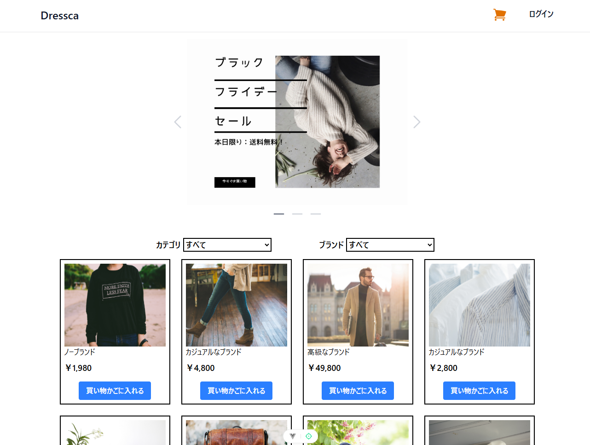
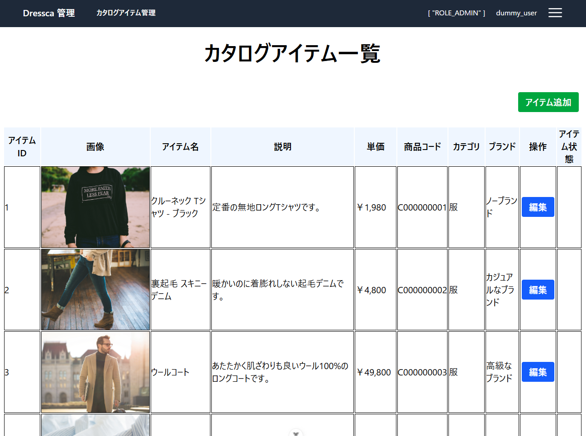
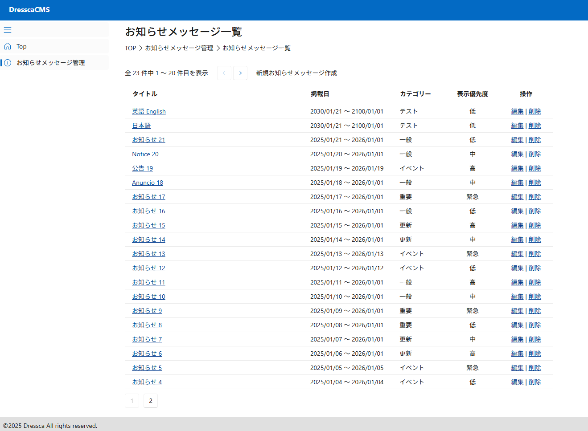

# AlesInfiny Maris OSS Edition にようこそ {#top}

## AlesInfiny Maris OSS Edition とは {#what-is-alesinfiny-maris-version}

AlesInfiny Maris OSS Edition （以降、 AlesInfiny Maris）では、 .NET アプリケーションの一般的なアーキテクチャや方式設計のためのドキュメントおよびサンプルアプリケーションを提供します。
AlesInfiny Maris の提供物は以下の通りです。

- システム形態別の標準的なアプリケーションアーキテクチャ
- 利用頻度の高い有用な OSS ライブラリ／フレームワークを基盤としたサンプルアプリケーションおよびその解説
- アプリケーション開発環境／プロジェクト初期構築までのチュートリアル
- 実現したい要件別のサンプルコード、および実現方式の解説

AlesInfiny Maris は、クリエイティブ・コモンズ表示 4.0 国際ライセンスおよび Apache License, Version 2.0 にて使用可能です。
商用のエンタープライズシステム開発から個人開発の小規模なシステムまで、ライセンスの条項に従う限り、個人、商用とも無料で使用できます。
ライセンスについての詳細は「[利用規約 - ライセンス](about-maris/terms.md#license)」を参照してください。

## サンプルアプリケーションのダウンロード {#id}

AlesInfiny Maris で構築した Web アプリケーションのサンプルを手元で動かしながら確認いただけます。

### CSR アプリケーション {#id}

CSR アーキテクチャに従って実装されたサンプルアプリケーションです。
[Dressca - クイックスタート](./samples/dressca/index.md#quick-start) からダウンロードできます。

[{ width="500" loading=lazy }](./images/samples/dressca-top.png)
[{ width="500" loading=lazy }](./images/samples/dressca-admin-top.png)

### SSR アプリケーション {#id}

SSR アーキテクチャに従って実装されたサンプルアプリケーションです。
[Dressca-CMS - クイックスタート](./samples/dressca-cms/index.md#quick-start) からダウンロードできます。

[{ width="800" loading=lazy }](./images/samples/dressca-cms-announcements.png){ align=center }
