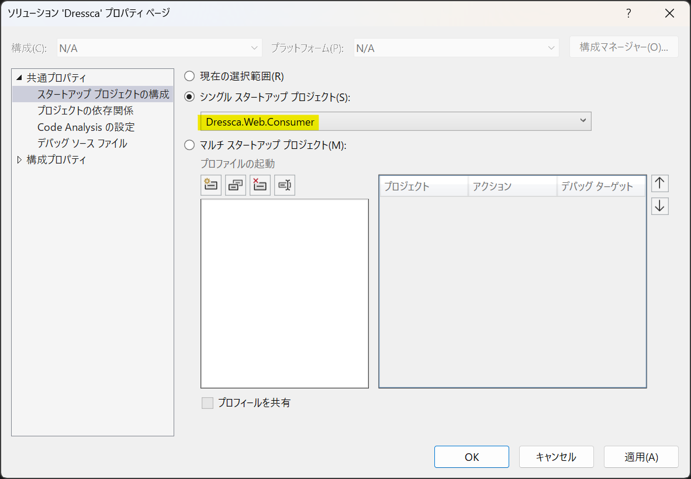

# AlesInfiny Maris OSS Edition にようこそ {#top}

## AlesInfiny Maris OSS Edition とは {#what-is-alesinfiny-maris-version}

AlesInfiny Maris OSS Edition （以降、 AlesInfiny Maris）では、 .NET アプリケーションの一般的なアーキテクチャや方式設計のためのドキュメントおよびサンプルアプリケーションを提供します。
AlesInfiny Maris の提供物は以下の通りです。

- システム形態別の標準的なアプリケーションアーキテクチャ
- 利用頻度の高い有用な OSS ライブラリ／フレームワークを基盤としたサンプルアプリケーションおよびその解説
- アプリケーション開発環境／プロジェクト初期構築までのチュートリアル
- 実現したい要件別のサンプルコード、および実現方式の解説

AlesInfiny Maris は、クリエイティブ・コモンズ表示 4.0 国際ライセンスおよび Apache License, Version 2.0 にて使用可能です。
商用のエンタープライズシステム開発から個人開発の小規模なシステムまで、ライセンスの条項に従う限り、個人、商用とも無料で使用できます。
ライセンスについての詳細は「[利用規約 - ライセンス](about-maris/terms.md#license)」を参照してください。

## クイックスタート {#quick-start}

AlesInfiny Maris で構築した Web アプリケーションのサンプルを手元で動かしながら確認いただけます。

1. 以下を参照し、開発環境を構築してください。

    - 「[ローカル開発環境の構築](guidebooks/how-to-develop/local-environment/index.md)」

1. 以下のリンクから、サンプルアプリケーションをダウンロードしてください。

    - 「[サンプルアプリケーションのダウンロード](samples/downloads/dressca.zip)」

1. ダウンロードした zip ファイルのプロパティを開き、ファイルへのアクセスを許可 ( ブロックを解除 ) してから、任意のフォルダーに展開してください。
   以降の手順では、「dressca」フォルダーに展開したものとして解説します。

    !!! info "展開先のフォルダーについて"
        展開先のフォルダーは、浅い階層にすることを推奨します。

1. VS Code で「ファイルでワークスペースを開く」から、「dressca\\dressca-frontend\\dressca-frontend.code-workspace」を開き、必要な拡張機能をインストールします。
「拡張機能」メニューから 「拡張機能のフィルター」>「推奨」>「ワークスペース推奨事項」にある拡張機能を全てインストールします。

    !!! info "「このフォルダー内のファイルの作成者を信頼しますか？」ダイアログが表示される場合"
        [{ width="300" loading=lazy align=right }](images/trust-folder.png)

        フォルダーを開いた際に、図のダイアログが表示される場合、
        「親フォルダー 'dressca' 内の全てのファイルの作成者を信頼します」のチェックボックスにチェックを入れ、「はい、作成者を信頼します」を押下してください。

    !!! info "拡張機能のインストールが失敗する場合"
        拡張機能のインストール時にエラーが発生する場合には、
        VS Code の再起動やローカルキャッシュのクリアを試してください。

1. フロントエンドのアプリケーションを実行するためのモジュールを取得します。
 VS Code のターミナルで、「dressca\\dressca-frontend」にいることを確認し、以下のコマンドを実行します。

    ```shell title="フロントエンドアプリケーションの実行に必要なパッケージのインストール"
    npm ci
    ```

    !!! info "npm ci が失敗した場合"
        `npm ci` の途中でエラーや脆弱性情報以外の警告が出た場合、インストールに失敗している可能性があります。
        その場合は、「dressca\\dressca-frontend\\node_modules」、
        「dressca\\dressca-frontend\\consumer\\node_modules」、
        「dressca\\dressca-frontend\\admin\\node_modules」ディレクトリをそれぞれ削除し、再度 `npm ci` を実行してください。

1. Visual Studio で「dressca\\dressca-backend\\Dressca.sln」を開き、ソリューションをビルドします。

1. データベースを構築します。
   コマンドプロンプトを開き、「dressca\\dressca-backend\\src\\Dressca.EfInfrastructure」に移動して以下のコマンドを実行します。

    ```shell title="SQL Server のデータベース構築"
    dotnet ef database update
    ```

1. Visual Studio で実行するプロジェクトを選択します。
   ソリューションのプロパティを開き、 [Dressca.Web.Consumer] プロジェクトをスタートアッププロジェクトに設定します。

    [{ width="600" loading=lazy }](images/select-startup-project.png)

1. Visual Studio で ++ctrl+f5++ を押下し、アプリケーションを実行します。
   いくつかプロンプト画面が立ち上がった後、ブラウザーが起動し、アプリケーションの実行が開始します。

    [{ width="600" loading=lazy }](images/dressca-top.png)

    !!! info "証明書のインストールを要求される場合"
        { loading=lazy align=right }
        { width="350" loading=lazy align=right }
        localhost の SSL 証明書をインストールしていない場合、アプリケーションの初回実行時に以下のような画面が表示されます。
        サンプルアプリケーションは SSL 環境で実行する構成になっているため、どちらも「はい」をクリックして証明書をインストールしてください。
        なお、証明書インストール後もアプリケーションへのアクセスをブラウザーに拒否される場合は、 Visual Studio や PC の再起動をお試しください。
        再起動してもアクセスできない場合はブラウザーの設定をご確認ください。
