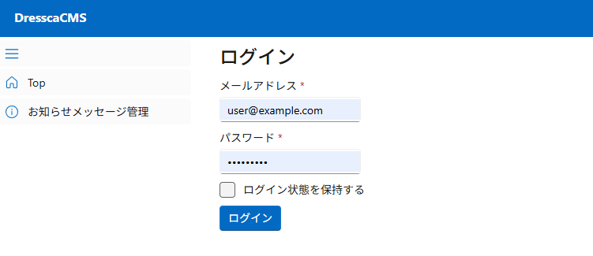

# Dressca-CMS {#top}

## 概要 {#overview}

Dressca-CMS は、 ASP.NET Core Blazor をベースとした CMS システムです。画面に表示される HTML はサーバーサイドでレンダリングされますが、 SignalR 接続を用いた対話型レンダリングにより、滑らかで快適なユーザー体験を実現しています。認証機能には ASP.NET Core Identity を採用しています。サンプルアプリケーションでは、ログイン機能に加え、認証済みユーザーがお知らせメッセージを管理するための一連の機能（登録、更新、削除）が実装されています。

## クイックスタート {#quick-start}

1. 以下を参照し、開発環境を構築してください。

    - 「[ローカル開発環境の構築](../../guidebooks/how-to-develop/ssr/local-development.md)」

1. 以下のリンクから、サンプルアプリケーションをダウンロードしてください。

    - 「[サンプルアプリケーションのダウンロード](../downloads/dressca-cms.zip)」

1. ダウンロードした zip ファイルのプロパティを開き、ファイルへのアクセスを許可 ( ブロックを解除 ) してから、任意のフォルダーに展開してください。
   以降の手順では、「dressca-cms」フォルダーに展開したものとして解説します。

    !!! info "展開先のフォルダーについて"
        展開先のフォルダーは、浅い階層にすることを推奨します。

1. Visual Studio で「dressca-cms\\DresscaCMS.slnx」を開き、ソリューションをビルドします。

1. データベースを構築します。
   コマンドプロンプトを開き、「dressca-cms」に移動して以下のコマンドを実行します。

    ```powershell linenums="0" title="SQL Server のデータベース構築"
    dotnet ef database update --projext .\src\DresscaCMS.Announcement\
    dotnet ef database update --project .\src\DresscaCMS.Authentication\
    ```

1. Visual Studio で実行するプロジェクトを選択します。
   ソリューションのプロパティを開き、 [DresscaCMS.Web] プロジェクトをスタートアッププロジェクトに設定します。

1. Visual Studio で ++ctrl+f5++ を押下し、アプリケーションを実行します。
   いくつかプロンプト画面が立ち上がった後、ブラウザーが起動し、アプリケーションの実行が開始します。

1. ログイン画面が表示されたら、開発環境用に設定されているメールアドレスとパスワードを入力して「ログイン」ボタンを押下してください。メールアドレスは [user@example.com] 、パスワードは [P@ssw0rd1] です。

    [{ width="600" loading=lazy }](../../images/samples/dressca-cms-login.png)

1. ログインに成功したら、トップ画面に遷移します。左メニューから「お知らせメッセージ管理」を押下してください。お知らせメッセージ管理画面が表示されます。

     [{ width="800" loading=lazy }](../../images/samples/dressca-cms-announcements.png)
