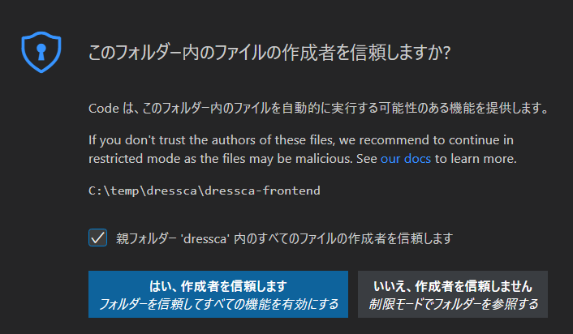
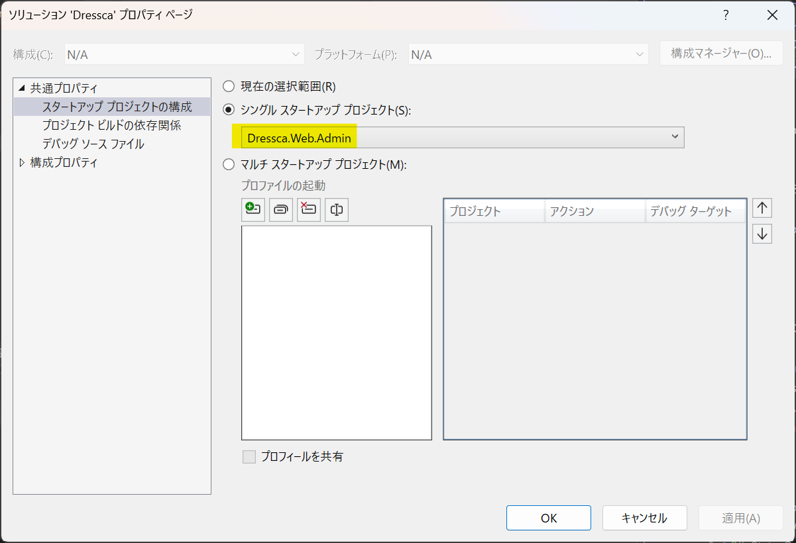
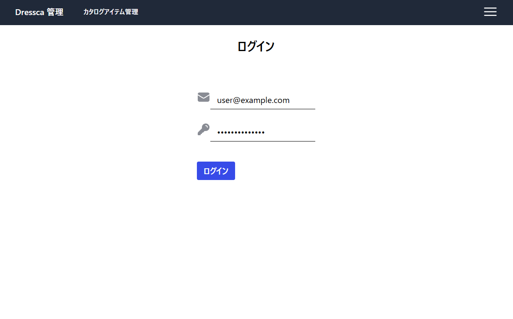
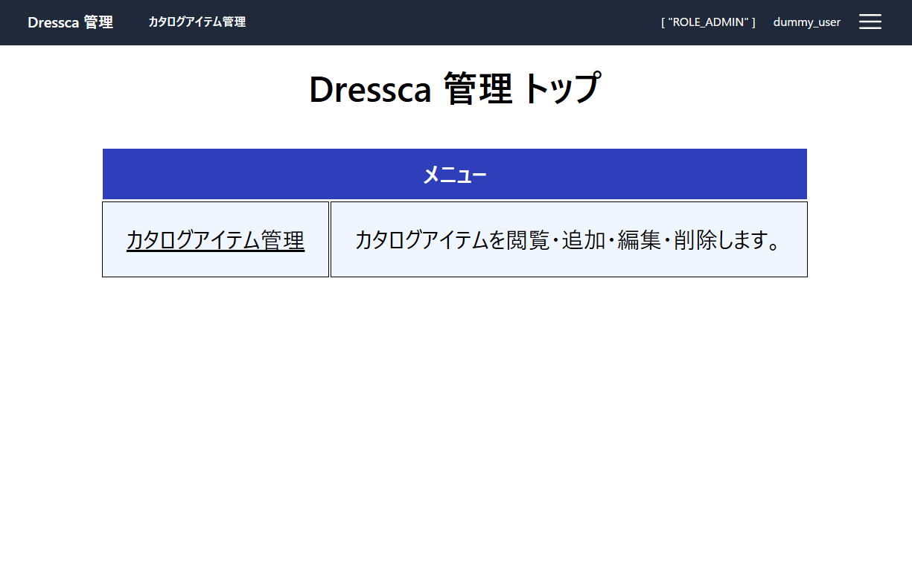

# Dressca {#top}

## 概要 {#overview}

Dressca は、 ASP.NET Core Web API を用いて構築されたバックエンドアプリケーションと、 Vue.js ベースのフロントエンドアプリケーションから構成される Web アプリケーションです。
クライアントサイドで HTML をレンダリングすることで、快適で高品質なユーザー体験を実現しています。
バックエンドとフロントエンドは、 OpenAPI により公開された API 仕様を介して連携しています。
サンプルアプリケーションでは、 EC サイト利用者向けアプリケーション（以下、 Consumer）と管理者向けアプリケーション（以下、 Admin）の 2 種類のアプリケーションを実装しています。

## アプリケーション起動の準備 {#application-startup-preparation}

1. 以下を参照し、開発環境を構築してください。

    - 「[ローカル開発環境の構築](../../guidebooks/how-to-develop/csr/local-environment/index.md)」

1. 以下のリンクから、サンプルアプリケーションをダウンロードしてください。

    - 「[サンプルアプリケーションのダウンロード](../downloads/dressca.zip)」

1. ダウンロードした zip ファイルのプロパティを開き、ファイルへのアクセスを許可 ( ブロックを解除 ) してから、任意のフォルダーに展開してください。
   以降の手順では、「dressca」フォルダーに展開したものとして解説します。

    !!! info "展開先のフォルダーについて"
        展開先のフォルダーは、浅い階層にすることを推奨します。

1. VS Code で「ファイルでワークスペースを開く」から、「dressca\\dressca-frontend\\dressca-frontend.code-workspace」を開き、必要な拡張機能をインストールします。
「拡張機能」メニューから 「拡張機能のフィルター」>「推奨」>「ワークスペース推奨事項」にある拡張機能を全てインストールします。

    !!! info "「このフォルダー内のファイルの作成者を信頼しますか？」ダイアログが表示される場合"
        [{ width="300" loading=lazy align=right }](../../images/samples/trust-folder.png)

        フォルダーを開いた際に、図のダイアログが表示される場合、
        「親フォルダー 'dressca' 内の全てのファイルの作成者を信頼します」のチェックボックスにチェックを入れ、「はい、作成者を信頼します」を押下してください。

    !!! info "拡張機能のインストールが失敗する場合"
        拡張機能のインストール時にエラーが発生する場合には、
        VS Code の再起動やローカルキャッシュのクリアを試してください。

1. フロントエンドのアプリケーションを実行するためのモジュールを取得します。
 VS Code のターミナルで、「dressca\\dressca-frontend」にいることを確認し、以下のコマンドを実行します。

    ```shell title="フロントエンドアプリケーションの実行に必要なパッケージのインストール"
    npm ci
    ```

    !!! info "npm ci が失敗した場合"
        `npm ci` の途中でエラーや脆弱性情報以外の警告が出た場合、インストールに失敗している可能性があります。
        その場合は、「dressca\\dressca-frontend\\node_modules」、
        「dressca\\dressca-frontend\\consumer\\node_modules」、
        「dressca\\dressca-frontend\\admin\\node_modules」ディレクトリをそれぞれ削除し、再度 `npm ci` を実行してください。

1. Visual Studio で「dressca\\dressca-backend\\Dressca.slnx」を開き、ソリューションをビルドします。

1. データベースを構築します。
   コマンドプロンプトを開き、「dressca\\dressca-backend\\src\\Dressca.EfInfrastructure」に移動して以下のコマンドを実行します。

    ```shell title="SQL Server のデータベース構築"
    dotnet ef database update
    ```

1. アプリケーション起動の準備は完了です。[Consumer アプリケーションの起動](#start-consumer-application)、[Admin アプリケーションの起動](#start-admin-application) を参照し、アプリケーションを起動してください。

## Consumer アプリケーションの起動 {#start-consumer-application}

1. Visual Studio で実行するプロジェクトを選択します。
   ソリューションのプロパティを開き、 [Dressca.Web.Consumer] プロジェクトをスタートアッププロジェクトに設定します。

    [{ width="600" loading=lazy }](../../images/samples/select-startup-project.png)

1. Visual Studio で ++ctrl+f5++ を押下し、アプリケーションを実行します。
   いくつかプロンプト画面が立ち上がった後、ブラウザーが起動し、アプリケーションの実行が開始します。

    [{ width="600" loading=lazy }](../../images/samples/dressca-top.png)

    !!! info "証明書のインストールを要求される場合"
        { width="400" loading=lazy align=right }
        { width="350" loading=lazy align=right }
        localhost の SSL 証明書をインストールしていない場合、アプリケーションの初回実行時に以下のような画面が表示されます。
        サンプルアプリケーションは SSL 環境で実行する構成になっているため、どちらも「はい」をクリックして証明書をインストールしてください。
        なお、証明書インストール後もアプリケーションへのアクセスをブラウザーに拒否される場合は、 Visual Studio や PC の再起動をお試しください。
        再起動してもアクセスできない場合はブラウザーの設定をご確認ください。

1. サンプルアプリケーションに実装された機能を確認できます。[Consumer アプリケーションの機能](#consumer-application-features) を参照してください。

### Consumer アプリケーションの機能 {#consumer-application-features}

Consumer アプリケーションに実装された機能の確認手順を示します。

#### カタログアイテムを注文する {#order-catalog-item}

{ width="600" loading=lazy }
{ width="600" loading=lazy }

1. 上記の [Consumer アプリケーションの起動](#start-consumer-application) に従って、 Consumer アプリケーションを実行します。

1. 任意のアイテムについて、「買い物かごに入れる」ボタンを押下します。買い物かご画面に遷移し、選択したアイテムが買い物かごに入っていることを確認してください。

1. 「レジへ進む」ボタンを押下すると、ログイン画面へ遷移します。ログインフォームにそれぞれ [メールアドレス形式の文字列] と [任意の 1 文字以上の文字列] を入力し、「ログイン」ボタンを押下してください。

1. 注文確認画面へ遷移します。「注文を確定する」ボタンを押下し、注文完了画面へ遷移することを確認してください。

## Admin アプリケーションの起動 {#start-admin-application}

1. Visual Studio で実行するプロジェクトを選択します。
   ソリューションのプロパティを開き、 [Dressca.Web.Admin] プロジェクトをスタートアッププロジェクトに設定します。

    [{ width="600" loading=lazy }](../../images/samples/select-startup-project-admin.png)

1. Visual Studio で ++ctrl+f5++ を押下し、アプリケーションを実行します。
   いくつかプロンプト画面が立ち上がった後、ブラウザーが起動し、アプリケーションの実行が開始します。

    [{ width="600" loading=lazy }](../../images/samples/dressca-admin-login.png)

1. ログイン画面が表示されたら、ログインフォームにそれぞれ [メールアドレス形式の文字列] と [任意の 1 文字以上の文字列] を入力し、「ログイン」ボタンを押下してください。

1. ホーム画面へ遷移し、メニューが表示されることを確認してください。

    [{ width="600" loading=lazy }](../../images/samples/dressca-admin-home.png)

1. サンプルアプリケーションに実装された機能を確認できます。[Admin アプリケーションの機能](#admin-application-features) を参照してください。

### Admin アプリケーションの機能 {#admin-application-features}

Admin アプリケーションに実装された機能の確認手順を示します。

#### カタログアイテムを編集する {#edit-catalog-item}

{ width="600" loading=lazy }
{ width="600" loading=lazy }

<!-- textlint-disable @textlint-ja/no-synonyms -->
<!--「一覧画面」の「一」に漢字を用いるため -->
1. 上記の [Admin アプリケーションの起動](#start-admin-application) に従って Admin アプリケーションを実行し、ログインしてホーム画面へ遷移します。

1. 「カタログアイテム管理」ボタンを押下し、カタログアイテム一覧画面へ遷移します。

1. 「アイテム ID」が 1 のアイテムの行の「編集」ボタンを押下し、カタログアイテム編集画面へ遷移します。

1. 「変更後」フォームに任意のアイテムの情報を入力してください。このとき、入力できるアイテムの情報にはバリデーションが実装されています。エラーメッセージが表示されたら、エラーメッセージに従って入力内容を修正してください。入力が完了したら、「更新」ボタンを押下します。

1. 確認モーダルが表示されます。「はい」を押下して実行します。

1. 更新に成功したら、通知モーダルが表示されます。「はい」を押下します。

1. 「変更前」のアイテムの情報が、先ほど入力した情報で更新されていることを確認してください。

1. ヘッダーメニューの「カタログアイテム管理」ボタンを押下し、カタログアイテム一覧画面へ遷移します。「アイテム ID」が 1 のアイテムの情報が、先ほど入力した情報で更新されていることを確認してください。
<!-- textlint-enable @textlint-ja/no-synonyms -->
