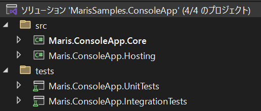

<!-- textlint-disable @textlint-rule/require-header-id -->
<!-- markdownlint-disable-file CMD001 -->
<!-- cSpell:ignore Validatable -->

# コンソールアプリケーションサンプル

## このサンプルについて

このサンプルアプリケーションは、汎用ホスト上でコンソールアプリケーションを実行するためのフレームワークと、実際の利用例で構成しています。
DI コンテナーの存在を前提とした、アプリケーションコア層やインフラストラクチャ層のクラス群を、コンソールアプリケーション上で実行できます。

またアプリケーションの構成設定は appsettings.json に記述できます。
DI コンテナーを用いた一般的な .NET の実装を、コンソールアプリケーション上でも実現できます。

## 動作環境

本サンプルは以下の環境で動作確認を行っています。

- .NET 8
- Visual Studio 2022 17.8.3

## 前提となる OSS ライブラリ

本サンプルでは以下の OSS ライブラリを内部で利用します。

- [CommandLineParser](https://www.nuget.org/packages/CommandLineParser/)
- [Microsoft.Extensions.Hosting](https://www.nuget.org/packages/Microsoft.Extensions.Hosting/)
- [Microsoft.Extensions.Logging.Abstractions](https://www.nuget.org/packages/Microsoft.Extensions.Logging.Abstractions/)

またテストプロジェクトでは、以下の OSS ライブラリを利用します。

- [coverlet.collector](https://www.nuget.org/packages/coverlet.collector/)
- [Maris.Logging.Testing](https://www.nuget.org/packages/Maris.Logging.Testing)
- [Microsoft.Extensions.Logging](https://www.nuget.org/packages/Microsoft.Extensions.Logging/)
- [Moq](https://www.nuget.org/packages/Moq/)
- [xunit.v3](https://www.nuget.org/packages/xunit.v3)
- [xunit.runner.visualstudio](https://www.nuget.org/packages/xunit.runner.visualstudio/)

## サンプルの構成

本サンプルは、コンソールアプリケーションの実装するためのフレームワークと、そのフレームワークの利用例で構成しています。

- コンソールアプリケーションの実行フレームワーク
    - Maris.ConsoleApp.Core
    - Maris.ConsoleApp.Hosting
    - Maris.ConsoleApp.UnitTests
    - Maris.ConsoleApp.IntegrationTests

- 利用例
    - Maris.Samples.Cli
    - （Maris.Samples.ApplicationCore）※
    - （Maris.Samples.InMemoryInfrastructure）※

※：サンプルアプリケーションを実行するために、 AlesInfiny Maris OSS Edition （以降、 AlesInfiny Maris ）の定義するアーキテクチャを簡略化して実装したサンプルです。
コンソールアプリケーションの実行フレームワークと、本質的な関連はありません。

コンソールアプリケーションの実行フレームワークは、プロジェクトごとご自身のソリューションに取り込んで利用します。

## 基本的な使い方

### ソリューションの作成

適当な名前でソリューションを作成してください。
本稿では「MarisSamples.ConsoleApp」という名前のソリューションを作成した前提で解説します。

### 必要なファイル・フォルダーの配置

ソリューションファイルを配置したフォルダーを第 1 階層として、本サンプルに付属するファイル・フォルダーを、以下のように配置します。

| 第 1 階層                            | 第 2 階層                         | 備考                                   |
| ------------------------------------ | --------------------------------- | -------------------------------------- |
| src                                  |                                   |                                        |
|                                      | Maris.ConsoleApp.Core             | フォルダーごと配置する                 |
|                                      | Maris.ConsoleApp.Hosting          | フォルダーごと配置する                 |
|                                      | Directory.Build.props             |                                        |
| tests                                |                                   |                                        |
|                                      | Maris.ConsoleApp.IntegrationTests | フォルダーごと配置する                 |
|                                      | Maris.ConsoleApp.UnitTests        | フォルダーごと配置する                 |
|                                      | .editorconfig                     | tests フォルダー内のファイルを配置する |
|                                      | Directory.Build.props             |                                        |
| <作成したソリューションファイル>.sln |                                   |                                        |
| .editorconfig                        |                                   |                                        |
| Directory.Build.props                |                                   |                                        |
| Directory.Package.props              |                                   |                                        |
| stylecop.json                        |                                   |                                        |

### ソリューションへのファイル・プロジェクトの取り込み

作成したソリューションを Visual Studio で開き、ソリューションファイルの直下に「src」ソリューションフォルダーと「tests」ソリューションフォルダーを作成します。
「src」ソリューションフォルダーに「Maris.ConsoleApp.Core」・「Maris.ConsoleApp.Hosting」の各プロジェクトを追加します。
また「tests」ソリューションフォルダーに「Maris.ConsoleApp.IntegrationTests」・「Maris.ConsoleApp.UnitTests」プロジェクトを追加します。



### フレームワークのビルドとテスト

Visual Studio を用いてソリューションをビルドします。
ビルドが正常に完了したら、 [テストエクスプローラー] ウィンドウを開いて、テストを実行してください。
「Maris.ConsoleApp.Core」プロジェクト、「Maris.ConsoleApp.Hosting」プロジェクトに対する単体テストが実行されます。
正しくプロジェクトが取り込めていれば、すべてのテストが正常に終了します。

### コンソールアプリケーションプロジェクトの作成と参照設定の追加

コンソールアプリケーションのエントリーポイントとなるコンソールアプリケーションプロジェクトをソリューションに追加します。
本稿では「Maris.Samples.Cli」プロジェクトと命名します。

続いて必要なフレームワークの参照設定を行います。
「Maris.ConsoleApp.Core」プロジェクト、「Maris.ConsoleApp.Hosting」プロジェクトを「Maris.Samples.Cli」プロジェクトから参照してください。
また汎用ホスト上でアプリケーションを実行するため、「[Microsoft.Extensions.Hosting](https://www.nuget.org/packages/Microsoft.Extensions.Hosting)」 NuGet パッケージも参照に追加してください。
バージョンは 8.x 系の最新バージョンの導入を推奨します。

最後に、 Directory.Build.props と重複している設定を Maris.Samples.Cli.csproj ファイルから削除します。
`TargetFramework` 、 `ImplicitUsings` 、 `Nullable` は、ソリューションルートへ配置した Directory.Build.props に設定してあるため削除対象です。
Maris.Samples.Cli.csproj ファイルは、以下のようになります。

```xml
<Project Sdk="Microsoft.NET.Sdk">

  <PropertyGroup>
    <OutputType>Exe</OutputType>
  </PropertyGroup>

  <ItemGroup>
    <PackageReference Include="Microsoft.Extensions.Hosting" />
  </ItemGroup>

  <ItemGroup>
    <ProjectReference Include="..\Maris.ConsoleApp.Core\Maris.ConsoleApp.Core.csproj" />
    <ProjectReference Include="..\Maris.ConsoleApp.Hosting\Maris.ConsoleApp.Hosting.csproj" />
  </ItemGroup>

</Project>
```

### パラメータークラスとコマンドクラスの追加

このフレームワークを使用すると、 1 つの exe に対して、複数のコマンドを持つコンソールアプリケーションを作成できます。
コマンドラインから指定する起動パラメーターを通じて、どのコマンドを呼び出すか設定できます。
このサンプルでは、 1 つのコマンドを実装する手順を解説します。
複数のコマンドを 1 つの exe から呼び出せるようにする場合は、以降解説するパラメータークラスとコマンドクラスを複数実装してください。

まず、「Maris.Samples.Cli」プロジェクトにパラメーターとコマンドを表すクラスを追加します。
起動パラメーターを受け取らないコマンドであっても、パラメーターを表すクラスの追加が必要です。
このサンプルでは、コマンドラインから以下のように起動するコマンドを実装します。

```winbatch
Maris.Samples.Cli.exe sample --loop-number 5
```

起動パラメーターの 1 番目には、コマンドの名前を指定します。
2 番目以降には、パラメーターの名前とその値を設定できます。
これらを受け取るパラメータークラスとコマンドクラスは以下のように作成します。

#### パラメータークラス

まず何も継承していないクラスを作成します。
このクラスに対して、 `Maris.ConsoleApp.Core.CommandAttribute` 属性を追加して、コマンドの名前と、後述するコマンドクラスの型、ヘルプテキストを設定します。
コマンドの名前は、起動パラメーターの 1 番目のパラメーターと一致するように実装します。
ヘルプテキストは、コンソールアプリケーションを実行したとき、コマンドの解説として機能します。
ヘルプテキストの設定は任意であり、省略してもかまいません。

続いて、起動パラメーターから受け取る値をバインドするプロパティを作成します。
この例では `--loop-number` に設定した値をバインドする `LoopNumber` プロパティを定義しています。
プロパティのアクセス修飾子は、必ず `public` に設定してください。
起動パラメーターの名前は、各プロパティへ付与する `CommandLine.OptionAttribute` 属性に設定します。
`OptionAttribute` に設定するパラメーターの名前は、先頭に付与する「--」を除いた文字列を設定します。
`OptionAttribute` には、起動パラメーターの意味を表すヘルプテキストを設定できます。
ヘルプテキストの設定は任意であり、省略してもかまいません。

単項目レベルの入力値検証であれば、サンプルのように `System.ComponentModel.DataAnnotations` 名前空間に定義されている、属性検証が利用できます。
この例では 0 ～ 20 の値以外受け入れないように設定しています。

起動パラメーターを一切受け取らない場合、プロパティの作成は不要です。
`CommandAttribute` を追加したパラメータークラスだけ作成してください。

```csharp
using System.ComponentModel.DataAnnotations;
using CommandLine;
using Maris.ConsoleApp.Core;

namespace Maris.Samples.Cli.Commands.SampleCommand;

[Command("sample", typeof(Command), HelpText = "サンプルのコマンドです。")]
internal class Parameter
{
    [Option("loop-number", Required = true, HelpText = "繰り返しの回数を 0 ～ 20 の整数値で指定します。")]
    [Range(minimum: 0, maximum: 20)]
    public int LoopNumber { get; set; }
}
```

#### コマンドクラス

コマンドクラスは `Maris.ConsoleApp.Core.SyncCommand<TParam>` または `Maris.ConsoleApp.Core.AsyncCommand<TParam>` を継承したクラスです。
処理内部が同期処理の場合は `SyncCommand<TParam>` を、 async/await を用いた非同期処理を利用する場合は `AsyncCommand<TParam>` を継承してください。
`TParam` には、前述したパラメータークラスの型を指定します。

コマンドの処理本体は、 `SyncCommand<TParam>.Execute` メソッドまたは `AsyncCommand<TParam>.ExecuteAsync` メソッドをオーバーライドして実装します。
メソッドの引数には、起動パラメーターからバインドしたパラメーターのオブジェクトが設定されます。

これらのメソッドの戻り値は、 `Maris.ConsoleApp.Core.ICommandResult` インターフェースを継承したオブジェクトを設定します。
`ICommandResult` の実装クラスとして、コンソールアプリケーションの処理成功を表す `Maris.ConsoleApp.Core.SuccessResult` クラスが既定で提供されています。
`SuccessResult` 以外の `ICommandResult` 実装クラスは、必要に応じて作成してください。
実装サンプルは、「Maris.Samples.Cli」プロジェクトの Commands/CommandResult.cs を参照してください。

```csharp
using Maris.ConsoleApp.Core;

namespace Maris.Samples.Cli.Commands.SampleCommand;

internal class Command : SyncCommand<Parameter>
{
    protected override ICommandResult Execute(Parameter parameter)
    {
        var total = 0;
        for (var i = 1; i <= parameter.LoopNumber; i++)
        {
            total += i;
            Console.WriteLine($"{i, 2}回目 累計:{total, 4}");
        }

        return new SuccessResult();
    }
}
```

### エントリーポイントの実装

コンソールアプリケーションの実行フレームワークを利用するためには、コンソールアプリケーションのエントリーポイントで汎用ホストを構築し、 `services.AddConsoleAppService` メソッドを呼び出します。
Program.cs を以下のように実装してください。
`AddConsoleAppService` メソッドを呼び出すためには、 `Maris.ConsoleApp.Hosting` 名前空間を `using` ディレクティブに追加してください。

```csharp
using Maris.ConsoleApp.Hosting;
using Microsoft.Extensions.Hosting;

// 汎用ホストのランタイムを設定します。
var builder = Host.CreateDefaultBuilder(args);
builder.ConfigureServices((context, services) =>
{
    services.AddConsoleAppService(args);
});

// 設定に基づき、汎用ホストのランタイムを構築します。
var app = builder.Build();

// 汎用ホストを実行します。
await app.RunAsync();
```

### アプリケーションのビルドと実行

Visual Studio でアプリケーションをビルドして実行してください。
コマンドの起動パラメーターを何も設定していないと、以下のようにコマンドの利用方法を示すテキストが表示されます。
登録した sample コマンドが、正しく認識されていることを確認できます。

```plane
Maris.Samples.Cli 1.0.0
Copyright © 2023 BIPROGY Inc. All rights reserved.

ERROR(S):
  No verb selected.

  sample     サンプルのコマンドです。

  help       Display more information on a specific command.

  version    Display version information.
```

続いて起動パラメーターを指定して、作成したコマンドを実行してみます。
ビルドした exe を直接実行する場合は、ビルドしたアプリケーションの出力されたフォルダーに移動し、以下のように実行します。

```plane
C:\MarisSamples.ConsoleApp\src\Maris.Samples.Cli\bin\Debug\net8.0>Maris.Samples.Cli.exe sample --loop-number 5
info: Maris.ConsoleApp.Hosting.ServiceCollectionExtensions[0]
      起動パラメーター:sample --loop-number 5 のパースを行います。
info: Maris.ConsoleApp.Hosting.ConsoleAppHostedService[0]
      sample コマンドのホストの処理を開始します。
 1回目 累計:   1
 2回目 累計:   3
 3回目 累計:   6
 4回目 累計:  10
 5回目 累計:  15
info: Microsoft.Hosting.Lifetime[0]
      Application is shutting down...
info: Microsoft.Hosting.Lifetime[0]
      Application started. Press Ctrl+C to shut down.
info: Microsoft.Hosting.Lifetime[0]
      Hosting environment: Production
info: Microsoft.Hosting.Lifetime[0]
      Content root path: C:\MarisSamples.ConsoleApp\src\Maris.Samples.Cli\bin\Debug\net8.0
info: Maris.ConsoleApp.Hosting.ConsoleAppHostedService[0]
      sample コマンドのホストの処理が終了コード 0 で完了しました。実行時間は 20 ms でした。
```

`dotnet run` を利用して実行する場合は、コンソールアプリケーションプロジェクトのルートフォルダーに移動して、以下のように実行します。

```plane
C:\MarisSamples.ConsoleApp\src\Maris.Samples.Cli>dotnet run sample --loop-number 5
info: Maris.ConsoleApp.Hosting.ServiceCollectionExtensions[0]
      起動パラメーター:sample --loop-number 5 のパースを行います。
info: Maris.ConsoleApp.Hosting.ConsoleAppHostedService[0]
      sample コマンドのホストの処理を開始します。
 1回目 累計:   1
 2回目 累計:   3
 3回目 累計:   6
 4回目 累計:  10
 5回目 累計:  15
info: Microsoft.Hosting.Lifetime[0]
      Application is shutting down...
info: Microsoft.Hosting.Lifetime[0]
      Application started. Press Ctrl+C to shut down.
info: Microsoft.Hosting.Lifetime[0]
      Hosting environment: Development
info: Microsoft.Hosting.Lifetime[0]
      Content root path: C:\MarisSamples.ConsoleApp\src\Maris.Samples.Cli
info: Maris.ConsoleApp.Hosting.ConsoleAppHostedService[0]
      sample コマンドのホストの処理が終了コード 0 で完了しました。実行時間は 22 ms でした。
```

Visual Studio から起動パラメーターを指定して実行したい場合は、コンソールアプリケーションプロジェクトの設定してください。
具体的な手順は以下を参照して下さい。

- [C# デバッグ構成のプロジェクト設定 (.NET Core、.NET 5+、ASP.NET Core) の設定](https://learn.microsoft.com/ja-jp/visualstudio/debugger/project-settings-for-csharp-debug-configurations-dotnetcore?view=vs-2022)

## フレームワークの設定

コンソールアプリケーションのフレームワークには、以下の設定があります。

| 設定項目                       | 既定値         | 解説                                                                 |
| ------------------------------ | -------------- | -------------------------------------------------------------------- |
| DefaultErrorExitCode           | `int.MaxValue` | アプリケーション内でハンドルされない例外が発生したときの終了コード。 |
| DefaultValidationErrorExitCode | `int.MinValue` | 起動パラメーターの入力値検証に失敗したときの終了コード。             |

エントリーポイントで `AddConsoleAppService` メソッドを呼び出す際、以下のように設定値を変更できます。

```csharp
using Maris.ConsoleApp.Hosting;
using Microsoft.Extensions.Hosting;

// 汎用ホストのランタイムを設定します。
var builder = Host.CreateDefaultBuilder(args);
builder.ConfigureServices((context, services) =>
{
    services.AddConsoleAppService(
        args,
        options =>
        {
            // 設定を変更
            options.DefaultErrorExitCode = 99;
            options.DefaultValidationErrorExitCode = 98;
        });
});

// 設定に基づき、汎用ホストのランタイムを構築します。
var app = builder.Build();

// 汎用ホストを実行します。
await app.RunAsync();
```

## 応用的な使い方

### パラメーターの入力値検証

パラメーターの入力値検証は、以下の方法で実行できます。

- パラメータークラスのプロパティに検証属性を付与する
- パラメータークラスにカスタムの検証ロジックを実装する
- コマンドクラスでカスタムの検証ロジックを実装する

入力値検証で実行する処理内容に応じて、適切な方法を選択してください。
パラメータークラス 1 つに対して、複数の入力値検証方式を組み合わせて実装できます。

#### パラメータークラスのプロパティに検証属性を付与する

パラメータークラスのプロパティに対して、 `System.ComponentModel.DataAnnotations` 名前空間に定義されている検証属性を付与して検証します。
検証ロジックを自前で実装せずに済むため、効率よく検証できる反面、複雑な入力値検証はできません。

```csharp
using System.ComponentModel.DataAnnotations;
using CommandLine;
using Maris.ConsoleApp.Core;

namespace Maris.Samples.Cli.Commands.SampleCommand;

[Command("sample", typeof(Command))]
internal class Parameter
{
    [Option("loop-number", Required = true)]
    [Range(minimum: 0, maximum: 20)]
    public int LoopNumber { get; set; }
}
```

検証に使用できる `System.ComponentModel.DataAnnotations` 名前空間の検証属性は、以下のものがあります。

- [CreditCardAttribute](https://learn.microsoft.com/ja-jp/dotnet/api/system.componentmodel.dataannotations.creditcardattribute)：クレジットカード形式の文字列であることを検証する。
- [CustomValidationAttribute](https://learn.microsoft.com/ja-jp/dotnet/api/system.componentmodel.dataannotations.customvalidationattribute)：カスタムの単項目入力検証メソッドを用いて検証する。
- [EmailAddressAttribute](https://learn.microsoft.com/ja-jp/dotnet/api/system.componentmodel.dataannotations.emailaddressattribute)：メールアドレス形式の文字列であることを検証する。
- [MaxLengthAttribute](https://learn.microsoft.com/ja-jp/dotnet/api/system.componentmodel.dataannotations.maxlengthattribute)：配列または文字列データの最大長以内であることを検証する。
- [MinLengthAttribute](https://learn.microsoft.com/ja-jp/dotnet/api/system.componentmodel.dataannotations.minlengthattribute)：配列または文字列データの最小長以上であることを検証する。
- [PhoneAttribute](https://learn.microsoft.com/ja-jp/dotnet/api/system.componentmodel.dataannotations.phoneattribute)：電話番号形式の文字列であることを検証する。
- [RangeAttribute](https://learn.microsoft.com/ja-jp/dotnet/api/system.componentmodel.dataannotations.rangeattribute)：数値が指定した値の範囲内であることを検証する。
- [RegularExpressionAttribute](https://learn.microsoft.com/ja-jp/dotnet/api/system.componentmodel.dataannotations.regularexpressionattribute)：指定した正規表現の形式にマッチすることを検証する。
- [StringLengthAttribute](https://learn.microsoft.com/ja-jp/dotnet/api/system.componentmodel.dataannotations.stringlengthattribute)：文字列長が指定した長さの範囲内であることを検証する。

[RequiredAttribute](https://learn.microsoft.com/ja-jp/dotnet/api/system.componentmodel.dataannotations.requiredattribute) 検証属性を用いた必須検証は行わないでください。
入力が必須のパラメーターを作成したい場合は、 `OptionAttribute` の `Required` プロパティを `true` に設定します。

#### パラメータークラスにカスタムの検証ロジックを実装する

属性検証では実行できないような検証ロジックを組み込みたい場合は、パラメータークラスに検証ロジックを実装します。
パラメータークラスで `System.ComponentModel.DataAnnotations.IValidatableObject` インターフェースを実装し、 `Validate` メソッドにカスタムの検証ロジックを実装します。
入力値にエラーがある場合は、エラーの情報を記録した `ValidationResult` のリストを返却します。
複数のプロパティ同士を比較するような入力値検証も、このように実装します。

```csharp
using System.ComponentModel.DataAnnotations;
using CommandLine;
using Maris.ConsoleApp.Core;

namespace Maris.Samples.Cli.Commands.ValidatableParameterSample;

[Command("validation-sample", typeof(Command))]
internal class ValidatableParameter : IValidatableObject
{
    [Option("exec-date", Required = true)]
    public DateTimeOffset ExecuteDate { get; set; }

    public IEnumerable<ValidationResult> Validate(ValidationContext validationContext)
    {
        if (this.ExecuteDate < DateTimeOffset.Now.AddDays(-7))
        {
            yield return new ValidationResult(
                "1 週間より前の日付は指定できません。",
                [nameof(this.ExecuteDate)]);
        }
    }
}
```

#### コマンドクラスでカスタムの検証ロジックを実装する

パラメータークラスだけでは完結できない検証ロジックを組み込みたい場合は、コマンドクラスで `ValidateParameter` メソッドをオーバーライドし、カスタムの検証ロジックを実装してください。
例に示すように、データベースとの突合せる入力値検証は、コマンドクラスの `ValidateParameter` メソッドで実装することを推奨します。
入力値にエラーがある場合は、 `ValidateParameter` メソッドから `ArgumentException` をスローしてください。

```csharp
using System.ComponentModel.DataAnnotations;
using CommandLine;
using Maris.ConsoleApp.Core;

namespace Maris.Samples.Cli.Commands.ValidatableCommandSample;

[Command("validation-command-sample", typeof(ValidatableCommand))]
internal class Parameter
{
    [Option("exec-business-date", Required = true)]
    public DateTimeOffset ExecuteBusinessDate { get; set; }
}

internal class ValidatableCommand : SyncCommand<Parameter>
{
    private readonly IBusinessDateRepository repository;

    public ValidatableCommand(IBusinessDateRepository repository) => this.repository = repository;

    protected override ICommandResult Execute(Parameter parameter)
    {
        Console.WriteLine(parameter.ExecuteBusinessDate.ToString("G"));
        return new SuccessResult();
    }

    protected override void ValidateParameter(Parameter parameter)
    {
        var businessDate = this.repository.GetBusinessDate();
        if (parameter.ExecuteBusinessDate < businessDate.AddDays(-7))
        {
            throw new ArgumentException(
                "1 週間より前の業務日付は指定できません。",
                nameof(parameter));
        }
    }
}
```

### DI コンテナーの利用

コマンドクラスでは、 `Microsoft.Extensions.DependencyInjection` を用いた DI を利用できます。
パラメータークラスでは、 DI を利用できません。

DI を利用する場合は、一般的な .NET の DI の実装方法に従い、コンストラクターインジェクションできるように実装します。
以下にアプリケーションサービスのオブジェクトや、 `ILogger` を受け取るコマンドクラスのコード例を示します。

```csharp
using Maris.ConsoleApp.Core;

namespace Maris.Samples.Cli.Commands.DISample;

internal class DependencyInjectionCommandSample : AsyncCommand<SampleParameter>
{
    private readonly SampleApplicationService service;
    private readonly ILogger logger;
    private readonly EventId GetTotalSuccess = new EventId(1001, nameof(GetTotalSuccess));

    public DependencyInjectionCommandSample(
        SampleApplicationService service,
        ILogger<DependencyInjectionCommandSample> logger)
    {
        this.service = service;
        this.logger = logger;
    }

    protected override async Task<ICommandResult> ExecuteAsync(
        SampleParameter parameter,
        CancellationToken cancellationToken)
    {
        var total = await this.service.GetTotalAsync(cancellationToken);
        this.logger.LogInformation(GetTotalSuccess, $"Total:{total}");
        return new SuccessResult();
    }
}

public class SampleApplicationService
{
    public Task<int> GetTotalAsync(CancellationToken cancellationToken)
    {
        // 省略
    }
}
```

エントリーポイントの処理内で、 DI コンテナーにクラスを登録する処理を実装します。
Scope の単位は 1 つのコマンドの開始から終了までです。
必要に応じて `scope.AddTransient` メソッド、 `service.AddScoped` メソッド、 `scope.AddSingleton` メソッドを使い分けてください。

```csharp
using Maris.ConsoleApp.Hosting;
using Maris.Samples.Cli.Commands.DISample;
using Microsoft.Extensions.DependencyInjection;
using Microsoft.Extensions.Hosting;

// 汎用ホストのランタイムを設定します。
// ILogger のインスタンスは CreateDefaultBuilder を呼び出せばインジェクションされるようになる。
var builder = Host.CreateDefaultBuilder(args);
builder.ConfigureServices((context, services) =>
{
    // アプリケーションサービスのクラスを DI コンテナーに登録。
    // AddTransient で登録しても良い。
    services.AddScoped<SampleApplicationService>();
    services.AddConsoleAppService(args);
});

// 設定に基づき、汎用ホストのランタイムを構築します。
var app = builder.Build();

// 汎用ホストを実行します。
await app.RunAsync();
```

### 構成設定

汎用ホストを利用した本サンプルでは、 ASP.NET Core と同等の構成設定ができます。
一般的な設定は appsettings.json に対して行います。
開発環境でのみ利用する設定は appsettings.Development.json に設定します。
環境変数に対する設定を読み込めます。
詳細は以下を参照してください。

- [ASP.NET Core の構成](https://learn.microsoft.com/ja-jp/aspnet/core/fundamentals/configuration/)

appsettings.json や appsettings.Development.json に設定する場合、これらのファイルがビルド成果物を出力するフォルダーにコピーされるよう csproj ファイルを設定してください。
単純に json ファイルを追加しただけだと、ビルド成果物のフォルダーにファイルが配置されません。
以下に設定例を示します。

```xml
<Project Sdk="Microsoft.NET.Sdk">

  <!-- 省略 -->

  <ItemGroup>
    <None Update="appsettings.Development.json">
      <CopyToOutputDirectory>PreserveNewest</CopyToOutputDirectory>
    </None>
    <None Update="appsettings.json">
      <CopyToOutputDirectory>PreserveNewest</CopyToOutputDirectory>
    </None>
  </ItemGroup>

</Project>
```

## アーキテクチャ

### プロジェクト構造

本サンプルを用いて開発するコンソールアプリケーションは、以下のようなプロジェクト構造をとります。


### 処理シーケンスの概要

本サンプルを用いて開発したコンソールアプリケーションは、以下の処理フローでビジネスロジックを実行します。
開発者は `Program.cs` の定型的な実装と、 `Parameter` クラス、 `Command` クラスを最低限実装しなければなりません。


<!-- textlint-enable @textlint-rule/require-header-id -->
